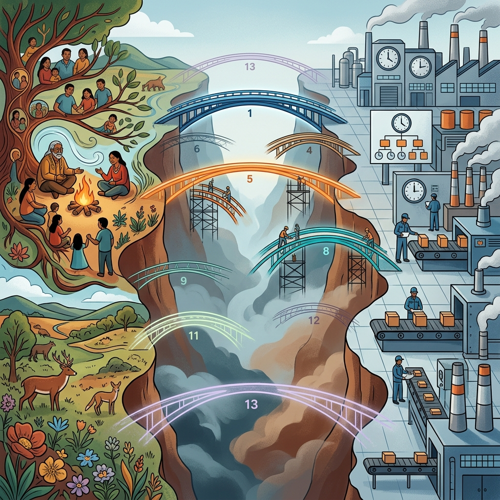

<!--Copyright (c) 2026 Mustafa Uzumeri. All rights reserved.-->

<figure class="blog-hero">
  
</figure>

# Thirteen Dimensions of Cultural Mismatch

## Why Indigenous Workers Leave Canadian Manufacturing — and What Industry Already Knows About Fixing It

**Bicultural Integration Exchange — White Paper Series**
**Paper 1 of 5**

**Author:** Mustafa Uzumeri
**Date:** June 2026
**Version:** 1.0

---

### Abstract

Indigenous workers in Canadian high-reliability manufacturing — aerospace, mining, automotive — face a 90-day attrition crisis. They are recruited, onboarded, and then leave (or are terminated) within the first quarter. Employers see an attendance problem, a skills gap, or a poor cultural fit. The research literature sees something else entirely: a systematic mismatch between the operating assumptions of Western industrial workplaces and the lived reality of Indigenous cultures.

This paper identifies **thirteen dimensions** of that mismatch, organized into three layers: seven interpersonal dimensions governing how people communicate and handle conflict at work, and six structural dimensions governing whether people can get to work, stay at work, learn at work, and get hired in the first place. For every dimension, at least one validated industry best practice already exists that could serve as a bridge — from Crew Resource Management (aviation) and the Toyota Production System (Japanese manufacturing) to AI-powered scheduling, video-based training, and double-blind competency matching.

This paper is the executive summary and roadmap for the four-paper series. Papers 2–4 provide the detailed analysis.

---

### Table of Contents

1. [The Problem: 90 Days and Out](#1-the-problem-90-days-and-out)
2. [The Thirteen Dimensions](#2-the-thirteen-dimensions)
3. [Three Layers, Three States of Readiness](#3-three-layers-three-states-of-readiness)
4. [Bridge Candidates at a Glance](#4-bridge-candidates-at-a-glance)
5. [Regional Variation: Not One Indigenous Experience](#5-regional-variation-not-one-indigenous-experience)
6. [The Readiness Spectrum: From Disconnection to Reconnection](#6-the-readiness-spectrum-from-disconnection-to-reconnection)
7. [Series Roadmap](#7-series-roadmap)
8. [Key References](#8-key-references)

---

## 1. The Problem: 90 Days and Out

Indigenous peoples are the fastest-growing demographic in Canada. In sectors like aerospace manufacturing, mining, and skilled trades, employers face persistent labour shortages and are actively recruiting from Indigenous communities. Yet Indigenous worker retention rates in these industries remain dramatically below non-Indigenous benchmarks. The pattern is consistent: workers are recruited, complete initial training, and then leave — overwhelmingly within the first 90 days.

Employers tend to attribute this attrition to individual factors: attendance issues, skills gaps, or "cultural fit." The research tells a different story. Studies from the Mining Industry Human Resources Council, the Future Skills Centre, Toronto Metropolitan University's Diversity Institute, and multiple Indigenous employment organizations converge on a structural diagnosis: Indigenous workers leave because the workplace is designed around assumptions — about time, communication, family, learning, urgency, and geography — that systematically exclude them.

This is not a recruitment problem. It is a retention problem. And it is not an individual failing. It is a system design failure.

---

## 2. The Thirteen Dimensions

The mismatch between Indigenous cultural norms and Western industrial assumptions can be mapped across thirteen dimensions, organized in three layers:

### Layer 1: Communication and Conflict (Dimensions 1–7)

These dimensions govern how people interact at work — how they talk, disagree, make decisions, and handle quality issues.

| # | Dimension | The Mismatch |
|---|---|---|
| 1 | Silence Misread | Indigenous reflective silence is read as disengagement, ignorance, or consent |
| 2 | Assertiveness Paradox | Indigenous indirect communication collides with the Western norm of "speak up" |
| 3 | Consensus vs. Authority | Indigenous consensus-based decision-making meets top-down management authority |
| 4 | Face-Saving | Indigenous face-saving norms meet Western direct feedback and public accountability |
| 5 | Emotional Tax | The cumulative burden of navigating a cultural environment that was not designed for you |
| 6 | Collectivism-Individualism | Indigenous collective identity meets Western individual performance metrics |
| 7 | Temporal Rhythm | Indigenous relational time meets Western clock-driven meeting and decision cadence |

### Layer 2: Structural Barriers (Dimensions 8–13)

These dimensions govern whether people can get to work, stay at work, learn at work, and get hired in the first place.

| # | Dimension | The Mismatch |
|---|---|---|
| 8 | Time Orientation | Monochronic (clock-driven, linear) vs. polychronic (relational, cyclical) scheduling |
| 9 | Family & Community Obligation | Nuclear family leave policies vs. extended kinship and ceremonial duties |
| 10 | Urgency Hierarchy | Production/financial urgency vs. relational/spiritual urgency |
| 11 | Learning & Knowledge Validation | Credential/written/classroom vs. experiential/oral/apprenticeship |
| 12 | Place & Geographic Rootedness | Geographic mobility assumed vs. territorial and community connection |
| 13 | Credential & Presentation Gatekeeping | Standardized CV/ATS screening vs. narrative/experiential work histories |

### Layer 3: Pre-Employment (Dimension 13)

Dimension 13 is unique: it operates *before* the worker enters the workplace. No amount of communication training or scheduling flexibility matters if the candidate is filtered out by an ATS system that cannot read their experiential history.

---

## 3. Three Layers, Three States of Readiness

Not all dimensions are equally understood. The thirteen dimensions fall into three categories of solution readiness:

| State | Dimensions | Status |
|---|---|---|
| **Proven bridges** | 1–7 (Communication & Conflict) | Validated industry practices (CRM, TPS) already exist and converge with Indigenous relational norms. The bridge tools are designed; they need adaptation and deployment |
| **Solvable now** | 8–9 (Time, Family) | Commercially mature AI scheduling, video-based training, and digital error-proofing technology can solve the scheduling collision today. The tools exist; they need to be deployed for inclusion, not just efficiency |
| **Research needed** | 10–13 (Urgency, Learning, Place, Credential Gatekeeping) | Bridge candidates are identified but not yet designed as bicultural tools. Each needs specific research, pilot testing, and community-engaged development |

---

## 4. Bridge Candidates at a Glance

| # | Dimension | Bridge Candidate(s) | Source |
|---|---|---|---|
| 1 | Silence Misread | CRM structured communication + TPS Nemawashi (pre-meeting consultation) | Aviation, Toyota |
| 2 | Assertiveness Paradox | PACE graded assertiveness + TPS Andon (system-level escalation) | Aviation, Toyota |
| 3 | Consensus vs. Authority | TPS Principle 13 (consensus decisions) + Tiered decision model | Toyota |
| 4 | Face-Saving | Threat-Error Management + Deming 85% Rule (blame the system, not the person) | Aviation, Quality |
| 5 | Emotional Tax | Bilateral CRM training (both cultures learn the other's norms) | Aviation |
| 6 | Collectivism-Individualism | Kaizen teams + team-based metrics | Toyota |
| 7 | Temporal Rhythm | Structured decision cadence (events, not clock positions) | Toyota, Military |
| 8 | Time Orientation | AI scheduling, compressed work weeks, takt time, seasonal leave banking | Manufacturing, Mining |
| 9 | Family & Community Obligation | AI scheduling + cross-trained teams + Indigenous cultural leave | Manufacturing, Federal policy |
| 10 | Urgency Hierarchy | Tiered priority systems + Two-Eyed Seeing (Etuaptmumk) | Military, Mi'kmaq |
| 11 | Learning & Knowledge Validation | Video SOPs, PLAR, competency-based assessment, TWI, dual-register SOPs | Toyota, Canadian trades |
| 12 | Place & Geographic Rootedness | FIFO/DIDO rotation, satellite manufacturing, Friendship Centres | Mining, Aerospace |
| 13 | Credential Gatekeeping | Double-blind matching, AI competency translation, competency demonstration hiring | DeeperPoint, Trades |

---

## 5. Regional Variation: Not One Indigenous Experience

The thirteen dimensions do not manifest uniformly. As Dr. Linda Manyguns (Mount Royal University) observes: *"the people in the north have different cycles and processes as compared to Blackfoot and even more different are the lifestyles found in the Great Lakes area where the Indigenous people are matrilineal, agricultural-based people."*

But regional variation is only part of the picture. **Over half of Canada's Indigenous population now lives in cities and towns** (2021 Census: 801,045 of 1.81 million identify as First Nations, Métis, or Inuit and reside in urban centres). These urban Indigenous workers face a different dimension profile than reserve-based communities — and they are the population most immediately available to manufacturing employers.

| Location | Cultural Context | Mismatch Profile |
|---|---|---|
| **Northern communities** | Extended winter hunting, ice road logistics, extreme seasonal variation | Longer seasonal absences; deep cold-weather operations and isolation-maintenance skills. Geographic distance (Dimension 12) is the dominant barrier |
| **Blackfoot / Plains nations** | Distinct ceremonial calendar, large-scale seasonal coordination | Different ceremonial windows; strong coordination and resource management skills. Scheduling (Dimensions 8–9) is the primary friction point |
| **Great Lakes (Anishinaabe / Haudenosaunee)** | Matrilineal governance, agricultural cycles, multi-season planning | Governance obligations; agricultural planning maps to production scheduling. Consensus vs. authority (Dimension 3) is often the sharpest daily collision |
| **Urban Indigenous** | May be disconnected from home community; navigating identity in a non-Indigenous majority environment; variable cultural connection (from fully active to exploring reconnection) | Geographic distance is low, but **credential gatekeeping (Dimension 13)** and **emotional tax (Dimension 5)** become dominant. The worker is close to the job but may lack institutional support networks, face ATS-format disadvantage, and carry the full burden of cultural code-switching without a proximate community to return to each evening |

### Why the Urban Category Matters

The urban Indigenous population is the largest and fastest-growing source of potential manufacturing workers. They are geographically proximate to plants, often already in the labour market, and may have some Western credential history. But the urban setting introduces its own barriers:

- **Isolation without community infrastructure.** A worker on a reserve has Elders, ceremony, and kinship networks within walking distance. An urban Indigenous worker may have none of these — or may be rebuilding these connections through Friendship Centres and urban Indigenous organizations that are themselves under-resourced.
- **Identity negotiation.** Urban Indigenous workers navigate a constant tension between cultural identity and workplace assimilation pressure. The emotional tax (Dimension 5) is often *higher* in urban settings because there is no daily return to a culturally affirming environment.
- **Variable cultural connection.** The urban population spans the full readiness spectrum (§6 below): some are culturally active and maintain strong ties to home communities; others are reconnecting after years of disconnection; still others are Métis or non-status individuals whose cultural identity is complex and may not map neatly onto reserve-based frameworks.
- **Credential gatekeeping is the first barrier.** Unlike remote communities where geographic distance is the initial filter, urban Indigenous workers can physically reach the workplace — but are filtered out by ATS systems, résumé format bias, and interview protocols that disadvantage narrative work histories (Dimension 13).

This variation — across both geography and urban/rural context — is precisely why one-size-fits-all cultural leave policies fail, and why the AI scheduling approach (worker-driven constraint entry, not employer-configured calendars) and the double-blind matching system (competency translation, not résumé formatting) are the correct designs.

---

## 6. The Readiness Spectrum: From Disconnection to Reconnection

The bridge tools described in this series assume a worker who is capable, motivated, and culturally active. But Dr. Manyguns identifies a critical reality: *"The majority of our people are not connected to the culture. The forced sedentary lifestyle really is a barrier we face, which results in low retention rates. Suddenly a person has to gear up from a sedentary position to be a totally functioning individual in mainstream society."*

This means the Indigenous workforce exists along a spectrum:

| Position | Characteristics | Primary Need |
|---|---|---|
| **Culturally active** | Connected to community, ceremony, seasonal cycles | Scheduling accommodation + credential translation |
| **Reconnecting** | Re-engaging with culture; growing obligations | Bridge infrastructure *before* the demand peaks |
| **Disconnected / sedentary** | Intergenerational trauma legacy; no structured daily routine | Graduated on-ramp to employment: micro-shifts, staged entry |

Dr. Manyguns also observes that cultures *"are getting stronger, which in turn will make this work even more relevant."* The scheduling, training, and matching infrastructure built today for the active minority will serve the reconnecting majority tomorrow. Building it now is an investment in a strengthening trend.

---

## 7. Series Roadmap

This executive summary introduces the problem space and the thirteen-dimension taxonomy. The remaining three papers provide detailed analysis:

### Paper 2: *Bridging the Conflict Divide*
**Dimensions 1–7 (Communication & Conflict)**

Demonstrates that three independent traditions — Crew Resource Management (aviation), the Toyota Production System (Japanese manufacturing), and Indigenous relational culture — converge on the same structural answer: design systems that give people time to think, make it safe to speak, focus on the problem rather than the person, and build decisions that everyone understands and owns. Presents a complete temporal architecture of validated tools from seconds (PACE) to years (TPS consensus culture).

### Paper 3: *Smart Scheduling and the Fungible Workforce*
**Dimensions 8–9 (Time Orientation, Family & Community Obligation)**

Argues that the scheduling collision is solvable today using commercially mature technology: AI scheduling engines treat cultural obligations as mathematical constraints to optimize, not exceptions to accommodate. But AI scheduling only works if the workforce is *fungible* — which requires video-based training (DeepHow), AI-driven cross-training matrices, and digital poka-yoke (computer vision error-proofing). Documents AS9100D compliance for all proposed tools.

### Paper 4: *The Research Agenda*
**Dimensions 10–13 (Urgency, Learning, Place, Credential Gatekeeping)**

Maps the bridge candidates for the four dimensions that require further research, pilot testing, and community-engaged development. Proposes specific study designs and connects each dimension to the three pilot proposals (Bicultural Documentation, Double-Blind Match, Platform Commons). The credential gatekeeping dimension is linked to the Double-Blind Bicultural Content Match Pilot, which uses AI to translate narrative experiential histories into standardized competency profiles for anonymous, consent-gated employer matching.

### Paper 5: *From Theory to Practice*
**Research Implementation Roadmap**

Translates the bridge candidates from Papers 2–4 into specific, actionable research designs organized in two tiers: **Tier 1** studies that can be completed by graduate students at minimal cost (PhD theses, Masters group projects), and **Tier 2** university-industry consortium pilots that build and test solutions with real participants, real manufacturers, and real community governance. Includes sequencing, institutional homes, and OCAP compliance requirements.

---

## 8. Key References

| Source | Relevance |
|---|---|
| **Hall, E. T.** *Beyond Culture* (1976) | Monochronic/polychronic time orientation framework |
| **Hofstede, G.** Cultural Dimensions | Power distance, individualism-collectivism structural analysis |
| **Mining Industry Human Resources Council (MiHR)** | Indigenous recruitment/retention best practices in Canadian mining |
| **Future Skills Centre (FSC-CCF)** | Indigenous workforce statistics; competency-based assessment |
| **Toronto Metropolitan University — Diversity Institute** | Workplace discrimination data |
| **Dr. Linda Manyguns** (Mount Royal University) | Regional variation, cultural disconnection, readiness spectrum |
| **AS9100D / ISO 9001:2015** | Quality management system — format-neutral documentation compliance |
| **Toyota Production System** | Consensus culture, visual management, kaizen, nemawashi |
| **Crew Resource Management (CRM)** | Aviation safety communication protocols |
| **Double-Blind Bicultural Content Match Pilot** | AI-driven competency translation and anonymous matching |
| **ICT (Indigenous Corporate Training Inc.)** | Practical Indigenous workplace inclusion resources |

---

### Series Navigation

| Paper | Title | Dimensions |
|---|---|---|
| **1 (this paper)** | *Thirteen Dimensions of Cultural Mismatch* | All 13 (executive summary) |
| **2** | *Bridging the Conflict Divide* | 1–7 (Communication & Conflict) |
| **3** | *Smart Scheduling and the Fungible Workforce* | 8–9 (Time, Family) |
| **4** | *The Research Agenda* | 10–13 (Urgency, Learning, Place, Credential Gatekeeping) |
| **5** | *From Theory to Practice* | Research implementation roadmap |

---

<!--Copyright (c) 2026 Mustafa Uzumeri. All rights reserved.-->
