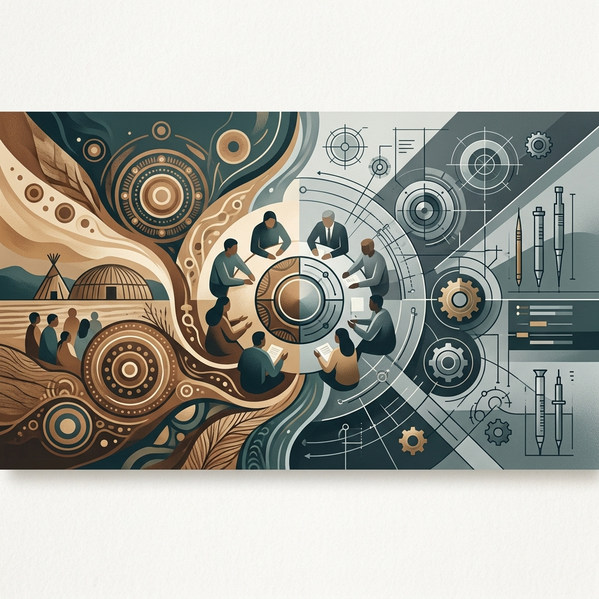

<!--Copyright (c) 2026 Mustafa Uzumeri. All rights reserved.-->

<figure class="blog-hero">
  
</figure>

# Bridging the Conflict Divide

## How Aviation Safety, Japanese Manufacturing, and Indigenous Relational Culture Converge on a Single Answer for High-Reliability Workplaces

**Bicultural Integration Exchange — White Paper Series**
**Paper 2 of 5**

**Author:** Mustafa Uzumeri
**Date:** June 2026
**Version:** 2.1

**Series context:** This paper covers dimensions 1–7 (Communication & Conflict) of the thirteen-dimension taxonomy introduced in Paper 1, *Thirteen Dimensions of Cultural Mismatch*.

---

### Abstract

In Western technical workplaces — aerospace, mining, automotive manufacturing — small-scale technical disagreement is not merely tolerated but actively cultivated as a driver of innovation and safety. For Indigenous workers entering these industries, the expectation to "speak up," challenge authority, and engage in adversarial debate collides with deeply held cultural norms around consensus, indirect communication, face-saving, and relational harmony. This mismatch is well-documented, multi-dimensional, and safety-critical: it affects error detection, quality reporting, and early attrition.

This paper synthesizes research from organizational psychology, Indigenous studies, aviation human factors, and Japanese manufacturing to demonstrate that the mismatch is not merely addressable but potentially advantageous. Three independent traditions — the Toyota Production System (TPS) from Japanese manufacturing, Crew Resource Management (CRM) from aviation, and Indigenous relational culture — arrive at the same structural answer from different directions: design systems that give people time to think, make it safe to speak, focus on the problem rather than the person, and build decisions that everyone understands and owns.

The paper presents a complete temporal architecture of validated industrial tools — from TPS consensus culture (months-years) through A3 problem solving (weeks), restorative circles (as needed), and After Action Reviews (daily) to PACE graded assertiveness (seconds) — and maps each tool to specific conflict dimensions, practical deployment channels, and Indigenous resonance. As the time scale lengthens, the tools become progressively more Indigenous-aligned, creating a natural integration arc where both the company and the Indigenous worker move toward the center.

---

### Table of Contents

1. [Is the Concern Valid?](#1-is-the-concern-valid)
2. [The Two Conflict Cultures](#2-the-two-conflict-cultures)
3. [The Known Dimensions of the Problem](#3-the-known-dimensions-of-the-problem)
   - 3.1 The Silence Misread
   - 3.2 The Assertiveness Paradox
   - 3.3 The Consensus vs. Authority Gap
   - 3.4 The "Face" Dimension
   - 3.5 The Emotional Tax
   - 3.6 The Collectivism-Individualism Friction
   - 3.7 The Temporal Mismatch
4. [The Industrial Evidence: Validated Analogs for Every Time Scale](#4-the-industrial-evidence-validated-analogs-for-every-time-scale)
   - 4.1 The Toyota Production System: Consensus as Competitive Advantage (Months–Years)
   - 4.2 A3 Problem Solving: Structured Collaborative Investigation (Days–Weeks)
   - 4.3 Restorative Circles: Relational Repair (As Needed)
   - 4.4 After Action Reviews: Rank-Free Shift Learning (Daily)
   - 4.5 Crew Resource Management and PACE: Immediate Safety Escalation (Seconds–Minutes)
5. [The Complete Temporal Architecture](#5-the-complete-temporal-architecture)
6. [Bridging the Divide: A Bicultural Remediation Toolkit](#6-bridging-the-divide-a-bicultural-remediation-toolkit)
   - 6.1 The Convergence Map
   - 6.2 Why This Bridge Works for Both Sides
   - 6.3 The Specific Remediation Toolkit
7. [Implications for the Three Pilot Proposals](#7-implications-for-the-three-pilot-proposals)
8. [Key References and Source Organizations](#8-key-references-and-source-organizations)
9. [Conclusion](#9-conclusion)

---

## 1. Is the Concern Valid?

**Yes — unambiguously.** The research literature across organizational psychology, Indigenous studies, cultural safety, and aviation human factors converges on this point. The mismatch between Western "constructive conflict" norms and Indigenous relational communication styles is:

- **Well-documented** in cross-cultural workplace research (Hofstede's individualism-collectivism and power distance dimensions; Ting-Toomey's face negotiation theory)
- **Identified as a primary driver of attrition** for Indigenous employees in Canadian workplaces
- **Recognized as a safety-critical issue** in aerospace and other high-reliability industries through Crew Resource Management (CRM) research
- **Not merely a "soft skills" problem** — it directly affects technical decision quality, error detection, safety reporting, and retention

The concern is not speculative. It maps onto a known taxonomy of cultural friction that the organizational psychology literature has been studying for decades — and that aviation safety research solved (partially) through structured intervention programs.

---

## 2. The Two Conflict Cultures

### 2.1 Western Technical Workplace: Constructive Conflict as a Valued Competency

In conventional Western engineering and manufacturing environments, small-scale technical disagreement is not merely tolerated — it is **actively cultivated** as a driver of innovation and decision quality:

- **Task conflict** (disagreements about methods, approaches, or technical trade-offs) is distinguished from **relationship conflict** (interpersonal tensions). Research consistently shows that task conflict — when managed correctly — improves decision-making by surfacing hidden assumptions, forcing clear articulation of reasoning, and enabling evaluation of trade-offs.
- **"Disagree and commit"** is a normalized protocol. Two engineers may argue vigorously about a design choice, and once a decision is made, both commit to executing it regardless of which position prevailed.
- **Psychological safety** is the recognized moderator: teams where members trust they can voice dissent without personal retribution produce the best outcomes from task conflict (Edmondson, 1999; Google's Project Aristotle, 2015).
- In **high-reliability organizations** (aerospace, nuclear, healthcare), the ability to challenge authority on safety grounds is not optional — it is a trained, assessed, and audited competency.

The cultural message is clear: *a good engineer pushes back*. Silence in the face of a technical concern is not seen as deference — it is seen as failure.

### 2.2 Indigenous Communication Norms: Relationality, Consensus, and Silence

Many (not all) Indigenous cultures operate within a fundamentally different framework for handling disagreement:

| Dimension | Western Technical Norm | Common Indigenous Norm |
|---|---|---|
| **Goal of disagreement** | Resolve the task issue efficiently; find the "best" solution | Restore and maintain relational harmony; ensure the well-being of all affected parties |
| **Scope of the conflict** | Bounded to the immediate technical question | Holistic — the disagreement impacts the relationships, the team, the community |
| **Communication style** | Direct, explicit, verbal; "get to the point" | Indirect, contextual, often non-verbal; storytelling, metaphor, and silence carry meaning |
| **Role of silence** | Interpreted as disengagement, agreement, or lack of opinion | A valued and respectful part of communication — time for reflection, listening, and processing |
| **Decision-making model** | Majority rule, authority decision, or "whoever argues best wins" | Consensus-seeking — every voice is heard, concerns are addressed, collective ownership of the outcome |
| **Accountability** | Individual — "who made this call?" | Collective — the group owns the decision |
| **Conflict escalation** | Accepted and even rewarded ("passionate advocacy") | Avoided — public confrontation threatens dignity and relationship |
| **Time horizon** | Resolve quickly, return to productivity | Take the time needed; a rushed resolution is worse than no resolution |

**Critical nuance:** These are tendencies, not absolutes. Indigenous cultures are diverse — a Blackfoot engineer from Siksika Nation may have different communication norms than a Haudenosaunee engineer from Six Nations. The table describes *patterns* observed in the research literature, not universal rules. Any program must be attentive to specific Nation-level variation.

---

## 3. The Known Dimensions of the Problem

The research identifies at least **seven distinct dimensions** where the conflict-culture mismatch creates friction for Indigenous workers entering technical workplaces:

### 3.1 The Silence Misread

**What happens:** An Indigenous worker pauses before responding to a technical question or remains silent during a heated team discussion.

**How the workplace reads it:** Disengagement, lack of confidence, absence of technical opinion, or passive agreement with the prevailing view.

**What it actually means (often):** Respectful listening, reflective processing, deference to seniority or expertise, or a deliberate choice not to create public confrontation.

**Consequence:** The worker's technical knowledge is never surfaced. Over time, they are perceived as "not contributing" and passed over for project leadership roles. The team loses access to valid technical perspectives.

**Research basis:** Canadian Bar Association cross-cultural communication guidelines; University of Waterloo Indigenous workplace retention research; University of Windsor Indigenous Workways Toolkit.

### 3.2 The Assertiveness Paradox

**What happens:** High-reliability industries (aerospace, mining, nuclear) require workers to **speak up immediately** when they observe a safety concern — regardless of rank, relationship, or social cost.

**How it collides:** This "assertiveness imperative" directly conflicts with cultural norms around deference, face-saving, and indirect communication. The aviation industry learned this the hard way through catastrophic accidents attributed to junior crew members not challenging captains' errors — a problem that Crew Resource Management (CRM) training was specifically designed to address.

**The Indigenous-specific layer:** CRM research focused on national-culture power distance (e.g., high-power-distance cultures in Asia and Latin America). The Indigenous dimension adds an additional layer: the assertiveness barrier is compounded by the **emotional tax** of navigating a workplace where the worker already feels "on guard" due to systemic racism, tokenism, or cultural isolation.

**Consequence:** An Indigenous worker may observe a safety-critical error — a dropped tool in an engine bay, a missed debulk cycle on a composite layup — and hesitate to escalate it, not because they don't recognize the problem, but because the organizational culture for raising concerns feels hostile, public, and confrontational.

**Research basis:** FAA Crew Resource Management guidelines; Hofstede's power distance research; Flight Safety Foundation cross-cultural assertiveness studies; PACE (Probe-Alert-Challenge-Emergency) graded assertiveness framework.

### 3.3 The Consensus vs. Authority Gap

**What happens:** A technical dispute arises on the shop floor (e.g., whether a weld meets spec, whether a cure cycle parameter should be adjusted). The Western norm resolves this through **authority hierarchy** — the shift lead or quality engineer makes the call, and the team executes.

**How it collides:** Workers from consensus-oriented cultures may experience this as exclusionary — their perspective was not sought, their concerns were not addressed, and the decision was imposed. Over time, this erodes their sense of agency and ownership.

**Consequence:** Disengagement. The worker stops offering input because the process doesn't incorporate it. The organization interprets this as a skills gap or attitude problem. The worker leaves within 90 days.

### 3.4 The "Face" Dimension

**What happens:** A quality inspector identifies an error in a colleague's work and must flag it — publicly, in writing, on a Non-Conformance Report (NCR).

**How it collides:** In many Indigenous cultures, causing someone to "lose face" in public — even through a procedural mechanism — is a significant relational transgression. The NCR system is designed to be impersonal ("we're documenting the defect, not blaming the person"), but in practice, it feels personal.

**Consequence:** Indigenous workers may under-report quality issues to avoid causing colleagues to lose face, or they may experience disproportionate distress when their own work is flagged. Both outcomes degrade quality performance.

### 3.5 The Emotional Tax

**What happens:** Indigenous workers report feeling the need to be "on guard" at work — monitoring their speech, modulating their communication style, suppressing cultural identity markers — in order to "fit in" to a workplace culture that prizes directness, assertiveness, and individual advocacy.

**How it collides:** This continuous code-switching imposes a cognitive and emotional burden that non-Indigenous workers do not carry. Research from Catalyst (2019) documents this "emotional tax" across multiple studies of underrepresented groups in corporate settings.

**Consequence:** Burnout, disengagement, and attrition — often within the first 90 days. The employer sees "poor cultural fit" or "lack of engagement." The actual cause is an organizational environment that requires Indigenous workers to suppress culturally ingrained communication norms in order to participate.

### 3.6 The Collectivism-Individualism Friction

**What happens:** Standard Western performance management rewards individual achievement — "who caught the defect," "who proposed the design improvement," "who led the project."

**How it collides:** Many Indigenous cultures prioritize collective achievement. Self-promotion is culturally uncomfortable or actively discouraged. An Indigenous worker who contributes significantly to a team outcome may not "claim credit" in the way the performance management system expects.

**Consequence:** The worker's contributions are invisible to the system. They are rated lower on performance reviews. Promotions and project assignments go to workers who self-advocate more aggressively. The Indigenous worker correctly perceives that the system does not value their contributions.

### 3.7 The Temporal Mismatch

**What happens:** Western technical environments resolve disputes quickly — "let's hash this out now and move on." The pace of technical decision-making in manufacturing is driven by production schedules, shift changes, and delivery deadlines.

**How it collides:** Indigenous consensus-seeking processes are deliberate and reflective. They prioritize taking the time needed to hear all perspectives and reach a resolution that everyone can support. This temporal rhythm is fundamentally incompatible with "resolve it in the stand-up meeting and move on."

**Consequence:** The Indigenous worker's input arrives after the decision is made. Their reflective processing style is interpreted as "slow" or "indecisive" rather than "thorough and considered."

---

## 4. The Industrial Evidence: Validated Analogs for Every Time Scale

The seven conflict dimensions identified above are not new problems. Each has been encountered — and solved — by at least one established industrial program. What makes this synthesis distinctive is that these programs, developed independently across different industries and cultures, **converge on the same structural answer**: design systems that give people time to think, make it safe to speak, focus on the problem rather than the person, and build decisions that everyone understands and owns.

This section presents the five validated programs in order from the longest time scale to the shortest — from organizational culture transformation to immediate safety escalation. Each subsection identifies the program's origin, its critical design features, its structural parallel with Indigenous relational practices, and its practical adaptation for bicultural workplaces.

### 4.1 The Toyota Production System: Consensus as Competitive Advantage (Months–Years)

The structural parallel between Indigenous consensus-seeking and Japanese manufacturing consensus is one of the most significant findings in this research synthesis, because it provides **hard evidence from the gold standard of global manufacturing** that consensus-based decision-making is not a liability to be accommodated but a competitive advantage to be cultivated.

#### 4.1.1 The Toyota Way: Principle 13

Jeffrey Liker's *The Toyota Way* (2004) codified 14 management principles underlying the Toyota Production System. **Principle 13** states:

> *"Make decisions slowly by consensus, thoroughly considering all options; implement decisions rapidly."*

This is not a cultural curiosity — it is a codified operating principle of the most successful manufacturing system in history. Toyota's documented approach involves two complementary practices:

**Nemawashi** (根回し — literally "going around the roots," a gardening metaphor for preparing a tree for transplant): The process of building consensus through informal, one-on-one discussions with all stakeholders *before* any formal proposal is made. By the time a formal meeting occurs, every concern has been identified, every perspective has been heard, and the team is aligned. There are no surprises.

**Ringi** (稟議): The formal system of circulating a written proposal to gather approval stamps from all relevant parties. In practice, by the time the document is formally signed, the real decision has already been reached through nemawashi. The ringi process ratifies consensus — it does not create it.

The result: **Toyota may spend 9–10 months planning a project that a Western competitor starts in 3 months.** But Toyota's execution is faster and more flawless because the organization is already aligned. The Western competitor spends the rest of the project lifecycle fixing mistakes, managing resistance, and re-doing work that was started before it was understood.

#### 4.1.2 The "Slower Is Faster" Evidence

The "slower is faster" principle is documented across multiple studies of Japanese manufacturing performance:

| Phase | Western "Decide Fast" Model | Toyota Consensus Model |
|---|---|---|
| **Decision** | Fast (days–weeks). Leader decides, team executes. | Slow (weeks–months). Nemawashi builds shared understanding. |
| **Implementation** | Slow and turbulent. Resistance, rework, misunderstanding, scope changes. | Fast and stable. Everyone already understands the plan and their role. |
| **Total cycle** | Often longer due to rework and resistance | Often shorter despite the longer planning phase |
| **Quality** | "Inspect-in" quality — find and fix defects after they occur | "Built-in" quality — prevent defects by aligning understanding before work begins |
| **Organizational learning** | Low — the team executes a plan they did not help design | High — the consensus process itself surfaces knowledge and builds capability |

This is not a marginal difference. Toyota's quality and reliability track record — sustained over decades — represents one of the most thoroughly documented competitive advantages in industrial history. The consensus process is not incidental to that advantage; it is foundational.

#### 4.1.3 Jidoka and the Andon Cord: Speaking Up as a System Design

The assertiveness paradox identified in §3.2 (Indigenous workers hesitating to escalate safety concerns) has a direct Japanese parallel — and a proven solution.

**Jidoka** ("automation with a human touch") is Toyota's principle that any worker can stop the production line when they detect an abnormality. The physical mechanism is the **andon cord** — a pull cord (or button) at every workstation that triggers a visual signal and halts the line.

The critical insight: Toyota did not simply tell workers to "speak up." They **designed the system** so that speaking up requires a single physical action (pulling a cord), triggers an impersonal process (a light turns on, a team leader responds), and focuses on the *problem* rather than the *person*. The system depersonalizes the act of escalation.

Compare this to the Western "speak up" expectation, which requires:
1. The worker to formulate a verbal challenge
2. Direct it at a specific person (usually a superior)
3. In a social context (a meeting, a shop floor conversation)
4. With personal reputational risk if the concern is dismissed

The andon cord eliminates steps 1–4. It replaces social courage with mechanical action. **This is exactly the kind of system design that could bridge the Indigenous assertiveness paradox** — not by training Indigenous workers to be "more assertive" (which asks them to suppress a cultural norm), but by designing escalation systems that do not require confrontation.

#### 4.1.4 Deming's Respect for People: The Missing Foundation

W. Edwards Deming — the American statistician whose teachings were foundational to Japan's post-war manufacturing transformation — taught that **85% of quality problems are caused by the system, not the worker.** This principle resonated deeply with Japanese collectivist culture because it shifted accountability from individual blame to systemic improvement.

Deming's philosophy maps directly onto the Indigenous relational framework:

| Deming Principle | Japanese Implementation | Indigenous Parallel |
|---|---|---|
| "The system causes 85% of problems" | Blame the process, not the person; redesign the system | Conflict is a systemic issue affecting the whole community, not an individual failing |
| "Drive out fear" | Create psychological safety for workers to report problems | Cultural safety — workers should not have to suppress identity to participate |
| "Respect for people" (TPS Pillar 2) | Workers are intelligent problem-solvers, not interchangeable labor | Collective wisdom — every voice carries knowledge worth hearing |
| "Constancy of purpose" | Long-term thinking over short-term metrics | Seven Generations thinking — decisions affect those who come after |

The irony is striking: the Western manufacturing world spent forty years trying to import Japanese consensus-based practices (lean manufacturing, TPS, kaizen). Many of those attempts failed precisely because they imported the *tools* (kanban boards, 5S, value stream maps) without the *culture* (nemawashi, respect for people, collective ownership). The cultural substrate that makes Japanese manufacturing work is, in many respects, **more similar to Indigenous relational values than to the individualist, adversarial Western management culture that was trying to adopt it.**

#### 4.1.5 Specific Lessons for the Bicultural Integration Exchange

The Japanese parallel provides six concrete, actionable lessons:

**Lesson 1: Reframe consensus as a competitive advantage, not a cultural accommodation.**
The documentation pilot should explicitly position Indigenous consensus-seeking not as a "cultural sensitivity" issue to be managed, but as an alignment with the world's most successful manufacturing methodology. This reframing changes the entire power dynamic of the conversation with employers.

**Lesson 2: Design andon-style escalation systems for safety concerns.**
Instead of training Indigenous workers to "speak up" in Western confrontational style, design depersonalized escalation mechanisms: physical signals, anonymous reporting channels, structured escalation protocols (like the PACE framework from CRM). The system, not the worker, carries the burden of raising the concern.

**Lesson 3: Adopt nemawashi as the standard pre-decision process for mixed teams.**
When Indigenous and non-Indigenous workers are on the same team, use nemawashi-style one-on-one consultation before group decisions. This creates space for indirect communication, reflective processing, and face-saving — all of which align with Indigenous norms — while also producing better decisions (as Toyota demonstrates daily).

**Lesson 4: Separate "decision speed" from "execution speed."**
Help employers understand that the relevant metric is not how fast a decision is made, but how fast and how well it is executed. A consensus-built decision implemented flawlessly in one cycle is faster than a top-down decision implemented three times because of resistance and rework.

**Lesson 5: Blame the system, not the person.**
Adopt Deming's principle explicitly in quality and safety reporting. Non-Conformance Reports (NCRs) should be framed as *process documentation*, not *person documentation*. This aligns with Indigenous face-saving norms and with Toyota's proven approach to quality improvement.

**Lesson 6: Recognize that "lean adoption failures" and "Indigenous integration failures" may have the same root cause.**
Many Canadian manufacturers have tried and failed to implement lean/TPS methods because their organizational culture is too individualist and hierarchical to support consensus-based practices. Indigenous workers entering these organizations may be better natural fits for genuine lean culture than the existing workforce — if the organization is willing to learn from them rather than simply assimilate them.

### 4.2 A3 Problem Solving: Structured Collaborative Investigation (Days–Weeks)

**Origin:** Toyota. Named for the A3-sized paper (11" × 17") on which the entire analysis must fit — a constraint that forces clarity and conciseness.

**How it works:** A structured, collaborative problem-solving process that unfolds over days to weeks:

1. **Problem statement** — define what's wrong, in one sentence
2. **Background** — why this matters to the organization
3. **Current condition** — data from the *gemba* (the actual workplace), not from reports
4. **Goal/target condition** — what success looks like, measurably
5. **Root cause analysis** — typically using the "5 Whys" method
6. **Countermeasures** — proposed changes, each with an owner and a test plan
7. **Follow-up** — how and when results will be verified

**The critical design feature:** The A3 process uses **"catchball"** — iterative back-and-forth dialogue between the A3 author, their coach (usually a more senior person), and the stakeholders affected by the problem. The author does not develop the solution alone and present it. They develop it *through* consultation, moving the document back and forth as understanding deepens. The coach's role is not to dictate answers but to ask questions that deepen the analysis.

**Indigenous parallel:** Catchball is **nemawashi with a visible artifact.** The iterative consultation, the seeking of multiple perspectives before commitment, the patient circling back to deepen understanding — these are the same structural elements as Indigenous consensus-building. The A3 sheet itself serves as a tangible record of the emerging consensus, visible to everyone, evolving over time. It is the antithesis of the closed-door executive decision.

**Bicultural adaptation:** Use A3s for quality issues, process improvements, and onboarding problems. Assign an Indigenous worker as the A3 owner for a problem they observed — this gives them structured, supported ownership of a contribution without requiring them to "speak up" in a meeting. The catchball process provides the one-on-one consultation that aligns with indirect communication preferences. The single-page constraint prevents the process from becoming bureaucratic.

### 4.3 Restorative Circles: Relational Repair (As Needed)

**Origin:** Restorative justice traditions, with deep roots in Indigenous peacemaking practices worldwide (Māori, First Nations, Navajo). Adapted into schools and, increasingly, into workplaces.

**How it works:** A facilitated circle — not a meeting — structured around relational repair rather than rule enforcement. When harm has occurred (a conflict, a misunderstanding, a quality failure with interpersonal consequences), the circle asks three questions:

1. **Who was harmed?** — not "what rule was broken?"
2. **What are their needs?** — not "what punishment is appropriate?"
3. **Whose obligation is it to repair this?** — not "whose fault is it?"

The circle uses a talking piece; only the person holding the piece speaks. Everyone sits at the same level. A trained facilitator guides the process but does not adjudicate.

**The critical design feature:** Restorative circles **shift the frame from compliance to relationship.** In a conventional workplace, a conflict between a supervisor and a new Indigenous worker would be handled through HR's disciplinary process — a fundamentally adversarial, authority-driven mechanism. A restorative circle treats the conflict as a relationship that needs repair, not a rule that was broken.

**Indigenous parallel:** This is not a parallel — it is a **homecoming.** Restorative circles are directly descended from Indigenous peacemaking traditions. For an Indigenous worker, a restorative circle is the closest thing in the Western workplace to how their own community handles conflict. For the employer, it is a well-documented, evidence-based practice with measurable benefits (reduced turnover, improved team cohesion, stronger safety culture).

**Bicultural adaptation:** Establish restorative circles as the Tier 2 conflict resolution mechanism (between immediate safety escalation and formal HR processes). Train Shared Facilitators in restorative practice. When a conflict involves cultural miscommunication — which it often will in the first 90 days — the restorative frame allows both parties to articulate their experience without either being "wrong."

### 4.4 After Action Reviews: Rank-Free Shift Learning (Daily)

**Origin:** Developed by the U.S. Army in the 1970s as a structured method for learning from field exercises. Now adapted across healthcare, manufacturing, emergency services, and corporate environments.

**How it works:** A facilitated team review conducted as close to the event as possible, organized around four questions:

| Question | Purpose | What It Sounds Like |
|---|---|---|
| **What was supposed to happen?** | Establish the baseline plan | *"We planned to complete the layup sequence for panels 4–7 this shift."* |
| **What actually happened?** | Build a shared, factual picture — no interpretation yet | *"We completed panels 4–6. Panel 7 was started but the vacuum bag integrity check failed."* |
| **Why was there a difference?** | Identify root causes — systemic, not personal | *"The sealant tape lot we received this week has different adhesion properties. Two operators noticed it was harder to work with but weren't sure if it was worth flagging."* |
| **What will we do differently next time?** | Commit to specific actions | *"Log sealant tape lot numbers on the setup sheet. If adhesion feels different, flag it at the Probe level immediately — don't wait."* |

**The critical design feature:** AARs are **explicitly rank-free.** The facilitator opens by stating that rank is set aside: a first-year apprentice's observation about the sealant tape has the same weight as the shift lead's assessment. The U.S. Army — one of the most hierarchical organizations in the world — designed this feature deliberately because they found that rank-filtered debriefs produced worse lessons.

**Indigenous parallel:** The rank-free AAR circle, guided by a facilitator, with sequential contributions where each person speaks without interruption, is structurally identical to a **talking circle.** The four questions provide the same function as a circle's opening protocol: they give structure to reflection so that the conversation is anchored in shared experience rather than individual opinion.

**Bicultural adaptation:** Conduct end-of-shift AARs as circles. Use a talking piece (or simply go around the table in sequence — the format matters more than the object). Open with the four questions. Close with commitments. Document the lessons. This can begin on Day 1 of the onboarding period without any special training.

### 4.5 Crew Resource Management and PACE: Immediate Safety Escalation (Seconds–Minutes)

#### 4.5.1 What CRM Is

**Crew Resource Management (CRM)** is a structured safety training system — originally developed for aviation — that optimizes team performance by addressing the human factors that cause accidents: poor communication, unchallenged authority, loss of situational awareness, and failure to speak up. CRM does not replace technical competence; it ensures that technical competence is not wasted because people failed to talk to each other.

The core premise is simple: **most accidents in high-reliability industries are not caused by a lack of skill or knowledge. They are caused by a breakdown in how teams communicate, make decisions, and manage disagreement.** The worker who saw the problem but didn't say anything. The supervisor who was too busy to listen. The quality issue that everyone assumed someone else would flag.

#### 4.5.2 Origin: The Accidents That Created CRM

CRM emerged from catastrophic failures in aviation where technically competent crews crashed airplanes because of communication breakdowns:

- **Tenerife, 1977** — Two Boeing 747s collided on a runway in fog, killing 583 people. The flight engineer of KLM Flight 4805 twice questioned the captain's decision to begin takeoff without clearance but was overruled. The captain's authority was unchallenged.
- **United Airlines Flight 173, 1978** — A DC-8 ran out of fuel and crashed in Portland, Oregon, killing 10 people. The flight engineer noticed the fuel situation but failed to assert the urgency forcefully enough to override the captain's focus on a landing gear problem.

These accidents — and the NASA research that followed — revealed a pattern: **the people closest to the problem often had the information needed to prevent the disaster, but the organizational culture prevented them from communicating it effectively.** The hierarchy was too steep. The cost of "speaking up" was too high. The mechanisms for escalation were too vague.

#### 4.5.3 The Six Core Components

CRM training, as codified by the FAA (Advisory Circular AC 120-51E) and adopted internationally by ICAO, addresses six skill domains:

| Component | What It Trains | Why It Matters for Bicultural Integration |
|---|---|---|
| **Communication** | Clear, concise, closed-loop verbal exchange. The speaker states, the listener confirms, the speaker verifies. | Provides structured alternatives to "just speak up" — the communication has a defined format, not a social negotiation |
| **Situational Awareness** | Maintaining a shared, real-time understanding of what is happening, what has happened, and what is about to happen | Aligns with Indigenous holistic perception — seeing the whole situation, not just the immediate task |
| **Decision-Making** | Structured approaches to choosing under time pressure and uncertainty | Can accommodate consensus-seeking by defining *when* consensus is appropriate and *when* authority must decide |
| **Teamwork & Leadership** | Creating shared mental models; leaders invite input, followers advocate for safety | Directly addresses the power-distance problem: leaders are *evaluated* on whether they create conditions for others to speak |
| **Task/Workload Management** | Prioritizing tasks, distributing cognitive load, avoiding fixation on a single problem | Helps prevent the situation where a new worker is overwhelmed and silent because they don't know what to focus on |
| **Threat & Error Management (TEM)** | Proactively identifying hazards and trapping errors before they propagate | Shifts the frame from "who made the mistake?" to "what threat did the system fail to catch?" — a Deming-aligned, depersonalized approach |

#### 4.5.4 The PACE Framework: Graded Assertiveness in Practice

The most directly relevant CRM tool for the conflict-culture mismatch is **PACE** — a graded assertiveness model that provides a structured, escalating pathway for raising safety concerns. It is specifically designed for situations where a worker needs to challenge a more senior person:

| Step | Action | What It Sounds Like (Manufacturing Floor Example) |
|---|---|---|
| **P — Probe** | Ask a non-threatening question to draw attention to an observation | *"I noticed the thermocouple on bay 3 is reading 12 degrees below the others. Is that expected?"* |
| **A — Alert** | State the concern and its potential consequences clearly | *"That thermocouple is reading well outside the tolerance band. If the cure temperature is uneven, we could get an uncured zone in the laminate."* |
| **C — Challenge** | Directly address the risk and propose a specific action | *"I think we need to hold the cycle and check whether that sensor is malfunctioning before we continue. Can we pull up the calibration log?"* |
| **E — Emergency** | Take control of the situation when the risk is immediate and prior steps have not worked | *"I'm stopping the cure cycle. We have a sensor anomaly that could produce a non-conforming part."* |

**Why PACE matters for Indigenous workers:** The framework provides several features that directly address the cultural barriers identified in §3:

1. **It starts soft.** The Probe step is a *question*, not a confrontation. It allows the worker to raise a concern without directly challenging anyone's competence or authority. This aligns with Indigenous indirect communication norms.
2. **It escalates only as needed.** If the Probe resolves the issue (the supervisor says "good catch, let me check that"), the worker never needs to reach the Alert or Challenge steps. Most safety concerns are resolved at Probe or Alert.
3. **It focuses on the situation, not the person.** Every step refers to the *technical condition* (the thermocouple reading, the cure temperature, the laminate risk), not to anyone's judgment or competence. This depersonalizes the disagreement — exactly what face-saving norms require.
4. **It provides a trained, practiced script.** The worker does not need to improvise a confrontation in real time. They have rehearsed these steps. The social cost is reduced because the behavior is *expected and proceduralized*, not spontaneous.
5. **It has a hard stop.** The Emergency step gives the worker explicit organizational permission to override authority when safety demands it. This permission is not informal — it is trained, documented, and backed by the quality system. The worker is not being "disrespectful"; they are executing a trained procedure.

#### 4.5.5 The Dual-Training Requirement

A critical design feature of CRM — often missed when people discuss "speaking up" training — is that **CRM trains both sides of the hierarchy simultaneously:**

- **Followers** (junior crew members, new workers, shop floor operators) are trained in graded assertiveness — *how* to raise concerns.
- **Leaders** (captains, supervisors, shift leads, quality engineers) are trained to *invite* dissent, *listen* actively, and *respond* constructively. Leaders are **evaluated** on whether they create conditions where others feel safe to speak.

This dual-training structure is essential for bicultural integration. Training Indigenous workers in assertiveness without training their supervisors to receive and value indirect communication styles would simply add to the emotional tax. Both sides of the relationship must be equipped.

#### 4.5.6 CRM's Track Record

CRM has been adapted from aviation into healthcare (surgical teams, emergency departments), maritime operations, nuclear power, and military contexts. The results are consistent:

- **Improved safety culture perceptions** and team communication quality
- **Reduced frequency of preventable incidents** in aviation (the primary evidence base)
- **Measurable improvement in non-technical skills** — situational awareness, assertiveness, conflict resolution
- **Strongest effects when embedded in organizational culture**, not delivered as one-time training

The limitation is also consistent: CRM works best when it is integrated into standard operating procedures and reinforced continuously, not treated as a standalone classroom exercise. This has direct implications for how a bicultural CRM adaptation would be deployed — it must be woven into the SOPs, not bolted on.

#### 4.5.7 What CRM Does Not Currently Address

CRM was designed for **national-culture** power distance (Hofstede) — the reluctance of Asian or Latin American first officers to challenge European or American captains. It was not designed for the specific dynamics of **settler-Indigenous** workplace relations, which add layers that national-culture CRM does not account for:

- **Historical trauma** — the power distance is not merely cultural preference but is compounded by generations of colonial authority structures
- **Emotional tax** — Indigenous workers in predominantly non-Indigenous workplaces carry a baseline cognitive burden of navigating cultural alienation, not just hierarchical deference
- **Face-saving in community context** — an Indigenous worker's assertiveness (or perceived lack of it) may have relational consequences in their home community, not just in the workplace
- **Systemic mistrust** — speaking up in institutional settings has historically been punished for Indigenous peoples, creating learned caution that goes deeper than workplace hierarchy

**A bicultural CRM adaptation — designed specifically for Indigenous workers entering high-reliability industries — does not appear to exist in the current literature.** This represents a significant gap and a concrete intervention opportunity for the Bicultural Integration Exchange.

---

## 5. The Complete Temporal Architecture

Taken together, the five validated programs create a **layered system** that covers every time scale where constructive conflict happens in a manufacturing workplace:

| Time Scale | Tool | Origin | Function | Indigenous Resonance |
|---|---|---|---|---|
| **Months–Years** | Kaizen / Nemawashi / Hansei | Toyota TPS | Organizational culture transformation; consensus-based continuous improvement | Seven Generations thinking; collective ownership; patience as a value |
| **Days–Weeks** | A3 Problem Solving | Toyota | Collaborative investigation of systemic problems | Catchball = nemawashi with an artifact; iterative, patient consensus-building |
| **When Harm Occurs** (as needed) | Restorative Circle | Indigenous Peacemaking / Restorative Justice | Relational repair after conflict or miscommunication | Homecoming — structurally identical to traditional peacemaking |
| **End of Shift** (daily) | After Action Review | U.S. Army | Rank-free structured learning from what just happened | Talking circle format; sequential speaking; facilitated reflection |
| **Seconds–Minutes** | PACE / Andon | Aviation CRM | Immediate safety escalation | Depersonalized; starts with a question; no confrontation required |

This architecture has a revealing property: **as the time scale lengthens, the tools become progressively more Indigenous-aligned.** PACE (seconds) is the most "Western" tool — structured, procedural, command-ready. AARs (daily) introduce the talking circle. A3 (weeks) introduces catchball/nemawashi. Restorative circles (as needed) are directly Indigenous. Kaizen/nemawashi/hansei (months-years) share deep structural alignment with Indigenous consensus and collective improvement.

This gradient means that the integration process itself has a natural arc: the Indigenous worker starts with the most structured, most scaffolded tool (PACE) and progressively encounters tools that are closer to their own relational norms. The company starts with the most familiar tool (CRM) and progressively encounters practices that align with the lean manufacturing culture it already aspires to. **Both sides move toward the center.**

---

## 6. Bridging the Divide: A Bicultural Remediation Toolkit

The five validated programs were developed independently — across American aviation, the U.S. Army, Toyota manufacturing, and Indigenous peacemaking traditions — to solve different problems. But their solutions share a structural logic that maps directly onto the seven conflict dimensions identified in §3. Taken together, they provide a **bilateral toolkit** that no single tradition alone can deliver.

The critical insight is that this is not a "one side learns to accommodate the other" model. It is a **convergent design** where the best practices of aviation safety, Japanese manufacturing, and Indigenous relational culture arrive at the same structural answer from three different directions.

### 6.1 The Convergence Map

| Conflict Dimension (§3) | What the Company Needs to Hear | What the Indigenous Worker Needs to Experience | CRM Tool | TPS Tool | Combined Remedy |
|---|---|---|---|---|---|
| **3.1 Silence Misread** | Silence is reflection, not disengagement. Your best ideas may come from the quietest person. | My silence is respected, not penalized. I have time to process before I'm expected to contribute. | Closed-loop communication (speaker states → listener confirms → speaker verifies). Silence is a defined phase, not a gap. | Nemawashi — one-on-one consultation *before* the group meeting. The quiet worker contributes in a setting that suits them. | **Pre-meeting nemawashi + structured meeting format.** Input is gathered bilaterally before the group convenes. The meeting ratifies; it does not create. |
| **3.2 Assertiveness Paradox** | You need a system that surfaces safety concerns regardless of who finds them. Relying on individual courage is a system failure. | I can raise a safety concern without confronting anyone personally. The system carries the burden, not me. | PACE graded assertiveness (Probe → Alert → Challenge → Emergency). Starts with a question, not a confrontation. | Andon cord — a physical, depersonalized mechanism that halts production without requiring verbal challenge. | **PACE for voice escalation + andon-style mechanisms for physical escalation.** Workers choose the channel that fits the urgency. Neither requires personal confrontation. |
| **3.3 Consensus vs. Authority** | Decisions made with input from everyone execute faster and with fewer errors — Toyota proved it. | My perspective is sought before decisions are made, not imposed after. | CRM decision-making framework: defines when consensus is appropriate (planning, process design) vs. when authority decides (immediate safety). | Toyota Principle 13: "Decide slowly by consensus; implement rapidly." Nemawashi + ringi as codified consensus process. | **Tiered decision model.** Safety-critical decisions: authority decides (with PACE as the input channel). Process and planning decisions: nemawashi-style consensus. Both are legitimate; the tier is explicit, not arbitrary. |
| **3.4 Face Dimension** | Quality reporting should document the *process*, not blame the *person*. Deming proved this produces better outcomes. | If I make an error, the system helps me fix it — it does not shame me in front of my colleagues. | TEM (Threat & Error Management): errors are "trapped" by the system, not blamed on individuals. Focus on "what threat did we miss?" | Jidoka + Deming's "85% rule": the system is responsible for most errors. NCRs document process failures, not personal ones. | **Depersonalized quality reporting.** NCRs rewritten to document the *process condition* that produced the non-conformance. Root cause analysis asks "what in the system allowed this?" not "who did this?" |
| **3.5 Emotional Tax** | Workers who feel culturally unsafe underperform and leave. Cultural safety is a retention investment, not a luxury. | I don't have to code-switch to participate. The system meets me where I am. | CRM dual training: supervisors are trained to *receive* different communication styles, not just workers trained to speak up. Leaders are evaluated on whether they create psychological safety. | "Respect for People" (TPS Pillar 2): the system is designed around the worker, not the other way around. | **Bilateral training.** Indigenous workers learn PACE and structured communication. Supervisors learn to recognize and value indirect communication, silence-as-reflection, and consensus-seeking — and are evaluated on it. |
| **3.6 Collectivism-Individualism** | Team-based performance metrics produce better outcomes than individual metrics — Toyota's team kaizen model proves it. | My contributions are recognized as part of the team's success, not measured by how loudly I claim them. | CRM teamwork model: shared mental models, collective ownership of outcomes. | Kaizen teams, collective problem-solving, hansei (group reflection). Performance measured at the team level. | **Team-based recognition and kaizen circles.** Performance metrics emphasize team improvement, not individual heroism. Credit is shared. Improvement is collective. |
| **3.7 Temporal Mismatch** | Spending more time on the front end produces faster, more reliable execution. Toyota's 10-month planning vs. 3-month execution proves "slower is faster." | I have the time I need to think carefully before committing. Rushing creates the errors that patience prevents. | CRM structured decision-making: explicit phases for information-gathering, evaluation, and decision. Time is allocated, not squeezed. | Toyota Principle 13: front-loaded planning, rapid execution. The "second paradox" — total cycle time is shorter despite slower decisions. | **Structured decision cadence.** Technical disputes have explicit phases: information-gathering (nemawashi-style), evaluation (CRM structured decision-making), commitment (consensus or authority, depending on tier), and execution (rapid, aligned). |

### 6.2 Why This Bridge Works for Both Sides

**For the company**, the toolkit does not ask management to adopt unfamiliar "cultural sensitivity" practices on faith. Every element traces to either:
- A **regulatory-grade aviation safety system** (CRM) that is already required or recommended in aerospace manufacturing, or
- A **proven manufacturing methodology** (TPS) that most manufacturers already aspire to implement

The company is not being asked to "accommodate" Indigenous culture. It is being asked to implement best practices from aviation safety and Toyota-class manufacturing — practices it probably already claims to follow — and to apply them consistently to *all* workers, including Indigenous ones.

**For the Indigenous worker**, the toolkit does not ask them to suppress their cultural norms. Instead, it provides:
- **Structured, face-saving pathways** for raising concerns (PACE starts with a question, andon uses a mechanism)
- **Consensus processes** that are recognized and valued (nemawashi is a codified best practice, not a "cultural accommodation")
- **Depersonalized systems** for quality and safety (blame the process, not the person)
- **Time for reflection** that is built into the process (nemawashi and structured decision-making both allocate time for thinking)

The bridge works because it is not a compromise. It is a convergence — three independent traditions (aviation safety, Japanese manufacturing, Indigenous relational culture) arriving at the same structural answer: *design systems that make it safe to speak, give people time to think, focus on the problem rather than the person, and build decisions that everyone understands and owns.*

### 6.3 The Specific Remediation Toolkit

For practical deployment through the three pilot proposals, the combined framework produces these specific, implementable tools:

| Tool | Description | Deployment |
|---|---|---|
| **Bicultural PACE Cards** | Laminated pocket cards showing the four PACE escalation steps with manufacturing-specific examples, written in dual-register (expository + relational narrative). Carried by every worker. | Documentation Pilot — produced as part of the dual-register SOP library |
| **Nemawashi Pre-Shift Protocol** | Structured one-on-one check-ins before shift stand-up meetings. Each team member is asked individually: "What do you see? What concerns you? What do you need?" | Double-Blind Match Pilot — built into the 30-day onboarding blueprint |
| **Depersonalized NCR Template** | Non-Conformance Report template redesigned to document the *process condition* (not the operator), the *system gap* (not the individual error), and the *corrective action* (not the disciplinary consequence) | Documentation Pilot — paired with the relational narrative explaining "what happens when we find a problem" |
| **Andon-Equivalent Reporting Channel** | Digital or physical mechanism for flagging quality/safety concerns without requiring face-to-face confrontation. Could be a button on a tablet, a drop-box, or a designated facilitator. | Platform Commons Pilot — governed as a commons resource with Tier 1 escalation |
| **Bilateral CRM Training Module** | Joint training for Indigenous new hires *and* their supervisors, covering PACE (for workers), active listening for indirect communication (for supervisors), and nemawashi-style consensus (for teams). Supervisors are evaluated on receptiveness, not just workers on assertiveness. | Double-Blind Match Pilot — core component of the 30-day onboarding blueprint |
| **Kaizen Circle with Elder Participation** | Team-based continuous improvement sessions structured as circles (not hierarchical meetings). An Elder or Knowledge Keeper may participate to bring relational perspective. Improvements are owned by the team, not assigned to individuals. | Platform Commons Pilot — governed under Ostrom commons principles |
| **"How We Disagree Here" Orientation** | A structured first-week module that explicitly names the conflict norms of the workplace: what constructive disagreement looks like, how PACE works, why consensus is valued, when authority decides, and how quality issues are documented. Presented in dual-register format. | Documentation Pilot — a new SOP pairing developed specifically for onboarding |

---

## 7. Implications for the Three Pilot Proposals

This research synthesis has direct implications for all three pilot proposals:

### For the Documentation Pilot
The dual-register SOP format must go beyond translating *procedures* — it must also translate the **conflict and communication norms** embedded in those procedures. When an SOP says "the operator shall report any non-conformance immediately to the shift supervisor," the relational narrative register should explain:
- *Why* speaking up is expected (not a transgression)
- *How* to escalate without confrontation (graded assertiveness)
- *What happens* to the report (it documents the defect, not the person)

### For the Double-Blind Match Pilot
The 30-day onboarding blueprint must include explicit cultural bridging for conflict norms:
- A structured "how we disagree here" orientation for Indigenous new hires
- Parallel training for supervisors and team leads on recognizing and valuing indirect communication styles
- A Shared Facilitator role specifically equipped to mediate the conflict-culture gap during the critical first 90 days

### For the Platform Commons Pilot
The Ostrom governance architecture must embed conflict resolution mechanisms that honor both Western procedural norms and Indigenous relational processes — potentially structured as:
- **Tier 1 (Immediate):** Standardized safety escalation (graded assertiveness, depersonalized)
- **Tier 2 (Operational):** Facilitated dialogue with Shared Facilitator mediation
- **Tier 3 (Relational):** Circle-based resolution involving Elders or Knowledge Keepers for issues that implicate relational or cultural dimensions

---

## 8. Key References and Source Organizations

| Source | Relevance |
|---|---|
| **Hofstede's Cultural Dimensions** (individualism-collectivism, power distance) | Foundational framework for understanding the structural cultural mismatch |
| **Edmondson, A. (1999)** "Psychological Safety and Learning Behavior in Work Teams" | Defines the conditions under which task conflict produces positive outcomes |
| **FAA Crew Resource Management** (AC 120-51E) | Aviation's structured solution to power-distance-driven communication failures |
| **PACE Framework** (Probe-Alert-Challenge-Emergency) | Graded assertiveness model adaptable to bicultural contexts |
| **Catalyst (2019)** "Emotional Tax: How Black Professionals Cope" | Documents the cognitive burden of code-switching in culturally misaligned workplaces |
| **Indigenous Workways Toolkit** (University of Windsor) | Practical tools for managers navigating cross-cultural communication |
| **Canadian Bar Association** — Indigenous Communication Styles Guide | Documents silence, indirect speech, and non-verbal cue norms |
| **Institute for Peace & Security** (ipsociety.ca) | Indigenous conflict transformation (vs. conflict resolution) frameworks |
| **First Nations Governance Centre** (fngovernance.org) | Consensus decision-making and restorative justice models |
| **Tamarack Community** (tamarackcommunity.ca) | Practical consensus-building tools for cross-cultural settings |
| **Liker, J. (2004)** *The Toyota Way: 14 Management Principles* | Principle 13 (slow consensus, rapid execution); nemawashi and ringi as codified practices |
| **Toyota Production System** — Jidoka and Andon | Depersonalized safety escalation system; worker empowerment to stop the line |
| **Deming, W. E.** *Out of the Crisis* (1986) | "85% of problems are systemic" — respect for people, drive out fear |
| **Womack, Jones & Roos (1990)** *The Machine That Changed the World* | Foundational comparison of lean (consensus-based) vs. mass (authority-based) manufacturing |
| **U.S. Army After Action Review** (TC 25-20) | Rank-free structured debrief; talking-circle-parallel daily learning process |
| **Shook, J. (2008)** *Managing to Learn: Using the A3 Process* | Toyota A3 collaborative problem-solving; catchball as nemawashi with an artifact |
| **Zehr, H. (2002)** *The Little Book of Restorative Justice* | Foundational text on restorative justice practices derived from Indigenous peacemaking |

---

## 9. Conclusion

The concern is not only valid — it identifies a **structural gap** in current Indigenous workforce integration programs. Most programs focus on recruitment and credential recognition. Almost none address the daily conflict-communication friction that drives 90-day attrition. The research is clear that this friction is:

1. **Real** — not a matter of individual personality or "soft skills"
2. **Cultural** — rooted in fundamentally different frameworks for handling disagreement
3. **Multi-dimensional** — spanning silence, assertiveness, consensus, face-saving, emotional tax, individualism, and temporal rhythm
4. **Safety-critical** — directly affecting error detection, quality reporting, and team problem-solving in high-reliability industries
5. **Addressable** — the Toyota Production System, A3 problem solving, restorative circles, After Action Reviews, and Crew Resource Management provide a complete temporal architecture of proven tools that bridge cultural communication gaps without erasing cultural identity
6. **Potentially advantageous** — the consensus-oriented, collectivist, face-preserving communication norms common across many Indigenous cultures are structurally aligned with the world's most successful manufacturing methodology. As the time scale of these tools lengthens, they become progressively more Indigenous-aligned — suggesting that the integration process itself has a natural arc from Western scaffolding toward Indigenous resonance.

A bicultural integration program that layers TPS consensus culture (months-years), A3 collaborative problem-solving (weeks), restorative circles (as needed), rank-free After Action Reviews (daily), and CRM-style graded assertiveness (seconds) — designed specifically for Indigenous workers entering aerospace, mining, and manufacturing — would be a novel contribution with no apparent precedent in the current literature. Every tool in this architecture traces to an established, evidence-based program that the receiving industry already recognizes. None requires the Indigenous worker to suppress their cultural norms. Both sides move toward the center.

---

### Series Navigation

| Paper | Title | Dimensions |
|---|---|---|
| **1** | *Thirteen Dimensions of Cultural Mismatch* | All 13 (executive summary) |
| **2 (this paper)** | *Bridging the Conflict Divide* | 1–7 (Communication & Conflict) |
| **3** | *Smart Scheduling and the Fungible Workforce* | 8–9 (Time, Family) |
| **4** | *The Research Agenda* | 10–13 (Urgency, Learning, Place, Credential Gatekeeping) |
| **5** | *From Theory to Practice* | Research implementation roadmap |

---

<!--Copyright (c) 2026 Mustafa Uzumeri. All rights reserved.-->
