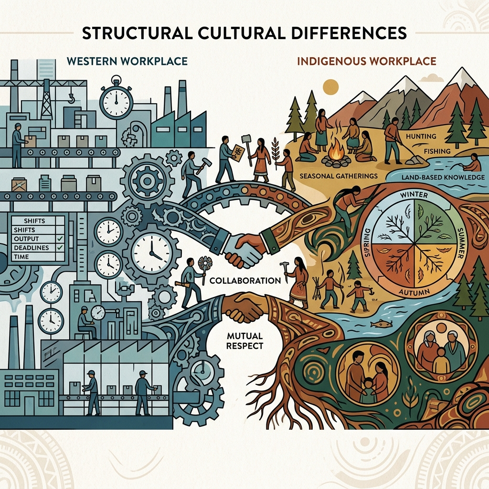

<!--Copyright (c) 2026 Mustafa Uzumeri. All rights reserved.-->

<figure class="blog-hero">
  
</figure>

# The Research Agenda

## Bridge Candidates for the Four Unsolved Dimensions of Cultural Mismatch

**Bicultural Integration Exchange — White Paper Series**
**Paper 4 of 5**

**Author:** Mustafa Uzumeri
**Date:** June 2026
**Version:** 1.2

**Series context:** This paper covers dimensions 10–13 (Urgency Hierarchy, Learning & Knowledge Validation, Place & Geographic Rootedness, Credential & Presentation Gatekeeping) of the thirteen-dimension taxonomy introduced in Paper 1, *Thirteen Dimensions of Cultural Mismatch*.

---

### Abstract

Papers 2 and 3 in this series address the dimensions of cultural mismatch for which validated industry solutions already exist: Crew Resource Management and the Toyota Production System bridge the seven communication and conflict dimensions (Paper 2), while AI scheduling, video-based training, and digital error-proofing bridge the scheduling collision (Paper 3).

This paper addresses the four dimensions for which bridge candidates have been identified but not yet designed, tested, or deployed as bicultural tools. These are the **open questions** — the dimensions where the research is clear about the problem but the solutions require further development:

- **Dimension 10: The Urgency Hierarchy** — when production urgency and relational urgency collide
- **Dimension 11: Learning & Knowledge Validation** — when the worker has the skill but not the credential
- **Dimension 12: Place & Geographic Rootedness** — when the job requires leaving the community
- **Dimension 13: Credential & Presentation Gatekeeping** — when the résumé format filters out the candidate before a human sees them

For each dimension, this paper defines the mismatch, identifies specific bridge candidates from validated industry practice, and proposes a research and development agenda. Paper 5 (*From Theory to Practice*) translates this agenda into specific study designs suitable for graduate research and university-industry consortia.

---

### Table of Contents

1. [Relationship to the Series](#1-relationship-to-the-series)
2. [Dimension 10: The Urgency Hierarchy](#2-dimension-10-the-urgency-hierarchy)
3. [Dimension 11: Learning and Knowledge Validation](#3-dimension-11-learning-and-knowledge-validation)
4. [Dimension 12: Place, Land, and Geographic Rootedness](#4-dimension-12-place-land-and-geographic-rootedness)
5. [Dimension 13: Credential and Presentation Gatekeeping](#5-dimension-13-credential-and-presentation-gatekeeping)
6. [Bridge Candidates Summary](#6-bridge-candidates-summary)
7. [Connection to the Three Pilot Proposals](#7-connection-to-the-three-pilot-proposals)
8. [Platform Governance: The Aggregator Trap](#8-platform-governance-the-aggregator-trap)
9. [Key References](#9-key-references)
10. [Conclusion](#10-conclusion)

---

## 1. Relationship to the Series

Paper 1 (*Thirteen Dimensions of Cultural Mismatch*) establishes a taxonomy of thirteen dimensions organized into three layers:

| Layer | Dimensions | Status | Covered In |
|---|---|---|---|
| Communication & Conflict | 1–7 | **Proven bridges** (CRM, TPS) | Paper 2 |
| Scheduling & Family | 8–9 | **Solvable now** (AI scheduling, video SOPs) | Paper 3 |
| **Open Questions** | **10–13** | **Bridge candidates identified; research needed** | **This paper** |

The four dimensions in this paper share a common characteristic: unlike dimensions 1–9, where existing industry tools can be adapted with relatively modest effort, these dimensions require **new frameworks, new tools, or new institutional arrangements** that do not yet exist in their bicultural form.

---

## 2. Dimension 10: The Urgency Hierarchy

### The Mismatch

Western industrial workplaces operate on an urgency hierarchy driven by **production, finance, and physical safety**: delivery deadlines, customer commitments, equipment downtime, and injury risk define what counts as "urgent." These priorities are explicit, quantified, and embedded in KPIs.

Many Indigenous worldviews operate on an urgency hierarchy driven by **relational well-being, community need, and spiritual obligation**: a community member in crisis, a ceremony that must be attended, a family obligation that cannot wait. These priorities are equally real and equally urgent — they are simply not legible within the Western KPI framework.

### How It Collides

- A worker leaves mid-shift because a family member on the reserve has been hospitalized. The supervisor sees "job abandonment." The worker sees "my cousin needs me — nothing else matters right now"
- A worker declines overtime during a production crunch because it conflicts with a community event. The supervisor sees "doesn't understand priorities." The worker sees "my community *is* my priority"
- In emergency response, Western protocols prioritize asset protection and operational continuity. Indigenous workers may prioritize relational and community well-being — leading to different assessments of what requires immediate action

### Why It Matters

This dimension is the most emotionally charged. When a supervisor tells a worker that a production deadline matters more than a family crisis, the message the worker hears — whether intended or not — is: "your family doesn't matter here." Both sides believe they are responding to genuine emergencies; they are applying different frameworks for what constitutes one.

### Bridge Candidates

| Bridge Candidate | Origin | How It Could Bridge |
|---|---|---|
| **Tiered Priority Systems** | Incident Command System (ICS); military; CRM | Explicit, published frameworks defining urgency levels and expected responses. Could include a "family/community emergency" tier with defined protocols — replacing ad hoc supervisor judgment with structured accommodation |
| **Two-Eyed Seeing (Etuaptmumk)** | Mi'kmaq Elder Albert Marshall | A framework for seeing with Indigenous knowledge from one eye and Western knowledge from the other. The workplace could maintain its production urgency framework *and* recognize relational urgency as a legitimate parallel |
| **Mutual Aid Agreements** | Emergency management, cooperative business models | Cross-team agreements for rapid coverage when a worker must respond to a personal emergency. The system absorbs the disruption rather than punishing the individual |
| **Holistic Wellness Programs** | Occupational health; progressive mining companies | Programs treating worker well-being (cultural, spiritual, relational) as a production input. If the worker's family is in crisis, the worker is not productive — addressing the crisis *is* addressing productivity |

### Research Agenda

This is the most conceptually challenging dimension because it requires genuine bilateral framework design — not adaptation of an existing Western tool, but the creation of a new framework that holds both urgency systems as legitimate. The Two-Eyed Seeing approach offers the most promising theoretical foundation, but no workplace has yet operationalized it into a decision protocol.

**Key questions for investigation:**
1. Can a tiered priority system be designed that includes relational urgency without creating a perception of "special treatment"?
2. What does a Two-Eyed Seeing urgency protocol look like in practice on a production floor?
3. How do supervisors learn to recognize and respond to relational urgency without requiring workers to justify their emergencies?

---

## 3. Dimension 11: Learning and Knowledge Validation

### The Mismatch

Western workplace training is **credentialed, written, classroom-based, and assessed by standardized tests.** The SOP is a written document. The training record is a signed form. The entire knowledge infrastructure assumes literacy, formal education, and comfort with written assessment.

Indigenous learning traditions are **experiential, observational, oral, and apprenticeship-based.** Knowledge is transmitted through storytelling, demonstration, and supervised practice. Competence is validated by the community's recognition of ability, not by a certificate.

### How It Collides

- A worker who can perform a complex composite layup flawlessly may struggle with a 30-page written SOP — not because they lack competence, but because the format doesn't match their learning pathway
- Hiring processes that require specific certificates may exclude workers with equivalent skills acquired through community practice or traditional building
- Written exams may test reading comprehension as much as technical knowledge
- The legacy of residential schools means Western educational institutions carry emotional weight that non-Indigenous workers do not experience

### Why It Matters

The worker has the *skill* but not the *credential*, and the system recognizes only the credential. The employer sees "skills gap." The reality is a *format gap*.

### Bridge Candidates

| Bridge Candidate | Origin | How It Could Bridge |
|---|---|---|
| **Visual Management / Pictorial SOPs** | Toyota Production System | Replace text-heavy SOPs with photo-sequenced, diagram-rich, literacy-independent work instructions. Designed to be understandable "at a glance, without speaking a word" |
| **Prior Learning Assessment and Recognition (PLAR)** | Canadian apprenticeship system | Formal pathway for experienced workers to demonstrate competence and challenge certification exams. Evaluates *what you can do*, not *where you learned it* |
| **Competency-Based Assessment (CBA)** | Modern trades training; military | Assesses task performance through hands-on demonstration, not written exams. Measures ability, not literacy |
| **Training Within Industry (TWI)** | U.S. War Manpower Commission (1940s); Toyota | A structured "show-do-review" on-the-job training methodology — an apprenticeship model Western industry already validates |
| **Dual-Register SOPs** | Bicultural Integration Exchange (proposed) | SOPs in both expository technical register and relational narrative register. The narrative conveys the *why*; the procedure conveys the *how* |
| **Digital e-Portfolios** | Future Skills Centre; modern apprenticeship | Photo/video evidence of demonstrated competence replaces paper-based training records |
| **Video-Based Work Instructions** | DeepHow, Whale (Alice AI) | AI-generated video SOPs from process recordings — literacy-independent, culturally neutral knowledge transfer (see Paper 3, §5) |

### Research Agenda

This dimension has the strongest existing bridge candidates — PLAR, CBA, TWI, and video SOPs are all validated tools that could be adapted for bicultural use with relatively modest effort. The research priority is testing whether these tools work *better* for Indigenous learners than standard text-based approaches, and developing the dual-register SOP methodology.

**Key questions for investigation:**
1. Do video-based SOPs produce equivalent or better comprehension and retention for Indigenous workers compared to text-based SOPs?
2. Can PLAR assessments be adapted to recognize cultural skills (e.g., hide tanning → composite layup) without trivializing either tradition?
3. What does a dual-register SOP pair look like for a specific manufacturing process — and does the narrative register actually improve internalization?

---

## 4. Dimension 12: Place, Land, and Geographic Rootedness

### The Mismatch

Western employment assumes **geographic mobility**: go where the jobs are, relocate for advancement, commute as the market requires.

Many Indigenous peoples maintain deep, constitutive ties to **specific territories** — reserves, traditional lands, seasonal harvesting areas, sacred sites. The community is not portable. The Elder who provides guidance, the ceremonies that maintain spiritual health, the family network that provides childcare — these exist in a specific place and cannot be replicated in a city apartment.

### How It Collides — Reserve-Based Workers

- The manufacturing job is in Mississauga; the worker's community is on Six Nations, 90 minutes away. The commute separates the worker from their support system every day
- Urban relocation brings cultural isolation, loss of identity markers, disconnection from Elders and ceremony, and housing insecurity
- Career advancement often requires geographic mobility. A worker who cannot relocate is perceived as "not ambitious"
- The social support networks that help a worker navigate the first 90 days are geographically distant

### How It Collides — Urban Indigenous Workers

For the over half of Canada's Indigenous population who already live in cities and towns (see Paper 1, §5), geographic distance to the worksite is not the primary barrier. Instead, the place dimension manifests as **cultural infrastructure scarcity**:

- The worker is physically close to the plant but culturally isolated — Friendship Centres and urban Elder programs may be across the city, under-resourced, and operating on limited schedules
- The worker's sense of *place* attachment may be to a distant home community that they visit periodically. These visits are not recreational — they are identity-sustaining — but they require travel that looks like "time off" to the employer
- The worker may be disconnected from place entirely — neither integrated into an urban Indigenous community nor connected to a home reserve — and the workplace becomes the only structured environment in their life, increasing the stakes of every workplace friction
- Housing insecurity in urban centres (Indigenous households are overrepresented in precarious housing) compounds every other dimension: a worker who is uncertain about next month's rent has less resilience for navigating cultural mismatch

The key insight is that **geographic proximity does not eliminate Dimension 12 — it changes its character** from physical distance to cultural infrastructure access.

### Why It Matters

Geographic rootedness most clearly illustrates the **structural** nature of these barriers. For reserve-based workers, every accommodation (long commute, urban relocation, separation from community) carries a cumulative cost that eventually overwhelms the economic benefit of the job. For urban Indigenous workers, the cost is subtler but equally real: the absence of ambient cultural support means the worker must *actively seek out* what reserve-based workers receive passively — and that effort competes with the demands of the job.

### Bridge Candidates

| Bridge Candidate | Origin | How It Could Bridge |
|---|---|---|
| **FIFO / DIDO Rotation** | Mining, oil & gas (Canada, Australia) | Workers maintain community residence while accessing distant employment. Extended rotation models (14/7, 21/7) provide concentrated work periods followed by substantial community time |
| **Satellite Manufacturing** | Aerospace supply chain | Locate smaller production facilities closer to Indigenous communities. Viable for labour-intensive assembly, sub-assembly, and component manufacturing |
| **Urban Indigenous Support Networks** | Friendship Centres (NAFC) | Partner with existing urban Indigenous organizations for cultural continuity: access to Elders, ceremony, language, and community |
| **Transportation & Housing Support** | Mining industry standard | Employer-provided or subsidized transportation from community to worksite. Reduces the economic penalty of geographic distance |
| **Virtual Cultural Connection** | Telehealth; COVID-era adaptation | Technology-enabled access to Elders, ceremony (where appropriate), and community governance for workers at distant worksites |

### Research Agenda

The geographic dimension is the most capital-intensive to address. FIFO rotation requires employer investment in accommodation and scheduling infrastructure; satellite manufacturing requires capital expenditure on new facilities. The research priority is establishing the *economic case* for these investments — showing that the retention cost of *not* accommodating geographic rootedness exceeds the cost of the accommodation.

**Key questions for investigation:**
1. What is the actual retention cost differential between Indigenous workers who commute >60 minutes vs. those who live within 30 minutes of the worksite?
2. For which manufacturing processes is satellite production economically viable when Indigenous workforce retention is factored in?
3. Can FIFO models (standard in mining) be adapted for aerospace manufacturing, and at what cost?

---

## 5. Dimension 13: Credential and Presentation Gatekeeping

### The Mismatch

Standard corporate recruitment depends on Applicant Tracking Systems (ATS) that parse, score, and rank résumés based on keyword matching, credential verification, chronological employment history, and standardized formatting. This system is structurally biased against Indigenous candidates:

- **Employment gaps** (seasonal harvesting, community caregiving, ceremonial duties) are flagged as risk indicators
- **Non-standard job titles** ("Community Liaison, Band Council") don't match ATS keyword taxonomies
- **Narrative work histories** are incompatible with the bullet-point, quantified-achievement format algorithms expect
- **Self-promotion style** differs: many Indigenous cultures value humility and collective achievement over individual self-promotion

As Dr. Linda Manyguns (Mount Royal University) observes: *"Non-Aboriginal people have way better CVs/résumés than us, hence they often take jobs that were intended for Indigenous people."*

### The Transferable Skills Problem

Dr. Manyguns raises a related challenge: matching **transferable skills from the culture** to their industrial equivalents. A hunter who can navigate extreme terrain, manage equipment in isolation, and coordinate multi-day logistics campaigns has skills that map directly to manufacturing roles — but neither the candidate nor the employer has a shared language for that translation.

This is precisely the problem the **Double-Blind Bicultural Content Match Pilot** was designed to solve. The pilot's AI Translation Engine maps narrative experiential histories to standard industrial competency tags, and the match is presented double-blind: the employer sees translated competencies without knowing the candidate's identity; the candidate sees a relational profile of the workplace. Identity is disclosed only upon mutual opt-in.

### Regional Variation in Transferable Skills

The skills mapping is not uniform. The translation engine must be regionally calibrated:

| Location | Cultural Skill Base | Industrial Translation |
|---|---|---|
| **Northern communities** | Cold-weather logistics, equipment isolation maintenance, long-range navigation | Remote operations, FIFO safety, fleet management, environmental monitoring |
| **Blackfoot (Plains)** | Seasonal resource management, large-scale coordination, ceremonial governance | Supply chain logistics, project management, quality governance |
| **Great Lakes (Anishinaabe / Haudenosaunee)** | Agricultural planning, matrilineal governance, multi-season crop cycles | Production scheduling, inventory management, consensus-based team leadership |
| **Urban Indigenous** | Hybrid work histories mixing formal employment with cultural and community roles; partial credentials (some college, some trades exposure); navigating multiple institutional systems simultaneously | The translation challenge is different: not cultural-to-industrial mapping, but *format conversion* of hybrid experiential-plus-formal histories into ATS-parseable profiles. The AI engine must handle partial credentials, mixed-register work narratives, and employment gaps that reflect urban realities (housing instability, care obligations, cultural reconnection) rather than seasonal cycles |

### Bridge Candidates

| Bridge Candidate | Origin | How It Could Bridge |
|---|---|---|
| **Double-Blind Matching** | DeeperPoint Cosolvent; Bicultural Integration Exchange pilot | AI translates narrative work histories into standardized competency profiles. Cosolvent's **Content Match Story** pattern delivers a three-stage, privacy-respecting narrative: (1) an anonymous match argument explaining why the pairing is promising, (2) a named introduction upon mutual opt-in, and (3) a deal-context summary as engagement deepens. Both parties review anonymized match stories before identity disclosure |
| **Blind Résumé Screening** | Progressive HR practice; some Canadian federal departments | Removes name, address, and institution from applications. Reduces bias but doesn't solve the format/vocabulary problem |
| **Competency Demonstration Hiring** | Skilled trades; military; some tech companies | Practical demonstration replaces résumé-based screening |
| **AI Competency Translation** | Emerging practice; Bicultural Integration Exchange pilot | AI maps experiential narratives to industrial skill taxonomies, producing profiles ATS systems can parse |
| **PLAR** | Canadian apprenticeship system | Formal pathway for recognizing non-credentialed experience |

### What This Looks Like in Practice

To make the gatekeeping problem concrete, consider how the same candidate appears under conventional HR screening versus bicultural competency translation:

#### Profile A: Conventional CV (Filtered Out by Standard ATS)

> **Employment Gaps**: Unemployed November 2024 to April 2025; Unemployed November 2023 to April 2024.
>
> **Experience**:
> - *Seasonal Harvester & Family Caregiver* (November–April, multiple years): Gathered resources, managed family logistics, operated local snowmobiles and transport.
> - *Community Liaison, Band Council* (Part-time, 2023): Handled disputes, organized local meetings, distributed community notices.
> - *Construction Laborer* (Seasonal, 2021–2022): General site cleanup, hand tool operations.
>
> **Certifications**: Standard high school diploma, driver's license.
>
> **ATS Verdict**: *REJECT. High risk due to chronic seasonal gaps. Missing direct industrial logistics experience or enterprise resource planning (ERP) system credentials.*

#### Profile B: Translated Bicultural Match Story (Double-Blind)

> **Candidate Competency Translation**:
> - **Variable-Condition Resource Logistics**: Managed seasonal supply networks, cold-weather transport operations, and community equipment inventory under extreme environmental constraints. Equivalent to multi-domain logistics coordination and fleet management.
> - **Multi-Stakeholder Relations**: Coordinated community communications, resource allocation, and dispute resolution across band council leadership, family units, and regional government representatives. Equivalent to cross-functional stakeholder management.
> - **Asset Stewardship & Safety**: Maintained remote operational machinery under isolated conditions, executing safety checkups with zero equipment loss.
>
> **30-Day Onboarding Blueprint**:
> - *Week 1–2 (Technical Integration)*: Match candidate's spatial planning and equipment upkeep experience with the company's tool control protocols.
> - *Week 3–4 (Relational Checkpoint)*: Introduce the local Shared Facilitator to coordinate communication between the team lead and the candidate, ensuring smooth transition dynamics.
> - *Temporal Accommodation*: Candidate is backed by a peer-to-peer capacity rotation pool, allowing time away for seasonal community harvests without interrupting shop-floor output.

The same person. The same skills. Profile A is rejected before a human sees it. Profile B produces a match, an onboarding plan, and a retention structure — all before the first day of work.

Note that the match does not merely produce a *placement* — it generates a **customized 30-day onboarding blueprint** that pairs the specific competency translation with scheduling accommodations and a Shared Facilitator check-in structure. This is a fundamental design difference from standard placement services, which end at the hire decision. The onboarding blueprint addresses the 90-day attrition problem directly: it builds the support structure *into* the match itself.

### Research Agenda

Dimension 13 is the highest-priority research target because it operates *before* the worker enters the workplace. No retention tool matters if candidates cannot get hired. The Double-Blind Match Pilot proposal is already drafted and represents the most developed bridge design in the entire series.

**Key questions for investigation:**
1. Do anonymized, AI-translated competency profiles produce higher callback rates from hiring managers than standard Indigenous résumés?
2. Can the AI translation engine be validated for accuracy across all four location-based skill profiles (Northern, Plains, Great Lakes, Urban) — including the hybrid formal-plus-experiential histories common among urban Indigenous candidates?
3. What is the consent and data sovereignty architecture required for community-controlled narrative profiles (OCAP compliance)?

---

## 6. Bridge Candidates Summary

| Bridge Candidate | Origin | Addresses Dimension(s) | Development Priority |
|---|---|---|---|
| **Double-Blind Matching + AI Competency Translation** | DeeperPoint / Bicultural Integration Exchange | 13 (Credential Gatekeeping) | **Highest** — pilot proposal drafted; #1 pre-employment barrier |
| **Visual SOPs + Video Work Instructions** | Toyota TPS; DeepHow | 11 (Learning) | **High** — complements Paper 3 technology; testable within 6 months |
| **Competency-Based Assessment + PLAR** | Canadian trades system | 11 (Learning), 13 (Gatekeeping) | **High** — existing Canadian infrastructure needs cultural adaptation |
| **Training Within Industry (TWI)** | U.S. WWII-era; Toyota | 11 (Learning) | **High** — proven show-do-review methodology |
| **Dual-Register SOPs** | Bicultural Integration Exchange (proposed) | 11 (Learning) | **High** — directly supports the Documentation Pilot |
| **Tiered Priority Systems** | ICS, military, CRM | 10 (Urgency) | **Medium** — extends CRM from Paper 2 |
| **Two-Eyed Seeing Framework** | Mi'kmaq tradition | 10 (Urgency), all dimensions | **Medium** — meta-framework requiring genuine bilateral design |
| **FIFO / DIDO Rotation** | Mining, oil & gas | 12 (Place) | **Medium** — well-proven in mining; needs aerospace adaptation |
| **Satellite / Distributed Manufacturing** | Aerospace supply chain | 12 (Place) | **Lower** — significant capital investment; longer-term |
| **Urban Indigenous Support Networks** | Friendship Centres | 12 (Place) | **Lower** — partnership opportunity, not process redesign |

---

## 7. Connection to the Three Pilot Proposals

Each of the four dimensions connects to specific pilot proposals already developed for the Bicultural Integration Exchange:

| Pilot Proposal | Primary Dimension(s) | How It Advances the Research |
|---|---|---|
| **Bicultural Documentation Pilot** | 11 (Learning) | Develops and tests dual-register SOPs and video-based work instructions in a real manufacturing setting. Produces the first examples of bicultural training materials for AS9100D-compliant aerospace processes |
| **Double-Blind Bicultural Content Match Pilot** | 13 (Credential Gatekeeping) | Builds and validates the AI narrative-to-competency translation engine. Tests whether double-blind match stories produce higher callback rates and better 90-day retention than standard résumés |
| **Platform Commons Pilot** | 12 (Place), 13 (Gatekeeping) | Develops the OCAP-compliant data sovereignty architecture for community-controlled candidate profiles. Tests the Ostrom-based governance model for the matching platform |

---

## 8. Platform Governance: The Aggregator Trap

The thirteen dimensions addressed in this series all describe friction at the *individual workplace level* — between a worker and an employer, mediated by scheduling, training, communication, and hiring systems. But a matching platform that connects Indigenous workers with manufacturing employers introduces a governance challenge at a different level entirely: **who controls the platform itself?**

Standard digital matching platforms operate under an extractive model that the DeeperPoint framework calls the **Aggregator Trap**. A central corporate intermediary controls candidate data, packages and monetizes profiles, and sets terms of service unilaterally. For Indigenous communities, this extractive architecture represents a direct threat to OCAP data sovereignty — the community loses Ownership, Control, Access, and Possession of its members' career profiles and cultural data the moment it enters a commercial SaaS database.

The Platform Commons Pilot addresses this by applying **Elinor Ostrom's eight principles for governing common-pool resources** to the matching platform itself:

| Ostrom Principle | Platform Application |
|---|---|
| Clearly defined boundaries | Only certified community members and committed employers access the commons pool |
| Congruence with local conditions | Wage minimums, ceremony calendar windows, and scheduling limits are set by each local community |
| Collective-choice arrangements | Rules are made by participant assemblies, not corporate terms of service |
| Monitoring by accountable agents | Shared Facilitators act as community-appointed monitors on the shop floor |
| Graduated sanctions | Employers who violate scheduling accommodations or safety playbooks receive progressive warnings before suspension from matching |
| Low-cost conflict resolution | Disputes are resolved locally through facilitated dialogue, not centralized ticketing |
| Recognition of self-governance | Federal and provincial authorities recognize the community's right to govern its own data |
| Nested enterprises | Local nodes federate into regional and national networks without centralizing data |

Candidate registries are contractually and physically separated from corporate databases — hosted on sovereign, community-controlled server nodes, or protected by localized encryption keys held strictly by community custodians. Employers receive only temporary, read-only access to anonymized match profiles during the matching process. All personally identifiable information is masked and cryptographically protected.

This governance architecture is not addressed by any of the thirteen dimensions of cultural mismatch — it sits at the *meta-level* of platform design. But without it, every bridge tool proposed in this series could be captured by an extractive intermediary, reproducing the power asymmetry the tools were designed to correct. The full design is documented in the **Platform Commons Pilot** proposal.

---

## 9. Key References

| Source | Relevance |
|---|---|
| **Hall, E. T.** *Beyond Culture* (1976) | Monochronic/polychronic time orientation framework |
| **Hofstede, G.** Cultural Dimensions | Structural framework for cultural mismatch analysis |
| **Marshall, A.** Two-Eyed Seeing (Etuaptmumk) | Mi'kmaq integrative framework for dual knowledge systems |
| **Mining Industry Human Resources Council (MiHR)** | Indigenous recruitment/retention in Canadian mining; FIFO models |
| **Future Skills Centre (FSC-CCF)** | Competency-based assessment and PLAR for Indigenous workers |
| **Indspire** | Indigenous education and skills training research |
| **Training Within Industry (TWI) Institute** | "Job Instruction" show-do-review methodology |
| **Lean Enterprise Institute** — Visual Management | Toyota visual workplace methodology |
| **National Association of Friendship Centres (NAFC)** | Urban Indigenous support infrastructure |
| **ICT (Indigenous Corporate Training Inc.)** | Practical Indigenous workplace inclusion resources |
| **Canadian Apprenticeship Forum (CAF-FCA)** | Competency-based apprenticeship research |
| **Dr. Linda Manyguns** (Mount Royal University) | CV gatekeeping, transferable skills, regional variation |
| **Double-Blind Bicultural Content Match Pilot** | AI-driven competency translation and anonymous matching |

---

## 10. Conclusion

The four dimensions addressed in this paper — urgency hierarchy, learning and knowledge validation, geographic rootedness, and credential gatekeeping — represent the **frontier** of bicultural integration work. Unlike dimensions 1–9, where existing industry tools can be adapted with relatively modest effort, these dimensions require new frameworks, new tools, and new institutional arrangements.

The bridge candidates are identified. The pilot proposals are drafted. What is needed now is the disciplined research to test whether these bridges work — and to design the ones that don't yet exist.

Paper 5 (*From Theory to Practice*) translates this agenda into specific study designs: graduate-level research that can be done with brains, time, and minimal cost, and consortium-level pilots that bring universities, industry partners, and Indigenous communities together to build and test the solutions.

---

### Series Navigation

| Paper | Title | Dimensions |
|---|---|---|
| **1** | *Thirteen Dimensions of Cultural Mismatch* | All 13 (executive summary) |
| **2** | *Bridging the Conflict Divide* | 1–7 (Communication & Conflict) |
| **3** | *Smart Scheduling and the Fungible Workforce* | 8–9 (Time, Family) |
| **4 (this paper)** | *The Research Agenda* | 10–13 (Urgency, Learning, Place, Credential Gatekeeping) |
| **5** | *From Theory to Practice* | Research implementation roadmap |

---

<!--Copyright (c) 2026 Mustafa Uzumeri. All rights reserved.-->
