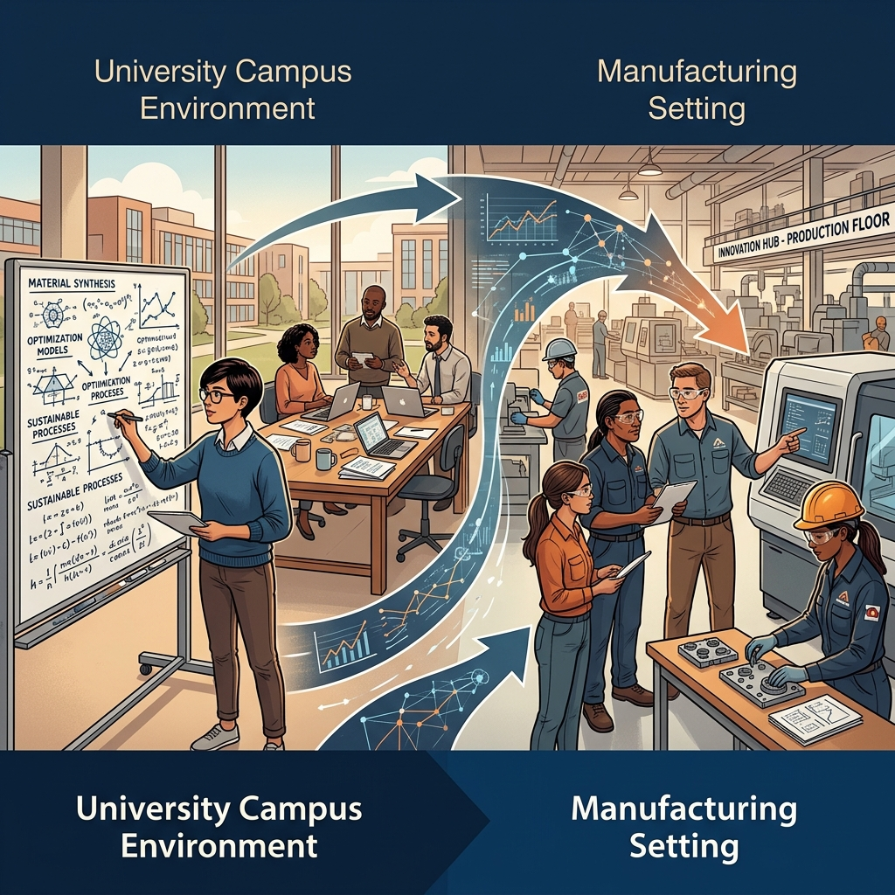

<!--Copyright (c) 2026 Mustafa Uzumeri. All rights reserved.-->

<figure class="blog-hero">
  
</figure>

# From Theory to Practice

## A Research Implementation Roadmap for Bicultural Workforce Integration

**Bicultural Integration Exchange — White Paper Series**
**Paper 5 of 5**

**Author:** Mustafa Uzumeri
**Date:** June 2026
**Version:** 2.0

**Series context:** This paper translates the bridge candidates identified in Papers 2–4 into specific, actionable research designs organized in two tiers: graduate-level studies (minimal cost) and university-industry consortium pilots (funded research).

---

### Abstract

Papers 2–4 in this series identify validated industry practices that could bridge the thirteen dimensions of cultural mismatch driving Indigenous worker attrition in Canadian manufacturing. But identifying a bridge candidate is not the same as proving it works. This paper provides the **research implementation roadmap** — specific study designs, organized into two tiers, that translate theory into testable practice.

**Tier 1** studies can be completed by a single graduate student or Masters group project with minimal out-of-pocket cost. They require brains, time, and access to participants — not labs, equipment, or industry partnerships. A PhD student could build a thesis around any of these studies; a Masters team could complete the shorter ones in a single term.

Critically, several of these studies can be **dramatically accelerated or strengthened by AI tools** — LLM-assisted content analysis, synthetic test data generation, automated literature screening, and AI-powered instrument design. Each study now includes an **AI Acceleration Note** describing how modern AI tools could compress timelines, increase statistical power, or produce richer deliverables — while respecting OCAP constraints on the use of AI with cultural data.

**Tier 2** studies require university-industry research consortia — funded partnerships between universities, manufacturers, and Indigenous communities. These studies build and test pilot solutions, collect longitudinal data, and produce the evidence base that would justify broader industrial deployment.

The goal is to create an actionable menu from which universities, non-profits, and funding agencies can select studies that match their capacity, expertise, and partnerships.

---

### Table of Contents

1. [How to Use This Roadmap](#1-how-to-use-this-roadmap)
2. [Tier 1: Graduate-Level Studies (Minimal Cost)](#2-tier-1-graduate-level-studies-minimal-cost)
3. [Tier 2: University-Industry Consortium Pilots](#3-tier-2-university-industry-consortium-pilots)
4. [Sequencing: What Comes First](#4-sequencing-what-comes-first)
5. [Institutional Homes](#5-institutional-homes)
6. [OCAP Compliance: Non-Negotiable Research Ethics](#6-ocap-compliance-non-negotiable-research-ethics)
7. [Conclusion](#7-conclusion)

---

## 1. How to Use This Roadmap

Each study is described with:
- **Research question**: What the study asks
- **Method**: How the study would be conducted
- **Dimension(s)**: Which of the thirteen dimensions it addresses
- **Output**: What the study produces
- **Duration**: Estimated time to completion
- **AI acceleration**: How AI tools could compress timelines, increase power, or enrich outputs — with OCAP constraints flagged
- **Tier justification**: Why it belongs in Tier 1 (low cost) or Tier 2 (funded consortium)

Studies are cross-referenced to the white papers that define the relevant bridge candidates.

---

## 2. Tier 1: Graduate-Level Studies (Minimal Cost)

These studies require brains, time, and access to willing participants. They do not require industry partnerships, specialized equipment, or significant funding. Any university with an Indigenous studies program, an engineering faculty, or a business school could host them.

---

### Study 1.1: The Silence Audit

**Dimensions:** 1 (Silence Misread), 2 (Assertiveness Paradox)
**Paper reference:** Paper 2, §3.1–3.2

| Field | Detail |
|---|---|
| **Research question** | How frequently do manufacturing supervisors misinterpret Indigenous silence as disengagement, and what are the consequences? |
| **Method** | Semi-structured interviews with 15–20 Indigenous manufacturing workers and 10–15 supervisors from the same worksites. Content analysis of incident reports and performance reviews for language indicative of silence misinterpretation ("disengaged," "unresponsive," "not participating"). |
| **Output** | A coded taxonomy of silence-misread incidents, their documented consequences (warnings, terminations, near-misses), and worker perceptions of what they were actually doing (reflecting, processing, showing respect) |
| **Duration** | 6–9 months (Masters thesis) |
| **Ethics** | Standard research ethics board (REB) approval. Interview protocols co-designed with Indigenous advisory committee. OCAP principles apply to all cultural data |
| **AI acceleration** | **Moderate.** Automated transcription (Whisper) eliminates weeks of manual work. LLM-assisted content analysis scans incident reports and performance reviews for bias-indicative language ("disengaged," "unresponsive," "not participating") at 10x the speed of manual coding — producing a first-pass taxonomy for human refinement. LLM-powered theme extraction across 30+ interview transcripts surfaces contradictions between worker and supervisor accounts and proposes coded themes as drafts. Could compress analysis phase from 2–3 months to 2–3 weeks; total duration to **4–5 months**. *OCAP: Interview transcripts require on-premise AI processing or community-approved cloud access* |

---

### Study 1.2: ATS Résumé Audit

**Dimensions:** 13 (Credential Gatekeeping)
**Paper reference:** Paper 4, §5

| Field | Detail |
|---|---|
| **Research question** | Does ATS-standard résumé formatting systematically disadvantage Indigenous candidates with equivalent competencies? |
| **Method** | Correspondence audit study. Create 20 matched pairs of fictitious candidate profiles — one in standard Western résumé format (bullet points, action verbs, quantified achievements, continuous employment) and one in narrative experiential format (the same skills described in relational, contextual language with seasonal employment gaps). Submit both to 40–50 online job postings across manufacturing, logistics, and trades sectors. Measure callback rates. |
| **Output** | Quantified callback rate differential between format styles, controlling for competency equivalence. Evidence of whether the barrier is *content* (skills) or *format* (presentation) |
| **Duration** | 4–6 months (Masters group project or thesis component) |
| **Ethics** | Standard audit study ethics. Fictitious candidates — no real applicants disadvantaged. Published methodology follows established correspondence audit protocols (Oreopoulos 2011; Banerjee et al. 2018) |
| **AI acceleration** | **High.** LLM-generated synthetic résumés scale from 20 matched pairs to 100+, systematically varying format style, employment-gap patterns, and regional skill bases — increasing statistical power by an order of magnitude. Automated ATS submission scripts eliminate weeks of manual data entry. A new sub-question becomes testable: does the ATS *algorithm itself* reproduce format bias, or does bias enter only at the human-review stage? If an ATS vendor or open-source ATS is used in a lab setting, profiles can be scored algorithmically without reaching human recruiters — isolating algorithmic from human bias. Could compress to **2–3 months** with dramatically stronger findings. *No OCAP constraint — all profiles are synthetic* |

---

### Study 1.3: Video vs. Text SOP Comprehension

**Dimensions:** 11 (Learning & Knowledge Validation)
**Paper reference:** Paper 3, §5; Paper 4, §3

| Field | Detail |
|---|---|
| **Research question** | Do video-based work instructions produce equivalent or better task comprehension and retention for Indigenous learners compared to text-based SOPs? |
| **Method** | Controlled comparison. Recruit 30–40 participants (mixed Indigenous and non-Indigenous, balanced for prior manufacturing experience). Teach a standardized assembly task using (a) text-based SOP, (b) video-based SOP, and (c) video + narrative-register voiceover. Measure task completion accuracy, time-to-competence, and 2-week retention. |
| **Output** | Quantified comprehension and retention data across three delivery formats. Interaction effects between delivery format and participant background |
| **Duration** | 6–9 months (Masters thesis or PhD chapter) |
| **Ethics** | Standard REB. No real workplace consequences for participants. Compensation for time |
| **AI acceleration** | **Low.** This is a human-subjects experiment measuring real learning and retention — AI cannot simulate that. Minor acceleration: AI video tools (DeepHow-style) can auto-generate the video SOP from a text SOP, ensuring identical content across conditions and saving production time. AI vision could automate task-completion scoring. No change to study design or duration recommended |

---

### Study 1.4: Urgency Hierarchy Mapping

**Dimensions:** 10 (Urgency Hierarchy)
**Paper reference:** Paper 4, §2

| Field | Detail |
|---|---|
| **Research question** | How do Indigenous workers and Western supervisors rank the same set of workplace urgency scenarios — and where do the rankings diverge? |
| **Method** | Scenario-based card sort. Present 20 workplace urgency scenarios (production deadlines, safety incidents, family emergencies, community crises, ceremonial obligations) to 15 Indigenous workers and 15 supervisors. Ask each participant to rank them by urgency and explain their reasoning. Analyze for systematic divergence patterns. |
| **Output** | A dual urgency map showing where the two frameworks align (safety), where they diverge (family vs. production), and where they are incommensurable (spiritual obligations). Foundation for designing a Two-Eyed Seeing urgency protocol |
| **Duration** | 4–6 months (Masters thesis) |
| **Ethics** | Standard REB. Scenario-based — no real consequences. Co-designed with Indigenous advisory committee |
| **AI acceleration** | **Moderate.** LLM-generated scenarios produce a richer, more nuanced set of urgency situations — including edge cases a researcher might miss (e.g., "a co-worker's child is hospitalized and asks you to cover" vs. "a community Elder's child is hospitalized and the Elder asks you to attend"). An LLM-simulated pre-test — prompted alternately as "a manufacturing supervisor" and "an Indigenous worker with strong cultural ties" — identifies uninformative scenarios before human recruitment, sharpening the instrument. Post-collection, ML clustering identifies systematic divergence patterns faster than manual analysis. Could compress to **3–4 months** with better data quality |

---

### Study 1.5: Transferable Skills Translation Validation

**Dimensions:** 13 (Credential Gatekeeping)
**Paper reference:** Paper 4, §5

| Field | Detail |
|---|---|
| **Research question** | Can an AI system accurately translate Indigenous experiential narratives into standardized industrial competency tags? |
| **Method** | Collect 20–30 experiential work narratives from Indigenous community members (with consent, under OCAP). The sample must include **urban Indigenous participants** with hybrid work histories (mixed formal employment, partial credentials, and cultural/community roles) alongside reserve-based participants with primarily experiential histories — the translation engine must handle both. Use an LLM-based translation engine to convert each narrative into a structured competency profile. Have 5–10 HR professionals and 5–10 Indigenous community validators independently rate the accuracy, completeness, and cultural appropriateness of the translations. |
| **Output** | Accuracy metrics for AI-mediated competency translation. A validated (or rejected) prototype of the core engine behind the Double-Blind Match Pilot. Documented failure modes (what the AI gets wrong and why) |
| **Duration** | 9–12 months (PhD thesis chapter) |
| **Ethics** | OCAP principles mandatory. Narrative data owned by the community. AI system must be auditable. Informed consent with right to withdraw |
| **AI acceleration** | **High (already AI-native).** The core method already uses an LLM translation engine. Additional leverage: (a) **multi-model comparison** — run the same narratives through multiple LLMs (GPT-4, Claude, Gemini, Llama) at trivial marginal cost, producing a model-benchmarking paper embedded inside the workforce study; (b) **prompt engineering as a research variable** — systematically vary prompt design (zero-shot, few-shot with exemplar translations, chain-of-thought with competency taxonomy) and measure accuracy differences; (c) **synthetic narrative augmentation** — LLM-generated plausible narratives stress-test edge cases (very sparse, mixed-language, no obvious industrial analog). Output becomes richer, not faster. *OCAP: Real narratives remain community-owned; synthetic narratives must be labeled and community-approved as "plausible" rather than "authentic"* |

---

### Study 1.6: CRM/TPS Training Material Cultural Bias Audit

**Dimensions:** 1–7 (all Communication & Conflict dimensions)
**Paper reference:** Paper 2, §4–§6

| Field | Detail |
|---|---|
| **Research question** | Do existing CRM and TPS training materials contain culturally biased assumptions that would undermine their effectiveness with Indigenous workers? |
| **Method** | Content analysis of 10–15 commercially available CRM and TPS training packages (manuals, slide decks, video modules). Code for implicit cultural assumptions: individualist framing, direct-confrontation scenarios, monochronic time assumptions, hierarchical authority structures. Cross-reference with Indigenous communication norms from the research literature. |
| **Output** | A cultural bias audit report identifying specific passages, scenarios, and framing choices that would need adaptation for bicultural deployment. A checklist for "debiasing" existing training materials |
| **Duration** | 4–6 months (Masters group project) |
| **Ethics** | No human subjects — analysis of published materials. Standard academic ethics |
| **AI acceleration** | **High.** LLM-powered document scanning processes the full text of 50+ training packages (manuals, slide decks, transcribed video narration) against the bias codebook in hours — a task requiring weeks of human coding for even 10–15 packages. For each flagged passage, the LLM generates a **draft "debiased" alternative** preserving safety/quality content while removing cultural assumptions. Bias severity scoring (cosmetic, moderate, structural) enables prioritization. The deliverable transforms from "an audit report" to **a ready-to-validate adaptation toolkit**. Could expand scope to 50+ packages and compress to **2–3 months** |

---

### Study 1.7: Literature Review and Meta-Analysis

**Dimensions:** All 13
**Paper reference:** Papers 1–4

| Field | Detail |
|---|---|
| **Research question** | What is the published evidence base for Indigenous workforce retention interventions in manufacturing, mining, and construction in Canada, Australia, and New Zealand? |
| **Method** | Systematic literature review and (if sufficient quantitative studies exist) meta-analysis. Search databases for interventions targeting Indigenous workforce retention in resource extraction and manufacturing. Code for intervention type, dimension addressed, study quality, and measured outcomes. |
| **Output** | A systematic evidence map showing which dimensions have been studied, what interventions have been tested, what worked, and where the research gaps are. This paper series' claims validated or qualified against the published evidence |
| **Duration** | 6–12 months (PhD thesis chapter or Masters thesis) |
| **Ethics** | No human subjects — analysis of published research |
| **AI acceleration** | **High.** AI-assisted search tools (Elicit, Semantic Scholar API, Research Rabbit) automate initial literature search and abstract screening — compressing weeks of manual database work to hours. LLM-powered data extraction pulls structured fields (intervention type, sample size, population, outcomes, effect sizes) into standardized tables for meta-analysis, with human verification. Automated gap mapping generates the evidence map — the study's primary output. With AI infrastructure in place, the review can be maintained as a **living systematic review**, automatically updated as new papers are published — transforming a static thesis chapter into a persistent community resource. Could compress to **3–4 months** |

---

## 3. Tier 2: University-Industry Consortium Pilots

These studies require partnerships between universities, manufacturers, and Indigenous communities. They build and test pilot solutions in real or simulated workplace environments. They need funding (research grants, industry co-investment) and institutional infrastructure.

---

### Study 2.1: AI Scheduling Pilot with Cultural Constraints

**Dimensions:** 8 (Time Orientation), 9 (Family & Community Obligation)
**Paper reference:** Paper 3, §3

| Field | Detail |
|---|---|
| **Research question** | Does AI-powered "reason-blind" scheduling improve Indigenous worker retention compared to standard supervisor-managed scheduling? |
| **Method** | Partner with one or two manufacturing plants employing Indigenous workers. Deploy a commercial AI scheduling platform (e.g., Legion, Indeavor) with the "cultural constraint" use case: workers enter personal unavailability windows (seasonal, ceremonial, family). Run for 12 months. Measure: 90-day and 12-month retention rates (treatment vs. historical baseline), shift-swap resolution time, worker satisfaction (survey), supervisor workload, production output impact. |
| **Output** | The first quantified evidence of whether AI scheduling reduces Indigenous attrition. Business case data (retention cost savings vs. platform cost) that other manufacturers can evaluate |
| **Duration** | 18–24 months (including setup, 12-month trial, analysis) |
| **Partners** | University (research design, analysis); manufacturer (platform, participants); Indigenous employment organization (recruitment, cultural advisory); AI scheduling vendor (technology, support) |
| **AI acceleration** | **Low (already AI-native).** The AI scheduling platform *is* the treatment — this study measures the impact of AI, not the application of it. The study requires 12 months of real workplace data. One addition: use the platform's analytics or an LLM analysis layer to generate **automated interim reports** at 30, 60, 90 days, surfacing emerging patterns (most common constraint types, hardest shift-swap scenarios) without waiting for full 12-month analysis |

---

### Study 2.2: Double-Blind Competency Match Pilot

**Dimensions:** 13 (Credential Gatekeeping)
**Paper reference:** Paper 4, §5; Double-Blind Match Pilot Proposal

| Field | Detail |
|---|---|
| **Research question** | Do anonymized, AI-translated competency profiles produce higher interview acceptance rates and better 90-day retention than standard Indigenous résumés? |
| **Method** | Recruit 30–50 Indigenous job seekers through community partner organizations — including both reserve-based partners and **urban Indigenous employment organizations** (e.g., Miziwe Biik Aboriginal Employment & Training in Toronto, Aboriginal Apprenticeship Board of Ontario, ONWA). The participant mix must include urban Indigenous candidates with hybrid work histories alongside reserve-based candidates with fully experiential histories. Collect narrative work histories. Use AI translation engine (validated in Study 1.5) to produce dual profiles: standard résumé and anonymized match story. Present each to participating employers through randomized assignment. Track: initial callback rates, interview-to-offer conversion, 90-day retention, employer and candidate satisfaction. |
| **Output** | Quantified evidence of double-blind matching effectiveness across both urban and reserve-based populations. Validated (or rejected) prototype ready for scaling. Data sovereignty architecture tested under real conditions |
| **Duration** | 18–24 months |
| **Partners** | University (research design); Indigenous employment organizations — both reserve-based and urban (recruitment, OCAP governance); participating employers (minimum 10–15 for statistical power); technology partner (matching platform) |
| **AI acceleration** | **Moderate (partially AI-native).** The core competency translation is already AI-driven. Additional leverage: before recruiting real employers, present anonymized match stories to an LLM prompted as "a manufacturing HR manager evaluating candidates" — a **simulated pre-test** that identifies format or content problems before real employers see them. Post-trial, LLM-powered sentiment analysis of employer and candidate satisfaction surveys automates qualitative theme extraction. Neither shortens the field trial, but both improve study quality and reduce analysis burden |

---

### Study 2.3: Dual-Register SOP Development and Testing

**Dimensions:** 11 (Learning & Knowledge Validation)
**Paper reference:** Paper 2, §6; Paper 4, §3

| Field | Detail |
|---|---|
| **Research question** | Does a dual-register SOP (technical + relational narrative) improve learning outcomes and procedural adherence for Indigenous workers in aerospace manufacturing? |
| **Method** | Select 3–5 specific manufacturing processes at a participating aerospace facility. Develop paired SOPs for each: (a) standard technical register, (b) relational narrative register with the same procedural content delivered through storytelling. Assign workers to training conditions. Measure: task comprehension, error rates, time-to-competency, worker preference, supervisor assessment. Knowledge Keeper involvement in narrative register development. |
| **Output** | The first empirical evidence for or against dual-register SOPs. A replicable methodology for developing bicultural training materials. Templates other manufacturers can adopt |
| **Duration** | 12–18 months |
| **Partners** | University (instructional design, research methodology); aerospace manufacturer (processes, facilities, participants); Indigenous Knowledge Keeper(s) (narrative register development); quality system consultant (AS9100D compliance verification) |
| **AI acceleration** | **Moderate.** Given a standard technical SOP, an LLM generates a **draft relational narrative register** — the storytelling version of the same procedure. The Knowledge Keeper then validates and rewrites from a substantive draft rather than a blank page. An LLM also verifies completeness — ensuring the narrative register contains every safety-critical step from the technical register. This enables scaling from 3–5 processes to a larger set within the same timeline, with the Knowledge Keeper focusing review time on the most critical SOPs. Could compress SOP development from weeks-per-SOP to hours (draft) + days (validation) |

---

### Study 2.4: FIFO Adaptation for Aerospace Manufacturing

**Dimensions:** 12 (Place & Geographic Rootedness)
**Paper reference:** Paper 4, §4

| Field | Detail |
|---|---|
| **Research question** | Can fly-in/fly-out or drive-in/drive-out rotation models, standard in Canadian mining, be adapted for aerospace manufacturing at competitive cost? |
| **Method** | Economic feasibility study combining: (a) cost modelling of FIFO/DIDO infrastructure for 3 representative aerospace sites near Indigenous communities, (b) retention cost analysis (recruitment, training, attrition costs under current model vs. projected FIFO costs), (c) comparative case studies from mining companies operating successful FIFO programs with Indigenous workers. Industry survey of 20+ aerospace manufacturers on willingness to adopt rotation models. |
| **Output** | A business case document showing the break-even point for FIFO investment in aerospace. Identification of specific sites and manufacturing processes where FIFO is viable. Decision framework for other manufacturers |
| **Duration** | 9–12 months |
| **Partners** | University (economic modelling); aerospace manufacturers (cost data, site access); mining companies (FIFO benchmarks); MiHR (mining industry human resources data) |
| **AI acceleration** | **Moderate.** LLM-assisted data gathering rapidly compiles publicly available cost data, industry benchmarks, and mining-sector FIFO case studies from annual reports, industry publications, and government databases — saving weeks of desk research. AI-powered scenario modelling generates sensitivity analyses across variable ranges (labour costs, retention rates, travel costs, housing costs) to identify break-even points. AI can also generate and pre-test the industry survey instrument. Could compress to **5–7 months** |

---

### Study 2.5: Two-Eyed Seeing Urgency Protocol Development

**Dimensions:** 10 (Urgency Hierarchy)
**Paper reference:** Paper 4, §2

| Field | Detail |
|---|---|
| **Research question** | Can a workplace urgency protocol be designed that recognizes both production/safety urgency and relational/spiritual urgency as legitimate — and does it improve supervisor-worker relations and reduce attrition? |
| **Method** | Participatory action research (PAR). Convene a design circle of Indigenous workers, supervisors, Elders, and operations managers from one or two partner plants. Co-design a tiered urgency protocol incorporating both frameworks. Pilot the protocol for 6 months. Measure: incident frequency (workers leaving mid-shift), disciplinary actions related to urgency conflicts, supervisor and worker satisfaction, cultural safety scores. |
| **Output** | The first operationalized Two-Eyed Seeing urgency protocol for manufacturing. Template for other workplaces. Qualitative data on implementation challenges |
| **Duration** | 12–18 months |
| **Partners** | University (PAR methodology, Indigenous studies); manufacturer (pilot site, participants); Elder/Knowledge Keeper advisory circle; CRM/safety training provider (integration with existing protocols) |
| **AI acceleration** | **Low.** This is Participatory Action Research — the methodology is relationship-based. AI cannot and should not accelerate design circles with Elders, workers, and managers. One narrow use: after the protocol is co-designed, an LLM can help document it in multiple formats (formal policy language, relational narrative, supervisor quick-reference card) for dissemination. No change to study design or duration |

---

### Study 2.6: Graduated Onboarding Program Design and Test

**Dimensions:** 8 (Time Orientation), cross-cutting (Readiness Spectrum)
**Paper reference:** Paper 1, §6; Paper 3, §3

| Field | Detail |
|---|---|
| **Research question** | Does a graduated onboarding schedule (2–3 shifts/week ramping to full-time over 60–90 days) improve 90-day retention for workers transitioning from unstructured to full-time employment? |
| **Method** | Partner with a manufacturer and an Indigenous employment readiness program. Enroll 15–20 new hires in a graduated schedule (managed by AI scheduling platform). Compare 90-day retention, absenteeism rates, and time-to-full-productivity with a historical baseline cohort. Qualitative interviews with participants at 30, 60, and 90 days. |
| **Output** | Evidence for or against graduated onboarding as a retention strategy. Optimal ramp schedule parameters. Business case for employers (retention benefit vs. reduced early productivity) |
| **Duration** | 12–15 months |
| **Partners** | University (research design); manufacturer (pilot site, AI scheduling platform); Indigenous employment readiness organization (recruitment, support); AI scheduling vendor (graduated constraint configuration) |
| **Urban note** | Urban Indigenous workers re-entering the workforce after a period of disconnection are the most natural participants for this study — and the most accessible to researchers. **Urban Indigenous employment readiness programs** (e.g., Miziwe Biik, ONWA employment services) are the natural recruitment partners. The urban setting provides the most practical pilot context: proximity to manufacturing plants, existing program infrastructure, and a population where the sedentary-to-functioning transition barrier (Paper 1, §6) is most visible |
| **AI acceleration** | **Low (already AI-native).** The AI scheduling platform manages the graduated ramp — it *is* the intervention. The study requires 12 months of real human data. Same interim-report suggestion as Study 2.1: automated pattern surfacing at 30, 60, 90 days |

---

## 4. Sequencing: What Comes First

Not all studies can or should run simultaneously. The following sequence maximizes learning and minimizes wasted effort:

### Phase 1: Foundation (Year 1)
Start with Tier 1 studies that build the evidence base and validate core assumptions.

| Priority | Study | Why First |
|---|---|---|
| **1** | Study 1.2 (ATS Résumé Audit) | Quantifies the pre-employment barrier. Fast, cheap, dramatic. Makes the case for everything else |
| **2** | Study 1.1 (Silence Audit) | Quantifies the most common daily friction. Provides data for CRM training adaptation |
| **3** | Study 1.4 (Urgency Hierarchy Mapping) | Produces the dual urgency map needed for Study 2.5 |
| **4** | Study 1.7 (Literature Review) | Validates the entire series against published evidence |

### Phase 2: Validation (Year 1–2)
Graduate-level studies that validate specific bridge candidates.

| Priority | Study | Why Next |
|---|---|---|
| **5** | Study 1.3 (Video vs. Text SOP) | Tests the core learning modality claim from Paper 3 |
| **6** | Study 1.5 (AI Translation Validation) | Validates the engine behind the Double-Blind Match Pilot |
| **7** | Study 1.6 (CRM/TPS Bias Audit) | Prepares training materials for Tier 2 pilots |

### Phase 3: Consortium Pilots (Year 2–3)
Tier 2 studies that require industry partnerships and funding.

| Priority | Study | Depends On |
|---|---|---|
| **8** | Study 2.2 (Double-Blind Match Pilot) | Study 1.5 (validated translation engine) |
| **9** | Study 2.1 (AI Scheduling Pilot) | Can run independently; benefits from Study 1.4 data |
| **10** | Study 2.3 (Dual-Register SOPs) | Study 1.3 (validated modality advantage); Study 1.6 (debiased materials) |
| **11** | Study 2.6 (Graduated Onboarding) | Can run alongside Study 2.1 using same platform |
| **12** | Study 2.5 (Two-Eyed Seeing Protocol) | Study 1.4 (urgency map); requires strong community relationship |
| **13** | Study 2.4 (FIFO Feasibility) | Can run independently; economic modelling study |

---

## 5. Institutional Homes

Different studies suit different institutions. The following are natural fits:

| Institution Type | Best-Fit Studies | Why |
|---|---|---|
| **Indigenous Studies programs** (Trent, Mount Royal, UBC) | 1.1, 1.4, 2.5 | Qualitative methods, community relationships, OCAP expertise, PAR methodology |
| **Engineering / Industrial Engineering** | 1.3, 2.1, 2.4 | Quantitative methods, manufacturing process knowledge, industry partnerships |
| **Business / HR / Organizational Behaviour** | 1.2, 1.5, 1.6, 2.2 | Audit study methodology, HR system access, organizational behaviour frameworks |
| **Education / Instructional Design** | 1.3, 2.3, 2.6 | Learning modality research, SOP design, training program evaluation |
| **Computer Science / AI** | 1.5, 2.2 | NLP, competency extraction, matching algorithms, data sovereignty architecture |
| **Non-profit Indigenous employment orgs** (reserve-based) | 2.2, 2.6 | Community access, cultural advisory, participant recruitment, OCAP governance |
| **Urban Indigenous employment organizations** (Miziwe Biik, ONWA, Aboriginal Apprenticeship Board of Ontario, Friendship Centres) | 1.5, 2.2, 2.6 | Urban Indigenous participant recruitment, hybrid work history expertise, employment readiness programming, accessible pilot site infrastructure. Essential partners for ensuring study populations include the majority of Indigenous people who live in cities and towns |

### Cross-Disciplinary Opportunities

The most impactful studies (2.2, 2.3, 2.5) are inherently cross-disciplinary — they require Indigenous Studies methodology, engineering domain knowledge, and organizational behaviour research design working together. These are natural candidates for **inter-faculty research clusters** or **SSHRC Partnership Grants**.

---

## 6. OCAP Compliance: Non-Negotiable Research Ethics

Every study in this roadmap that involves Indigenous participants, communities, or cultural knowledge must comply with **OCAP principles** (Ownership, Control, Access, Possession):

| Principle | Requirement |
|---|---|
| **Ownership** | The community owns the cultural data collectively. Research products derived from Indigenous knowledge are co-owned |
| **Control** | Indigenous communities and participants dictate how data is classified, who accesses it, and how results are disseminated |
| **Access** | Participants retain absolute right of access to their own data. Communities have standing access to aggregate results |
| **Possession** | Data must reside on community-controlled infrastructure or, at minimum, be removable from university systems on request |

### Practical Implications for Researchers

1. **Co-design, not extraction.** Research protocols must be co-designed with Indigenous advisory committees, not presented for post-hoc approval
2. **Community veto.** The community has the right to pause, redirect, or terminate any study that produces findings they deem harmful or misrepresentative
3. **Data return.** At study completion, all raw data returns to the community. The university retains only aggregate, anonymized findings authorized for publication
4. **Informed consent is ongoing.** Consent is not a one-time checkbox — it is a relationship maintained throughout the study

This is not a procedural hurdle. It is a **design principle** that shapes every study from inception. Studies that treat OCAP as an afterthought will fail — not ethically, but practically, because communities will not participate.

### OCAP Guardrails for AI Tool Use

Several studies in this roadmap use AI tools (LLMs, NLP, automated analysis) to accelerate research. AI acceleration must not become AI extraction:

1. **No cloud processing of cultural data without explicit community consent.** Interview transcripts, experiential narratives, and cultural knowledge must not be sent to cloud-hosted LLM APIs (OpenAI, Google, Anthropic) unless the community has reviewed and approved the data-handling terms. Local or on-premise models (Llama, Mistral) may be required
2. **AI outputs are drafts, not findings.** Every LLM-generated coding, translation, or analysis is a first pass for human validation — never a final output published without human review
3. **Synthetic data must be labeled.** LLM-generated résumés, narratives, and scenarios are clearly marked as synthetic and must not be presented as authentic Indigenous voices
4. **Community review of AI tooling.** The Indigenous advisory committee reviews not just the research protocol but the AI tools and prompts used — ensuring the technology serves the community's goals, not just the researcher's convenience

---

## 7. Conclusion

The five-paper series now traces a complete arc:

| Paper | What It Does |
|---|---|
| **1** | Defines the problem: 13 dimensions of cultural mismatch driving Indigenous worker attrition |
| **2** | Demonstrates that dimensions 1–7 have proven bridges (CRM, TPS) |
| **3** | Demonstrates that dimensions 8–9 are solvable with existing technology (AI scheduling, video SOPs) |
| **4** | Identifies bridge candidates for dimensions 10–13 that require further research |
| **5 (this paper)** | Translates the bridge candidates into **actionable research designs** at two tiers |

The Tier 1 studies are designed to be accessible to any Canadian university with an Indigenous studies or engineering program. Several (Study 1.2, Study 1.6) could be completed in a single academic term. Others (Study 1.5, Study 1.7) would form the core of a PhD thesis.

The Tier 2 studies require industry partnerships, funded research programs, and genuine community engagement. They are the path from validated concepts to operational tools. The sequencing in §4 ensures that each Tier 2 pilot is built on the evidence produced by Tier 1 studies.

The research agenda is large but modular. No single institution needs to do all of it. The roadmap is designed to be a **menu** — pick the studies that match your capacity, expertise, and partnerships. The studies build on each other, but each also produces standalone value.

What is needed now is not more theory. It is students, supervisors, funding applications, and the willingness to test whether the bridges this series has identified can actually carry traffic.

---

### Series Navigation

| Paper | Title | Dimensions |
|---|---|---|
| **1** | *Thirteen Dimensions of Cultural Mismatch* | All 13 (executive summary) |
| **2** | *Bridging the Conflict Divide* | 1–7 (Communication & Conflict) |
| **3** | *Smart Scheduling and the Fungible Workforce* | 8–9 (Time, Family) |
| **4** | *The Research Agenda* | 10–13 (Urgency, Learning, Place, Credential Gatekeeping) |
| **5 (this paper)** | *From Theory to Practice* | Research implementation roadmap |

---

<!--Copyright (c) 2026 Mustafa Uzumeri. All rights reserved.-->
