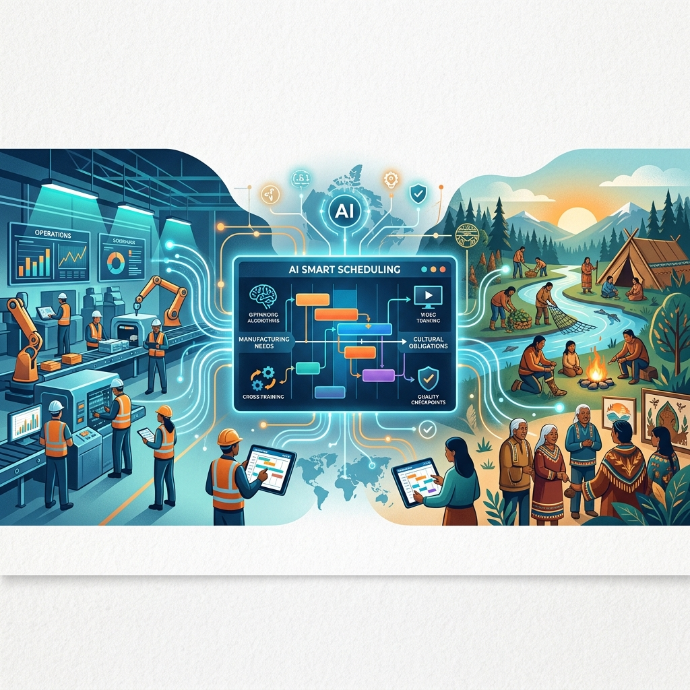

<!--Copyright (c) 2026 Mustafa Uzumeri. All rights reserved.-->

<figure class="blog-hero">
  
</figure>

# Smart Scheduling and the Fungible Workforce

## How AI, Video-Based Training, and Digital Error-Proofing Could Solve the Scheduling Problem That Drives Indigenous Worker Attrition

**Bicultural Integration Exchange — White Paper Series**
**Paper 3 of 5**

**Author:** Mustafa Uzumeri
**Date:** June 2026
**Version:** 1.1

**Series context:** This paper covers dimensions 8–9 (Time Orientation, Family & Community Obligation) of the thirteen-dimension taxonomy introduced in Paper 1, *Thirteen Dimensions of Cultural Mismatch*.

---

### Abstract

The single most cited reason for Indigenous workforce attrition in Canadian manufacturing is a scheduling collision: the rigid, monochronic clock of the production floor versus the relational, seasonal, and community-driven rhythms of Indigenous life. Workers are forced to choose between their jobs and their families, their shifts and their ceremonies, their paycheques and their cultural obligations. Most choose to leave.

This paper argues that the scheduling problem is solvable — but not by policy alone. AI-powered scheduling algorithms can optimize complex, multi-constraint rosters that accommodate cultural calendars, extended family obligations, and seasonal commitments alongside production targets and labour law compliance. These tools exist today and are commercially mature. However, smart scheduling only works if the workforce is *fungible* — if workers can be moved between stations, shifts, and roles without collapsing quality or safety.

Achieving fungibility requires three enabling technologies that have matured dramatically in the last five years: (1) AI-powered video work instructions that capture and distribute expert knowledge without text-heavy manuals, (2) competency-based cross-training systems driven by AI skill matrices, and (3) digital poka-yoke (error-proofing) using computer vision that makes workstations inherently safe regardless of who is operating them. All three are AS9100D-compliant. All three align structurally with Indigenous experiential and visual learning preferences. And all three are available as commercial products today.

The paper concludes that the technology to bridge the scheduling gap is ready. The missing ingredient is employer intent.

---

### Table of Contents

1. [The Scheduling Collision](#1-the-scheduling-collision)
2. [Why Policy Alone Cannot Solve It](#2-why-policy-alone-cannot-solve-it)
3. [The AI Scheduling Solution](#3-the-ai-scheduling-solution)
4. [The Prerequisite: A Fungible Workforce](#4-the-prerequisite-a-fungible-workforce)
5. [Enabling Technology 1: Video-Based Work Instructions](#5-enabling-technology-1-video-based-work-instructions)
6. [Enabling Technology 2: AI-Driven Cross-Training](#6-enabling-technology-2-ai-driven-cross-training)
7. [Enabling Technology 3: Digital Poka-Yoke](#7-enabling-technology-3-digital-poka-yoke)
8. [The Integrated System: How the Three Technologies Work Together](#8-the-integrated-system-how-the-three-technologies-work-together)
9. [AS9100D Compliance: Video and Visual SOPs Are Already Legal](#9-as9100d-compliance-video-and-visual-sops-are-already-legal)
10. [The Unintended Benefit: Everyone Gets Flexibility](#10-the-unintended-benefit-everyone-gets-flexibility)
11. [What Is Missing: Employer Intent](#11-what-is-missing-employer-intent)
12. [Conclusion](#12-conclusion)
13. [References](#13-references)

---

## 1. The Scheduling Collision

Manufacturing runs on monochronic time. The shift starts at 6:00 AM. The stand-up meeting begins at 6:15. The autoclave cycle runs for exactly 127 minutes. Workers are evaluated on punctuality, and three tardiness events in 90 days trigger progressive discipline. The entire system assumes that the worker's life outside the plant will conform to the plant's schedule — not the other way around.

Many Indigenous cultures operate on fundamentally different temporal rhythms:

- **Relational time**: Events begin when the people are ready and the conditions are right, not when the clock says so. A conversation continues until it reaches its natural conclusion.
- **Seasonal obligations**: Moose camp, fishing, harvesting, and hunting follow ecological rhythms that do not align with a 52-week production calendar. These are not recreational activities — they are economic, nutritional, and cultural necessities.
- **Extended family and ceremonial duties**: A funeral for a clan Elder may require 4–7 days of travel and ceremony. A naming ceremony is non-negotiable. Bereavement policies that grant 3 days for "immediate family" may not recognize the Elder as "immediate" and will not accommodate a multi-day ceremony.
- **Community obligations**: When a community member is in crisis, the obligation to respond is immediate and absolute. It does not wait for a supervisor's approval.

The collision produces a predictable sequence: the worker misses a shift (or part of a shift), receives a disciplinary warning, misses another shift for a different but equally legitimate reason, receives a second warning, and either quits or is terminated — typically within 90 days. The employer records "attendance problem." The worker experiences a system that forced them to choose between their culture and their income.

These scheduling pressures vary significantly by region — Northern, Plains, and Great Lakes communities face different seasonal and ceremonial calendars (see Paper 1, *Thirteen Dimensions of Cultural Mismatch*, §5). This variation is precisely why a one-size-fits-all cultural leave policy cannot work, and why the AI scheduling approach described below succeeds: it is *worker-driven*, not employer-configured.

---

## 2. Why Policy Alone Cannot Solve It

The obvious response — "just add more leave days" — addresses the symptom but not the structure. Consider what happens when a plant adds 5 days of "Indigenous Cultural Leave" per year:

- Five days does not cover a 2-week moose camp, a 5-day funeral, and an unpredictable family crisis in the same year
- The leave request still goes through a supervisor who may not understand why the request matters
- The worker's absence still creates a gap on the production line that someone else must cover
- If the cross-trained coverage doesn't exist, the supervisor has a legitimate operational reason to deny the request

Policy-based solutions treat Indigenous scheduling needs as exceptions to be accommodated within a rigid system. They do not change the system itself.

The structural solution is to make the system flexible enough that a worker's absence — for any reason — is a normal, optimized variable rather than an operational emergency.

---

## 3. The AI Scheduling Solution

Modern AI workforce scheduling platforms treat the production roster as a **Constraint Satisfaction Problem (CSP)** — a mathematical optimization that simultaneously balances hard constraints (labour law, safety certifications, production targets) and soft constraints (employee preferences, cultural calendars, fairness metrics).

### What the AI Does

| Function | How It Works |
|---|---|
| **Preference ingestion** | Workers enter recurring unavailability windows (ceremonies, seasonal obligations, hockey practice, college classes) via a mobile app. The AI treats all personal constraints equally — it is "reason-blind" |
| **Multi-constraint optimization** | The algorithm evaluates thousands of schedule permutations to find the roster that maximizes production coverage while respecting the highest percentage of personal preferences |
| **Automated shift swapping** | When a worker flags an urgent absence, the AI scans the entire workforce for qualified, available replacements — checking certifications, overtime limits, rest periods, and equity metrics — and offers the shift within seconds |
| **Predictive demand forecasting** | By analysing historical patterns (attendance drops during regional harvesting seasons, for example), the AI predicts labour shortfalls months in advance and prompts proactive cross-training or float pool scheduling |
| **Fairness tracking** | The AI monitors the distribution of desirable and undesirable shifts across the entire workforce, preventing the common pattern where the most flexible workers are overloaded |

### What Exists Today

These are not hypothetical capabilities. Commercial platforms operating in manufacturing right now include:

| Platform | Focus |
|---|---|
| **Indeavor** | Complex frontline scheduling with deep manufacturing integration |
| **Shiftboard** | Production-aligned scheduling automation for manufacturing |
| **Legion** | AI-driven shift management with employee engagement focus |
| **Workeen AI** | Fast AI-solver engine for automated shift optimization |
| **WorkForce Software** | Scalable suite for complex labour compliance and shift management |

These platforms integrate with existing ERP and MES systems, operate on mobile devices accessible to frontline workers, and produce audit-ready compliance reports.

### The Critical Insight: "Reason-Blind" Is the Key

The AI algorithm does not rank the moral value of why someone needs time off. To the optimizer, a cultural harvesting window, a kid's recurring hockey practice, and a college evening class are all simply **constraints to satisfy**. This eliminates the perception of "special treatment" that can breed resentment on the plant floor. Everyone submits their constraints; the AI optimizes for everyone. Flexibility becomes a collective benefit, not a contested privilege.

### Graduated Onboarding: The Same System, Different Use

Dr. Manyguns identifies a barrier that sits *before* the scheduling collision: *"The forced sedentary lifestyle really is a barrier we face. Suddenly a person has to gear up from a sedentary position to be a totally functioning individual in mainstream society."*

For workers transitioning from a disconnected, unstructured baseline to full-time industrial employment, the leap to a 40-hour week may be too large to sustain. The same AI scheduling system that accommodates cultural leave can support **graduated onboarding** — starting a new worker at 2–3 shifts per week and systematically increasing to full-time over 60–90 days, with the AI managing coverage around the ramping schedule.

This is not special treatment — it is the same constraint-satisfaction logic applied to a different variable. The AI treats "this worker is available 3 days per week for the first month" exactly the same way it treats "this worker is unavailable during moose camp." The math is identical.

---

## 4. The Prerequisite: A Fungible Workforce

AI scheduling solves the **availability** problem — figuring out who can work when. But it cannot solve the **capability** problem. If only one person in the plant can run Machine X, no amount of scheduling optimization will cover their absence.

For smart scheduling to work, the workforce must be *fungible* — meaning that multiple workers must be qualified to perform the same tasks, so that the AI scheduler has enough certified alternatives to fill any gap.

Fungibility has three requirements:

1. **Knowledge must be transferable**: A worker stepping onto an unfamiliar station must be able to learn the task quickly, without relying on a 50-page written manual
2. **Cross-training must be systematic**: The organization must know who is qualified for what, identify skill gaps proactively, and schedule training during slow periods — not scramble when someone is absent
3. **Errors must be caught by the system, not by the worker's memory**: A substitute worker who hasn't run a specific line in three months must be protected from making a costly quality mistake

Each of these requirements is now addressed by a mature, commercially available technology.

---

## 5. Enabling Technology 1: Video-Based Work Instructions

### The Problem with Written SOPs

Standard manufacturing SOPs are text-heavy documents — often 20–50 pages — written in technical English, formatted as numbered procedural steps, and stored in binders or document control databases. They assume literacy, comfort with formal instruction, and the patience to read before doing.

For Indigenous workers — and, frankly, for most workers — these documents are a barrier, not a bridge. The reasons are well-documented:

- **Literacy and format mismatch**: Indigenous learning traditions are experiential, observational, and oral. Knowledge is transmitted by watching an expert, doing the task under guidance, and internalizing through practice. A text-heavy manual inverts this sequence: it forces "read the abstract concept first, execute second"
- **Residential school legacy**: For many Indigenous families, Western educational formats carry intergenerational trauma. Formal written assessment and classroom-style training invoke an institutional history that non-Indigenous workers do not experience
- **Practical inefficiency**: Even for literate, experienced workers, nobody wants to read a 30-page binder to cover a 3-hour shift swap. The format is an obstacle to the fungibility that smart scheduling requires

### The Video Alternative

AI-powered video work instruction platforms transform how knowledge is captured, stored, and delivered. The current market leader in manufacturing is **DeepHow**, which is used by over 100 enterprise customers including Unilever and Energizer. Other platforms include **Whale** (with its "Alice AI" video-to-SOP converter), **Trupeer AI**, and **Descript**.

These platforms work as follows:

1. **Capture**: A subject matter expert performs the task while a smartphone or workstation camera records. There is no script, no production crew, no staging
2. **AI segmentation**: The AI automatically breaks the footage into logical steps based on changes in hand movement, tool interaction, and object state. A 30-second clip becomes three or four titled micro-steps
3. **Auto-transcription and annotation**: The AI generates text descriptions for each step, adds visual highlights (zoom, arrows, bounding boxes), and identifies the critical quality checkpoint — the "poka-yoke moment" where a mistake is most likely
4. **Multilingual translation**: The text can be instantly translated into French, Cree, Ojibwe, or any other language — completely addressing language barriers
5. **Point-of-use delivery**: The finished micro-lesson is pushed to a tablet at the workstation, or accessed via QR code on the machine. The worker scans, watches 30 seconds, and starts

### Why This Aligns with Indigenous Learning

The alignment is not coincidental. Video-based instruction replicates the **"see it, internalize it, do it"** observational learning loop that is the foundation of Indigenous pedagogy:

| Indigenous Learning Principle | Video SOP Feature |
|---|---|
| Learn by watching an expert model the behaviour | Raw footage of a peer performing the real task on the real equipment |
| Holistic — see the whole context first, then the parts | 30-second clips show the entire station and workflow before isolating individual steps |
| Oral tradition — knowledge transmitted through voice and demonstration | Audio narration (or auto-generated voiceover) accompanies visual demonstration |
| Authentic — learn from real conditions, not idealized abstractions | "Harvested" floor footage carries immediate credibility vs. staged corporate training videos |
| Community-validated — expertise recognized by practice, not credentials | Expert workers are the stars of the training clips — their craft is visibly honoured |

### The "Harvested Video" Loop

A powerful secondary benefit: process-focused cameras installed for quality monitoring automatically generate training content. The camera records the production line continuously. When a veteran operator performs a perfect setup, that 30-second segment can be clipped, AI-processed, and pushed to the training library — with zero additional documentation effort.

The plant's daily operations literally document themselves. Quality control, mistake-proofing, and training cease to be separate initiatives — they become a single self-sustaining loop.

---

## 6. Enabling Technology 2: AI-Driven Cross-Training

Fungibility requires that multiple workers be certified on each critical station. Managing this manually — tracking who knows what, identifying gaps, scheduling training sessions — is the kind of tedious administrative work that causes improvement initiatives to fade.

AI skill matrix systems automate this entirely:

1. **The skill matrix**: Every worker's certifications, qualifications, and training completions are mapped against every station and task in the plant
2. **Vulnerability scanning**: The AI continuously monitors the roster and flags concentration risks — "You only have two certified CNC operators scheduled during harvesting season next month"
3. **Proactive training triggers**: During slow production periods, the AI nudges managers: "Schedule Worker A for 4 hours on Station B this week. They are 80% qualified, and completing their training now clears your coverage gap for next month"
4. **Just-in-time refresher**: When the scheduler assigns a worker to a station they haven't run recently, the system automatically attaches the relevant video micro-lesson to their shift notification. They watch the 30-second clip before their shift starts

The AI doesn't just react to absences — it anticipates them and builds the workforce depth to absorb them.

---

## 7. Enabling Technology 3: Digital Poka-Yoke

The final piece: even with video training and cross-training, a substitute worker stepping onto an unfamiliar station faces a risk of error. In aerospace manufacturing, a single misplaced washer can have catastrophic consequences.

Traditional poka-yoke (physical fixtures, mechanical interlocks) is effective but rigid — changing the jig for every product variant is a logistical burden. Modern AI-powered error-proofing uses **computer vision** to create a flexible, passive safety net:

### How It Works

- **Process-focused cameras** (not people-focused) watch the workspace, not the worker. The camera monitors the part, the tools, and the assembly — not the operator's face, body language, or bathroom breaks
- **Real-time verification**: The AI knows what a correct assembly looks like. If a component is missing or misoriented, it highlights the error on a nearby screen — a gentle, non-judgmental prompt, not an alarm
- **Zero operator friction**: The worker does not have to scan barcodes, press confirmation buttons, or interact with the system at all. The camera operates passively. The worker simply does the work. The system only speaks up by exception
- **Instant adaptability**: When a product design changes, you update the AI's visual model — no physical retooling required

### The Market

The AI visual inspection market has grown from approximately $24 billion in 2024 to $30 billion in 2025. Commercial platforms include iFactory, Retrocausal, and Jidoka-Tech. The hardware — industrial IP cameras with edge AI processing — is commodity-priced.

### Why This Matters for Fungibility

Digital poka-yoke means that **the workstation holds the intelligence, not the worker's head**. A substitute worker can step in with confidence, knowing that even if they are rusty, the camera will catch any error before a defective part leaves the cell. The system absorbs the quality risk of workforce flexibility.

### Cultural Neutrality

Process-focused video evidence is inherently culture-neutral. When a quality investigation relies on camera footage of the *process*, it changes the dynamic from "Why are you acting defensive?" to "Let's look at what happened to the machine at 2:00 PM." The worker and the supervisor sit side-by-side looking at a screen together — looking *outward* at a process problem rather than looking *at each other* in a blame game.

This aligns directly with Indigenous conflict norms documented in White Paper 1: the preference for collaborative problem-solving over confrontational investigation, and the tendency for silence or indirect communication when placed in an accusatory setting.

---

## 8. The Integrated System: How the Three Technologies Work Together

When video SOPs, AI cross-training, and digital poka-yoke are combined with an AI scheduling engine, they form a self-reinforcing system:

<table style="border-collapse: collapse; width: 100%; text-align: center; font-family: sans-serif; margin: 1.5em 0;">
  <tr>
    <td colspan="3" style="border: 2px solid #2c3e50; background: #2c3e50; color: white; padding: 12px; font-weight: bold;">
      AI SCHEDULING ENGINE 
      Inputs: production targets + labour law + worker preferences Output: optimized roster with automated shift swapping
    </td>
  </tr>
  <tr><td colspan="3" style="padding: 4px; font-size: 1.2em;">&#9660; &nbsp;&nbsp;&nbsp;&nbsp;&nbsp;&nbsp;&nbsp;&nbsp; &#9660; &nbsp;&nbsp;&nbsp;&nbsp;&nbsp;&nbsp;&nbsp;&nbsp; &#9660;</td></tr>
  <tr>
    <td style="border: 2px solid #2980b9; background: #ebf5fb; padding: 10px; width: 33%; vertical-align: top;">
      <strong>AI SKILL MATRIX</strong>  
      Who can do what? Who needs training?
    </td>
    <td style="border: 2px solid #27ae60; background: #eafaf1; padding: 10px; width: 33%; vertical-align: top;">
      <strong>VIDEO SOPs</strong>  
      How to do it (30-sec visual clips)
    </td>
    <td style="border: 2px solid #e67e22; background: #fef5e7; padding: 10px; width: 33%; vertical-align: top;">
      <strong>DIGITAL POKA-YOKE</strong>  
      The system catches errors the worker might make
    </td>
  </tr>
  <tr><td colspan="3" style="padding: 4px; font-size: 1.2em;">&#9660;</td></tr>
  <tr>
    <td colspan="3" style="border: 2px solid #8e44ad; background: #f5eef8; padding: 12px; font-weight: bold;">
      FUNGIBLE WORKFORCE 
      Any qualified worker can step into any station safely
    </td>
  </tr>
</table>

**The operational sequence when a worker requests time off:**

1. Worker flags a shift as unavailable (ceremony, family obligation, seasonal activity) via the mobile app
2. The AI scheduler scans the skill matrix for certified, available alternatives
3. The scheduler assigns the replacement and notifies them
4. The replacement's shift notification includes the relevant 30-second video SOP for the assigned station
5. The replacement watches the clip, steps onto the station
6. The process-focused camera monitors the work, catching any errors before they become quality escapes
7. Production continues. Quality is maintained. The absent worker fulfills their obligation without disciplinary consequences

The worker's absence is not an emergency. It is an optimized variable.

---

## 9. AS9100D Compliance: Video and Visual SOPs Are Already Legal

A critical concern for aerospace manufacturers: does any of this violate the quality management standard?

**No.** AS9100D (which incorporates ISO 9001:2015) is explicitly format-neutral:

- **Clause 7.5 (Documented Information)** states that documented information can be in "any format and on any media" — paper, digital, video, images, or software. The only requirements are identification (title, revision, date), approval before use, version control, accessibility at the point of use, and protection from unauthorized modification
- **Clause 7.2 (Competence)** requires "documented information as evidence of competence" — but the evidence can be a hands-on demonstration observed by a supervisor, not necessarily a written test. The training material can be a video; the competence verification can be a practical assessment

This means a plant can legally:

- Replace a 30-page written SOP with a set of controlled, revision-tracked video clips at each workstation
- Verify worker competence through hands-on demonstration rather than a written exam
- Maintain training records as electronic logs rather than signed paper forms

The entire training and assessment pathway — from instruction to competence verification — can be **literacy-independent** and still pass an AS9100D surveillance audit, as long as the document control infrastructure (numbering, revision tracking, approval workflows) is in place.

This is not a workaround. It is the standard, applied as written.

---

## 10. The Unintended Benefit: Everyone Gets Flexibility

A scheduling system designed to accommodate Indigenous cultural obligations does not create a "special tier of privileges." It **democratizes flexibility for the entire workforce.**

To the AI scheduler, a cultural harvesting window, a kid's hockey practice every Thursday at 6:00 PM, and an evening college class are all simply constraints to optimize. Every worker inputs their preferences into the same app. The AI optimizes for everyone.

The non-Indigenous parent who has been fighting for years to get consistent Tuesday evenings off for their child's hockey practice suddenly gets what they want too — through the same system, with the same ease. The worker taking an evening college class to upgrade their credentials gets it. The worker who simply prefers not to work Friday evenings gets it, if the math allows.

When flexibility is abundant and algorithmically distributed, it ceases to be a source of division. The perception shifts from "who is getting special treatment?" to "we all have lives outside this plant, and the system respects that."

This is the strongest possible argument for employer adoption: the system improves retention and satisfaction for *everyone*, not just Indigenous workers.

---

## 11. What Is Missing: Employer Intent

The technology to solve the scheduling problem exists. It is commercially mature, industrially proven, and standards-compliant. The AI scheduling platforms are deployed in hundreds of manufacturing plants. The video SOP tools are used by over 100 enterprise customers. The computer vision error-proofing market is a $30 billion industry. None of this is speculative.

What does not yet exist is the **deliberate deployment of these tools for workforce inclusion.**

When a Fortune 100 company implements digital poka-yoke, they do it to maximize lean efficiency — to make the human element interchangeable so the line runs faster. When they deploy video SOPs, they do it to onboard cheaper labour during a crunch. When they implement AI scheduling, they do it to minimize overtime costs.

But the same tools, deployed with a different intent, become instruments of **workforce resilience and social equity:**

| When Deployed for Strict Efficiency | When Deployed for Workforce Flexibility |
|---|---|
| **Poka-yoke** ensures workers can't make mistakes while keeping up with a punishing line speed | **Poka-yoke** lowers the barrier to entry, allowing any cross-trained worker to step in safely |
| **Video SOPs** onboard temporary labour faster during a production crunch | **Video SOPs** decentralize tribal knowledge so any worker can step away without halting production |
| **Cross-training** runs a "lean" crew — fewer people doing more jobs to cut costs | **Cross-training** builds a resilient bench so the AI scheduler can seamlessly accommodate personal lives |
| **AI scheduling** minimizes labour costs | **AI scheduling** maximizes labour retention by treating cultural obligations as normal variables |

The technology is identical. The intent is different. The outcome — a stable, skilled, loyal, diverse workforce — is dramatically better.

### Why the Intent Gap Persists

Three factors explain why manufacturers have not yet made this connection:

1. **The "Champion" Trap**: Innovation is often tied to the enthusiasm of a single manager. When that person is promoted or reassigned, the initiative dies. The system must be embedded in the plant's DNA — its ERP, its HR policies, its capital planning — not in one person's passion project
2. **Corporate attention span**: Leadership views these tools as "projects" with quarterly ROI targets, not as infrastructure (like electricity or compressed air) that the business requires to function
3. **The default to compliance**: When the visionary leaves, bureaucracy steps back in. Rigid attendance points are easy to enforce and require zero engineering thought — even when they systematically destroy retention for the fastest-growing demographic in the country

---

## 12. Conclusion

The scheduling collision between manufacturing clock-time and Indigenous relational time is the single largest structural driver of Indigenous workforce attrition in Canadian industry. It is not a personality problem, an attendance problem, or a work ethic problem. It is a system design problem.

The solution has three layers:

1. **AI scheduling** treats personal and cultural obligations as mathematical constraints to optimize, not exceptions to accommodate
2. **Video-based training, AI cross-training, and digital poka-yoke** create the workforce fungibility that makes flexible scheduling possible
3. **AS9100D compliance** is already assured — the standard permits any format, any media, any assessment method, as long as document control and competence verification are maintained

The technology is ready. The economics are favourable (retaining a skilled worker is dramatically cheaper than recruiting and training a replacement every 90 days). The standard permits it. The workforce — Indigenous and non-Indigenous alike — wants it.

As Paper 1 documents, this system serves not just the culturally active worker who needs scheduling accommodation today, but also the disconnected worker who needs a graduated on-ramp to sustained employment, and the reconnecting worker whose obligations will grow as cultural recovery strengthens. The same AI infrastructure handles all three (see Paper 1, §6: *The Readiness Spectrum*).

What remains is for a manufacturer to decide that keeping skilled workers matters more than enforcing clock-discipline, and to deploy the tools they already own for a purpose they haven't yet imagined.

---

## 13. References

| Source | Relevance |
|---|---|
| **Mining Industry Human Resources Council (MiHR)** | Indigenous retention best practices in Canadian mining; FIFO scheduling models |
| **Future Skills Centre (FSC-CCF)** | Indigenous workforce statistics; competency-based assessment research |
| **Toronto Metropolitan University — Diversity Institute** | Workplace discrimination data (38% Indigenous workers report identity-based discrimination) |
| **DeepHow** | AI-powered video work instruction platform; 100+ enterprise customers |
| **Whale (Alice AI)** | Video-to-SOP conversion platform |
| **Indeavor / Shiftboard / Legion / WorkForce Software** | Commercial AI scheduling platforms for manufacturing |
| **AS9100D / ISO 9001:2015** | Clause 7.5 (documented information — "any format, any media"); Clause 7.2 (competence evidence) |
| **iFactory / Retrocausal / Jidoka-Tech** | AI computer vision platforms for digital poka-yoke |
| **Battiste, M.** *Decolonizing Education* | Indigenous pedagogy — observational and experiential learning traditions |
| **Hall, E. T.** *Beyond Culture* (1976) | Monochronic vs. polychronic time orientation framework |
| **Deming, W. E.** | 85/15 Rule: ~85% of defects are systemic, not human error |
| **Canada Labour Code** (2019 amendments) | Traditional Indigenous Practices Leave provisions |
| **ICT (Indigenous Corporate Training Inc.)** | Practical Indigenous workplace inclusion resources |
| **Training Within Industry (TWI) Institute** | "Job Instruction" show-do-review methodology |
| **Dr. Linda Manyguns** (Mount Royal University) | Personal communication on regional cultural variation, sedentary-to-functioning readiness gap, cultural disconnection, and cultural recovery trajectory |

---

### Series Navigation

| Paper | Title | Dimensions |
|---|---|---|
| **1** | *Thirteen Dimensions of Cultural Mismatch* | All 13 (executive summary) |
| **2** | *Bridging the Conflict Divide* | 1–7 (Communication & Conflict) |
| **3 (this paper)** | *Smart Scheduling and the Fungible Workforce* | 8–9 (Time, Family) |
| **4** | *The Research Agenda* | 10–13 (Urgency, Learning, Place, Credential Gatekeeping) |
| **5** | *From Theory to Practice* | Research implementation roadmap |

---

<!--Copyright (c) 2026 Mustafa Uzumeri. All rights reserved.-->
