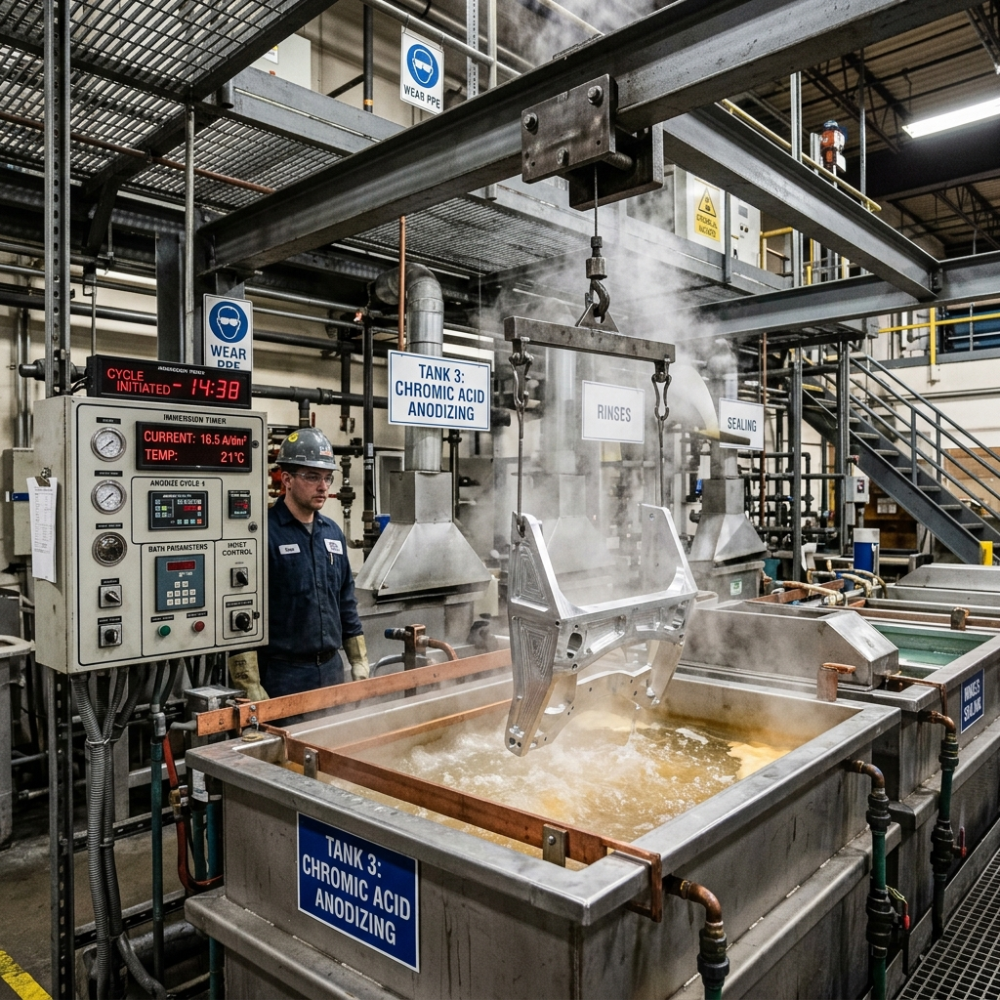

<!--Copyright (c) 2026 Mustafa Uzumeri. All rights reserved.-->

---
title: "anodizing_immersion_time"
type: "pedagogy"
topics: [safety, compliance, nadcap-ac7108, chemical-processing, anodizing, story]
sources: []
status: "active"
---

# Aluminum Anodizing — A Bicultural Dual-Register Explanation

<figure class="blog-hero">
  
  <figcaption>The chemical processor controls the acid tank immersion time — ensuring the aluminum forms a protective skin (the Dyeing of the Quills) that resists the salt and moisture of the sky.</figcaption>
</figure>

This document presents a dual-register bicultural explanation of **Aluminum Anodizing (Type II/III Sulfuric Acid Anodizing)** — a critical chemical process governed by Nadcap AC7108. The relational narrative register draws a direct parallel to the traditional art of **The Dyeing of the Quills**, where preparing natural materials requires precise control of temperature, acid-alkali balance, and immersion times to bind colors and strengthen fibers without destroying the substrate.

---

## Why This Process?

Aluminum is lightweight, but it is susceptible to corrosion and wear. Anodizing is an electrochemical process that converts the aluminum surface into a hard, porous aluminum oxide layer. This oxide layer is not a coating applied to the metal; it is grown *out* of the metal itself. In the acid tank, electric current creates microscopic pores in the surface. If the immersion time is too short, the oxide layer is too thin, failing to protect the component from corrosion. If the immersion time is too long, the acid will dissolve the layer as fast as it grows, making the surface powdery and weak. Controlling the acid concentration, temperature, current density, and immersion time is critical to achieving the specified thickness and pore structure.

This is identical to dyeing porcupine quills or spruce roots for basketry: the quills must be boiled in a dye-bath containing a mordant (a natural acid, like wild berries or fermented urine) to open their fibers and lock in the color. If you boil them too long, the quills become soft, brittle, and useless. If you do not leave them in long enough, the color is superficial and washes away in the first rain.

| Settler Compliance Demand | Traditional Story Parallel |
|---|---|
| **Alkaline Clean & Acid Pickling** | Scraping and washing the quills in ash-water to remove the natural oils and grease |
| **Anodizing Tank Immersion Time** | Timing the boiling of quills in the dye-bath so they absorb color without dissolving |
| **Electrolyte Temperature Control (±1°C)** | Maintaining a gentle simmer of the dye pot; boiling too hot ruins the delicate materials |
| **Current Density (Amps/Sq Ft)** | Controlling the intensity of the wood fire under the pot to keep the energy steady |
| **Deionized Water Seal (Hydration)** | Dipping the dyed quills in cold water or rubbing them with fat to close the pores and lock in the color |

---

## Register A: Conventional Expository SOP

> **SOP Code: CHM-SOP-108 — Sulfuric Acid Anodizing Protocol**
>
> 1.0 **Purpose & Scope**: This procedure defines the operating parameters for Type II (Sulfuric Acid) Anodizing of aluminum alloys, in compliance with Nadcap AC7108 and MIL-A-8625.
>
> 2.0 **Process Parameters**:
> 2.1 **Pre-Treatment**: Clean parts in alkaline degreaser (Tank 1) for 10-15 minutes at 60°C. Rinse. Etch in acid pickle (Tank 3) for 2-3 minutes to remove natural oxides. Rinse.
> 2.2 **Anodizing Bath (Tank 5)**:
>   - Electrolyte: 165-200 g/L Sulfuric Acid ($H_2SO_4$).
>   - Bath Temperature: Maintain at 20°C ± 1°C.
>   - Current Density: Apply 12-15 Amps per square foot ($A/ft^2$).
>   - **Immersion Time: Maintain parts in tank for 35 minutes ± 1 minute to achieve a coating thickness of 12-18 micrometers.**
> 2.3 **Rinse Cycle**: Rinse immediately in clean running water (Tank 6) for 2-3 minutes.
> 2.4 **Sealing (Tank 8)**: Immerse in deionized water seal at 95°C-100°C for 20 minutes to hydrate the aluminum oxide and close the porous structure.
>
> 3.0 **Compliance**: If bath temperature deviates by more than ±2°C or immersion time falls outside the ±1 minute window, the batch must be rejected, stripped, and re-processed (Form 108-NCR).

---

## Register B: Bicultural Relational Narrative

> **The Dyeing of the Quills**
>
> A chemical process operator stands before a series of large, steaming stainless steel tanks. Beside her, a young apprentice watches a crane lift a rack of aluminum aerospace brackets from a tank of bubbling acid.
>
> The operator points to the rack. "This acid tank is Tank Five. The brackets must stay in this bath for exactly thirty-five minutes at twenty degrees. If we pull them out early, they will be naked to the corrosion of the salt air. If we leave them in too long, the acid will eat the metal, making it soft like chalk. Let me tell you about **The Dyeing of the Quills**.
>
> "In the old days, our grandmothers decorated clothing with porcupine quills. The quills are white and hard, with sharp tips. To make them beautiful, they dyed them red, yellow, and black. But a quill is like aluminum: it has a smooth, oily skin that rejects color. If you just drop a quill into dye, the color slides off.
>
> "First, the grandmother would wash the quills in wood-ash water. The ash-water is alkaline; it cuts the grease and cleans the surface. We do the same in Tank One. We wash the aluminum to clear the oils.
>
> "Second, they boiled the quills in a dye pot. They added wild berries or hemlock bark, which are acidic. The acid acts as a mordant — it opens the microscopic pores of the quill so the dye can crawl inside. In Tank Five, our sulfuric acid and electricity do the same thing. They open millions of tiny pores in the aluminum skin.
>
> "But the grandmother had to watch the fire closely. If the pot got too hot, the quills would turn to mush. If it was too cold, the pores would not open. She used her fingers to test the heat. Here, we use digital sensors to keep the bath at exactly twenty degrees. We control the electric current like she controlled the wood fire.
>
> "The grandmother knew the **immersion time** by heart. She counted the songs or the breathing of the wind. If she took the quills out too fast, the color was weak and would fade in the sun. If she left them in the boiling acid of the berries too long, the quills would dissolve.
>
> "Finally, when the quills came out of the dye, they dipped them in cold water or rubbed them with bear grease. This closed the pores, locking the color inside the body of the quill. We do the same in our hot sealing tank. We close the metal pores so the barrier is solid.
>
> "Every bracket we anodize is a quill we are preparing for the winter trail. Respect the time of the bath, watch the heat of the fire, and seal the skin so the metal remains strong against the elements."

---

## The Structural Bridge: What the Two Registers Share

Both registers describe a process of surface activation, penetration, and stabilization. The expository SOP (Register A) defines the acid concentrations, current densities, and micrometer thicknesses. The relational narrative (Register B) explains the chemical activation (opening pores) and thermal control using the traditional craft of porcupine quill dyeing, showing that chemical processing is a balance between opening a material to change and protecting it from destruction.

| SOP Requirement | Expository Rationale | Relational Rationale |
|---|---|---|
| Alkaline Degrease (§2.1) | Removes organic oils that inhibit acid activation | "Washing the quills in ash-water to cut the grease so the skin can receive the change" |
| Sulfuric Acid Bath (§2.2) | Electrolytic reaction creates porous aluminum oxide | "Using acid and heat to open the microscopic pores of the material" |
| 20°C Temperature Limit (§2.2) | Prevents high dissolution rate of oxide layer in warm acid | "Watching the fire closely so the pot does not boil too hot and ruin the fibers" |
| 35 Min Immersion Time (§2.2) | Dictates the target coating thickness (12-18 microns) | "Timing the bath by song or wind so the color runs deep but the material does not dissolve" |
| Hot DI Water Seal (§2.4) | Hydrates oxide to close pores, locking in protection | "Dipping in cold water or rubbing with fat to close the pores and lock the barrier tight" |
| Non-Conformance Rejection (§3.0) | Strict thickness limits ensure corrosion resistance | "Stripping and starting again if the quills are soft or the color washes away in the rain" |

---

## Pedagogical Notes

1.  **Electrochemical Surface Growth**: Trainees often think anodizing is a paint-like coating that sticks to the outside. The quill metaphor shifts this understanding: it is a deep chemical opening and transformation of the material's own skin.
2.  **Strict Process Windows**: Relational learners can view rigid time/temperature windows (e.g. ±1°C) as arbitrary settler rules. Frame these limits as "the respect of the fire" to connect precision to quality and craft integrity.

---

<!--Copyright (c) 2026 Mustafa Uzumeri. All rights reserved.-->
