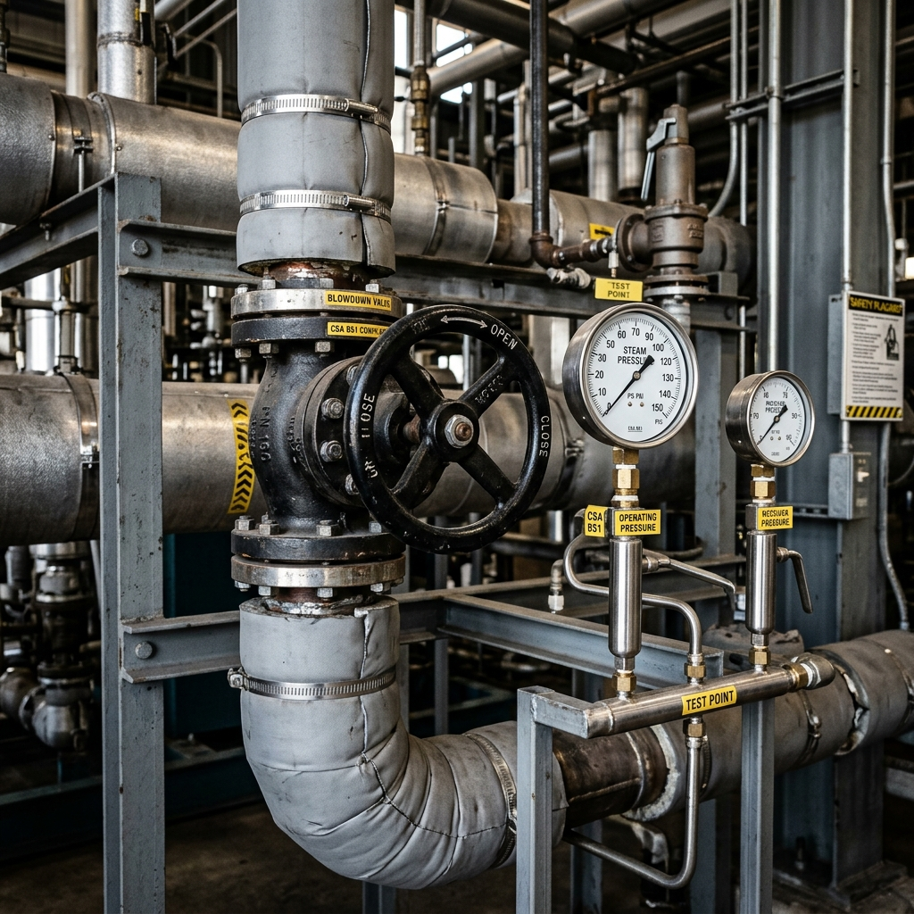

<!--Copyright (c) 2026 Mustafa Uzumeri. All rights reserved.-->

---
title: "boiler_blowdown_procedure"
type: "pedagogy"
topics: [safety, compliance, csa-b51, pressure-vessel, story]
sources: []
status: "active"
---

# Boiler Blowdown Procedure — A Bicultural Dual-Register Explanation

<figure class="blog-hero">
  
  <figcaption>The boiler piping contains immense thermal energy — a geyser spirit trapped in a steel box that must be vented with care to prevent catastrophic failure.</figcaption>
</figure>

This document presents a dual-register bicultural explanation of the **Boiler Bottom Blowdown Procedure** — a high-risk operational task governed by CSA B51 (Boiler, Pressure Vessel, and Pressure Piping Code). The relational narrative register draws a direct parallel to the traditional relationship with **natural geysers, hot springs, and steam spirits**, where high-pressure steam is respected as a trapped natural force that will destroy its containment if the boundaries are released in a rushed or careless manner.

---

## Why This Process?

A steam boiler operates under **extreme physical tension**. Water is heated under pressure to temperatures far exceeding the normal boiling point, storing immense energy. Over time, dissolved minerals settle at the bottom of the boiler shell as a thick sludge. This sludge isolates the water from the hot boiler tubes, causing localized overheating and structural weakening of the steel shell. To clear this sludge, the operator must perform a **bottom blowdown** — opening valves to blast the sludge out. However, if the valves are opened too quickly, the sudden drop in pressure can trigger a **steam hammer** (an explosive shockwave) that can rupture the thick steel pipes, releasing superheated steam that instantly cooks anything in its path.

In traditional wood-curing and cooking methods, steam is used to bend wood. But steam is also understood as a spirit that expands with force. Confining a hot spring or geyser inside a stone lodge requires respecting the path of the steam; if you lift the heavy stone door too quickly, the steam will burst out and burn the face of the maker.

| Settler Compliance Demand | Traditional Story Parallel |
|---|---|
| **Slow-Opening Valve Sequence** | Opening the lodge door slowly to let the steam spirit escape in a gentle breath |
| **Verify Water Level (Before Blowdown)** | Checking that the spring has enough water to cover the hot rocks before venting |
| **Two-Valve System (Quick vs. Slow)** | The double-lock on a containment: a heavy door and a sliding latch to control the wind |
| **Continuous Pressure Monitoring** | Listening to the whistle of the steam to read the strength of the spirit |
| **Blowdown Tank Heat Exchanger** | Routing the geyser through cold stones and water before letting it flow into the creek |

---

## Register A: Conventional Expository SOP

> **SOP Code: SAFE-SOP-051 — Boiler Bottom Blowdown and Desludging Protocol**
>
> 1.0 **Purpose & Scope**: This procedure defines safety requirements for venting sludge from primary steam boilers, in compliance with CSA B51-19 and provincial safety codes.
>
> 2.0 **Pre-Blowdown Verification**:
> 2.1 Verify that the boiler water level is at or slightly above the normal operating limit (high-water mark). **Do not perform blowdown if the water level is low.**
> 2.2 Verify that the boiler operating pressure is within the normal operating band (typically 100–120 psi).
>
> 3.0 **Blowdown Sequence (Two-Valve Protocol)**:
> 3.1 Locate the blowdown line at the bottom of the boiler. The line is equipped with a **Quick-Opening (lever) valve** and a **Slow-Opening (screw-wheel) valve** in series.
> 3.2 **Open the Quick-Opening Valve First**: Pull the lever valve fully open. (No steam should flow yet, as the slow valve is shut).
> 3.3 **Open the Slow-Opening Valve Second**: Rotate the handwheel of the slow-opening valve slowly. Open it partially until the sludge begins to discharge.
> 3.4 Open the slow-opening valve fully for 5–10 seconds to clear the sludge. Monitor the boiler water level.
> 3.5 **Close the Slow-Opening Valve First**: Rotate the handwheel slowly until the valve is completely shut. **Never slam the valve shut; sudden closure will cause a steam hammer.**
> 3.6 **Close the Quick-Opening Valve Second**: Return the lever valve to the closed position.
> 3.7 Verify that the drain lines are clear and pressure returns to normal.

---

## Register B: Bicultural Relational Narrative

> **The Geyser in the Stone Box**
>
> An Elder stationary engineer stands in the boiler room beside a large steel drum wrapped in insulation. On the pipes below, two massive steel valves stand in a line: one with a long lever handle, and one with a large round handwheel.
>
> The Elder touches the cold end of the discharge pipe. "This boiler is a hot spring. We have trapped the water and the fire inside this steel drum to make steam. The steam has the strength to run the entire mill. But inside, the steam is a geyser spirit trying to break its box.
>
> "Our ancestors knew the hot springs at the base of the mountains. They were places of healing, but also places of caution. If you blocked the throat of a bubbling spring with heavy logs, the steam would build up until the earth shook and the spring exploded, throwing boiling mud and stone across the valley.
>
> "The steam inside this boiler is the same. As the water boils, it leaves mud — sludge — at the bottom of the drum. This mud is like ash on a fire; it blocks the heat, and if we do not clear it, the steel will burn and weaken until the drum explodes. So we must vent the mud. We call this the blowdown.
>
> "But to vent the geyser, we must use the two valves in a specific sequence. We do not rush.
>
> "First, we check the water. You look at the glass tube. The spring must be full. If the water is low and you vent the mud, the dry rocks inside will overheat and crack.
>
> "Second, we open the **lever valve**. This is the first lock. No steam flows yet, because the second lock is shut.
>
> "Third, you place your hands on the **handwheel**. This is the slow valve. You turn it slowly, turn by turn. You will hear the steam start to hiss, then roar. It is the geyser spirit waking up. You let the mud blow out for ten seconds.
>
> "And here is the moment of greatest caution: when you close the valve, you must turn the wheel slowly, step by step. If you get scared by the roar and slam the valve shut, the rushing water inside will slam against the valve like a great stone wall. We call this the **steam hammer**. It will split the steel pipe instantly, and the boiling geyser will fill this room in a single breath.
>
> "You must let the spirit settle. You close the slow wheel first, gently, letting the flow die down to a whisper. Only when the line is quiet do you close the lever valve.
>
> "Treat the steam not as a dead tool, but as a trapped wind that wants to return to the sky. Open the gates slowly, close them with care, and respect the pressure in the line, and the steam will work for you without turning its teeth against you."

---

## The Structural Bridge: What the Two Registers Share

Both registers describe the same physical requirements. The expository SOP (Register A) defines the strict order of valve operation and water level checks. The relational narrative (Register B) explains the *why* of the two-valve protocol using the natural physics of steam containment, helping the worker remember the sequence through relational discipline rather than memorization.

| SOP Requirement | Expository Rationale | Relational Rationale |
|---|---|---|
| High Water Level Check (§2.1) | Prevents dry firing and thermal shock to boiler tubes | "Ensures the hot rocks of the spring remain covered before venting" |
| Quick-Opening Valve First (§3.2) | Protects the seat of the quick valve from erosion during flow | "Opening the first lock while the gate is still closed to keep it clean" |
| Slow Valve Control (§3.3) | Prevents rapid pressure drop and hydraulic shock | "Letting the geyser spirit wake up and blow the mud out without shaking the lodge" |
| Slow Closure of Handwheel (§3.5) | Prevents steam hammer / pipe rupture due to inertia | "Letting the flow die down to a whisper; never slamming the gate against the rushing river" |
| Two Valves in Series (§3.1) | Redundancy to ensure isolation if one valve leaks | "Using a double-lock to keep the wild wind secure inside the box" |

---

## Pedagogical Notes

1.  **Understanding the "Steam Hammer"**: Workers often fail to grasp the destructive kinetic energy of water column movement in pressurized lines. The metaphor of "water slamming like a great stone wall" creates a vivid physical picture of hydraulic shock, reinforcing the necessity of slow valve closure.
2.  **Order of Operations**: The sequence (Quick-First, Slow-Second, Slow-Close, Quick-Close) is notoriously easy to mix up in written exams. The narrative helps the worker visualize opening the outer lock first, then using the wheel to control the release, and reversing the process.

---

<!--Copyright (c) 2026 Mustafa Uzumeri. All rights reserved.-->
