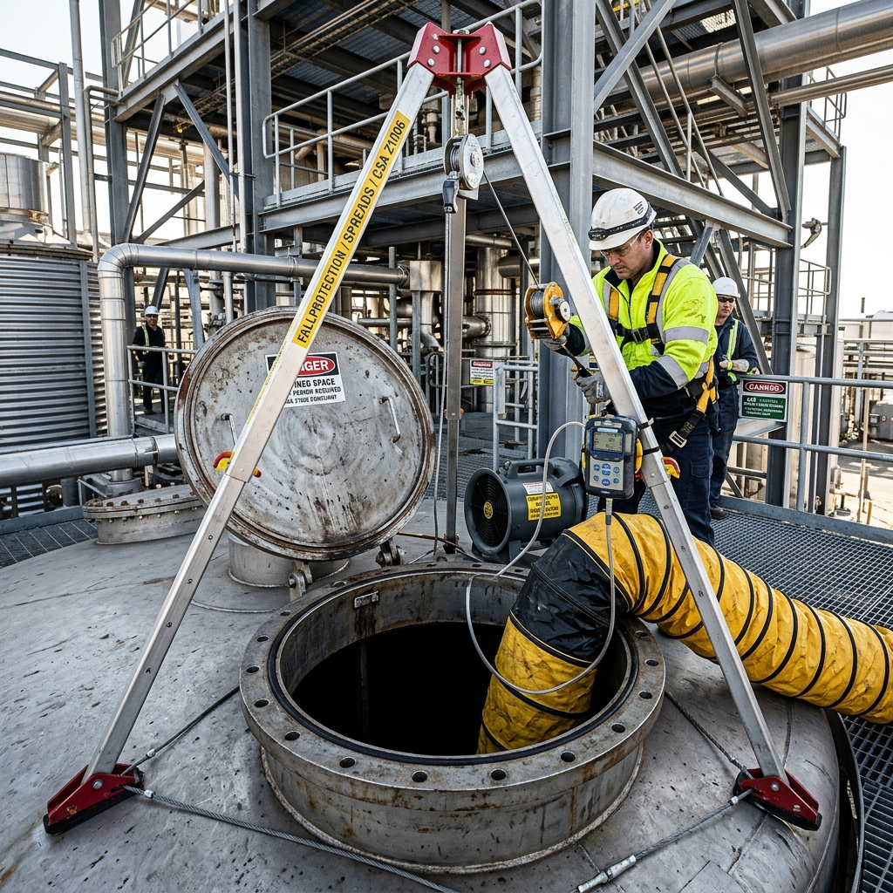

<!--Copyright (c) 2026 Mustafa Uzumeri. All rights reserved.-->

---
title: "confined_space_tank_entry"
type: "pedagogy"
topics: [safety, compliance, csa-z1006, confined-space, story]
sources: []
status: "active"
---

# Confined Space Tank Entry — A Bicultural Dual-Register Explanation

<figure class="blog-hero">
  
  <figcaption>The round portal of the confined space is a cave that does not breathe — a physical boundary requiring atmospheric checks and a lifeline before anyone enters.</figcaption>
</figure>

This document presents a dual-register bicultural explanation of **Confined Space Tank Entry** — a high-risk safety procedure governed by CSA Z1006 (Management of Work in Confined Spaces). The relational narrative register draws a direct parallel to the traditional concept of **caves, deep pits, or hollows that do not breathe**, where enclosed spaces are respected as separate ecological zones requiring testing, a physical lifeline, and a guardian to watch over the entry.

---

## Why This Process?

A confined space is an **invisible hazard container**. A storage tank or sewer pit can look completely empty, clean, and dry. However, because it has limited air circulation, heavier-than-air gases (such as carbon monoxide, hydrogen sulfide, or nitrogen) can settle at the bottom, displacing oxygen. A worker who steps inside without testing the air can lose consciousness in a single breath, with no warning. Because the brain cannot detect a lack of oxygen (only an excess of carbon dioxide), the worker will feel no distress before collapsing.

This matches the caution taught in traditional oral histories regarding deep caves or sinkholes: these are places where the earth's breath is trapped. Entering a "sleeping cave" requires respect, testing the air with natural indicators (like a cedar branch or monitoring the behavior of animals), and always leaving a partner outside with a rope to pull the explorer back to the daylight.

| Settler Compliance Demand | Traditional Story Parallel |
|---|---|
| **Atmospheric Testing (Gas Monitor)** | Testing a cave's air with a burning branch or observing animal behavior |
| **Active Mechanical Ventilation** | Lighting a fire at the mouth of a cave to draw fresh wind inside |
| **The Safety Sentry (Attendant)** | The Guardian who stands at the cave entrance and never leaves the threshold |
| **Body Harness & Retrieval Lifeline** | Binding a rawhide rope to the waist of the gatherer before they crawl into a pit |
| **Emergency Rescue Plan (No Entry Rescue)** | Pulling the rope from outside rather than jumping in to help a collapsed partner |

---

## Register A: Conventional Expository SOP

> **SOP Code: SAFE-SOP-1006 — Confined Space Tank Entry Protocol**
>
> 1.0 **Purpose & Scope**: This procedure defines safety requirements for entering industrial storage tanks and vessels where atmospheric hazards or entrapment risks exist, in compliance with CSA Z1006-20 §6.1 and OHS standards.
>
> 2.0 **Atmospheric Testing & Ventilation**:
> 2.1 Prior to entry, the operator shall perform pre-entry testing of the internal atmosphere using a calibrated 4-gas detector. Test at three levels: top, middle, and bottom.
> 2.2 The atmosphere must fall within safe limits: Oxygen (19.5%–23.0%), Combustibles (<10% LEL), Hydrogen Sulfide (<10 ppm), Carbon Monoxide (<25 ppm).
> 2.3 Run the mechanical ventilation blower continuously for not less than 15 minutes prior to entry, and maintain active ventilation throughout the work.
>
> 3.0 **Entry Setup & Retrieval**:
> 3.1 The entrant shall don a full-body rescue harness. Attach the retrieval lifeline from the tripod winch to the rear D-ring of the harness.
> 3.2 Position a qualified **Confined Space Attendant (Sentry)** at the tank hatch.
> 3.3 The Attendant shall maintain continuous communication (visual or vocal) with the entrant and maintain the Entry Log Sheet (Form 1006-A) at 5-minute intervals.
>
> 4.0 **Emergency Rescue**:
> 4.1 If the entrant collapses or shows signs of distress, **the Attendant shall immediately activate the emergency response and operate the rescue winch to pull the entrant out from the outside.**
> 4.2 **Under no circumstances shall the Attendant enter the tank to perform a rescue.** Entering a hazardous atmosphere without supplied-air breathing apparatus constitutes a fatal safety violation.

---

## Register B: Bicultural Relational Narrative

> **The Cave that Does Not Breathe**
>
> An Elder safety lead stands beside a large stainless-steel vat with a young operator. Above the open circular hatch of the vat, a steel tripod stands with a steel cable hanging down. A yellow air duct blows fresh air into the tank, making a low humming sound.
>
> The Elder points down into the dark hatch. "Look down there. It is empty, clean, and dry. It looks like a simple room. But let me tell you why we treat it differently.
>
> "Our grandfathers spoke of the **caves that do not breathe**. These are hollows in the earth, deep sinkholes, or stone pits where the wind cannot reach. The air inside them does not move; it sleeps. Sometimes, the spirit of the cave is heavy, and the air becomes poison. 
>
> "When a gatherer had to go into a deep pit to collect clay or minerals, they did not just slide down. They knew the cave could steal their breath silently. First, they would tie a strong rawhide rope around their waist. Second, they would leave a strong partner at the mouth of the pit, holding the rope. Third, they would test the air. They would lower a burning pine branch on a cord. If the flame flickered and died, the cave had no spirit; it had no air. They would wait.
>
> "This steel tank is a sleeping cave. It has no wind. If you step down there and the oxygen is gone, you will drop before you can call out. You will not feel like you are choking; you will simply fall asleep and never wake up.
>
> "So we use this meter — it is our pine branch. We lower it on a cord to the bottom, the middle, and the top. It listens to the air for us. If it chirps and shows green, the air is clean. But we do not stop there. We run this yellow hose to blow fresh wind into the tank, keeping the air alive while you are inside.
>
> "Next, we attach this cable to the ring on your back. This is your **tether of life**. If you fall or get hurt, this cable connects you to the daylight. 
>
> "And you," the Elder turns to the apprentice who is acting as the watchman. "You are the **Guardian of the Threshold**. When your partner goes down into that tank, your eyes do not leave the hatch. Your ears listen to their breath. You write down their name and check on them every five minutes. You do not leave to get a tool. You do not look at your phone. You are their link to the living world.
>
> "If your partner collapses, your heart will tell you to jump down to help them. That is the voice of love, but it is also the trap of the cave. If you go down there, you will breathe the same sleeping air and collapse beside them. Then the lodge has lost two hunters instead of one. 
>
> "Your duty is to stand outside, turn this winch, and pull them up into the wind. Let the cable do the work. Protect the threshold, keep the wind blowing, and ensure your partner returns to the campfire when the sun goes down."

---

## The Structural Bridge: What the Two Registers Share

Both registers describe the same physical requirements. The expository SOP (Register A) defines the technical limits (gas limits, ventilation times, log intervals). The relational narrative (Register B) explains the *why* of the watchman's role and the non-entry rescue rule as a traditional guardian contract, helping the worker understand the strict rules as a system of mutual survival.

| SOP Requirement | Expository Rationale | Relational Rationale |
|---|---|---|
| Pre-Entry Gas Testing (§2.1) | Identifies stratified toxic/combustible gases or oxygen deficiency | "Lowering the burning pine branch into the deep pit to see if the flame dies" |
| Continuous Blower Ventilation (§2.3) | Prevents hazardous gas accumulation during work | "Keeping the wind blowing inside the sleeping cave to keep the air alive" |
| Attendant/Sentry Role (§3.2) | Legal safety watch, maintains communication, coordinates rescue | "The Guardian of the Threshold who never leaves the mouth of the pit" |
| Rear D-Ring Lifeline Attachment (§3.1) | Allows vertical extraction of an unconscious worker through a narrow hatch | "The tether of life connecting the explorer to the daylight" |
| No-Entry Rescue Rule (§4.2) | Prevents double-fatality incident when rescuers enter toxic air | "Resisting the urge to jump into the pit; pulling the rope from outside instead" |

---

## Pedagogical Notes

1.  **The Double-Fatality Danger**: In confined space incidents, over 60% of fatalities are the would-be rescuers who enter without thinking. Relational narratives that frame the sentinel's restraint ("don't jump in, use the winch") as a technical duty of respect and honor are highly effective at counteracting the natural human impulse to rush in.
2.  **Verbal Connection**: Using a 5-minute verbal check-in log shifts the task from an administrative burden to a relational contract of care between the entrant and the sentinel.

---

<!--Copyright (c) 2026 Mustafa Uzumeri. All rights reserved.-->
