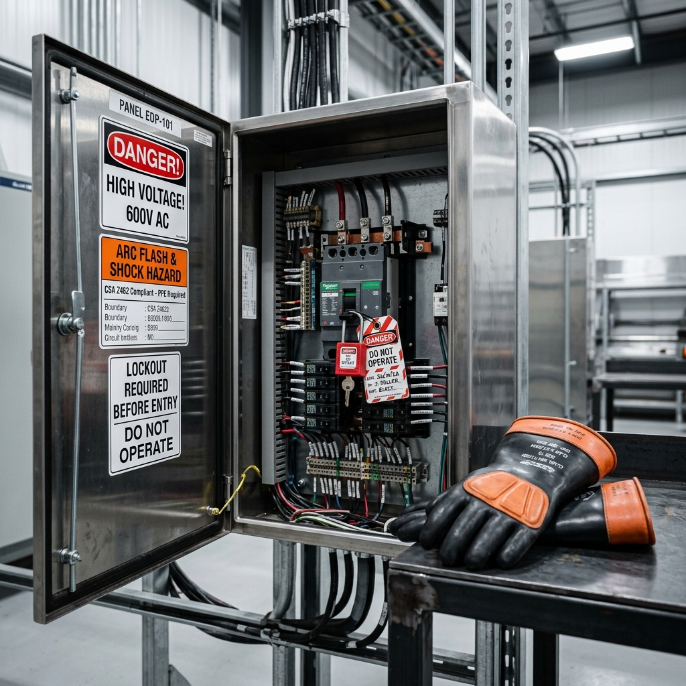

<!--Copyright (c) 2026 Mustafa Uzumeri. All rights reserved.-->

---
title: "electrical_panel_access"
type: "pedagogy"
topics: [safety, compliance, csa-z462, electrical, story]
sources: []
status: "active"
---

# Electrical Panel Access — A Bicultural Dual-Register Explanation

<figure class="blog-hero">
  
  <figcaption>The open electrical panel exposes live voltage — a physical manifestation of lightning that must be approached with the proper shielding and respect for boundaries.</figcaption>
</figure>

This document presents a dual-register bicultural explanation of **Electrical Panel Access and Live Verification** — a high-risk safety procedure governed by CSA Z462 (Workplace Electrical Safety). The relational narrative register draws a direct parallel to the traditional relationship with **lightning and the storm spirits (Thunderbolts)**, where natural energy is respected as an active, volatile force that must be approached only with the proper shielding, preparation, and boundary awareness.

---

## Why This Process?

Electrical energy is **invisible and instantaneous**. When an operator opens an active electrical cabinet to test a circuit, they are exposing live, uninsulated components. A single misplaced metal probe or a dust bridge can trigger an **arc flash** — a massive explosion of thermal energy hotter than the surface of the sun, occurring in a fraction of a second. Because there is no sensory warning (no sound or visible movement in the wire prior to contact), safety depends entirely on maintaining strict **physical boundaries** and using specialized **insulating barriers**.

In traditional understanding, lightning is a powerful spirit that strikes without warning. To survive its path, one does not challenge the sky or touch the struck tree directly; instead, one maintains a distance of respect, stays within the shelter of the tipi, and uses dry wood or leather as buffers to ground the force.

| Settler Compliance Demand | Traditional Story Parallel |
|---|---|
| **Boundary Distances (Limited/Restricted)** | The circle of respect around a nesting site or a sacred fire |
| **Personal Protective Equipment (PPE)** | Wearing dry leather and carrying a shield when handling hot stone or coals |
| **Voltage-Rated Insulated Gloves** | Using dry birch bark or thick hide wraps to handle the thunder-struck branch |
| **Zero-Voltage Testing (Three-Step Method)** | Testing a fruit's safety on a bird, then tasting it slightly, before eating |
| **Non-Conductive Tools (Category Ratings)** | Selecting green willow poles rather than wet metal rods to stir the embers |

---

## Register A: Conventional Expository SOP

> **SOP Code: SAFE-SOP-462 — Electrical Panel Access and Verification Protocol**
>
> 1.0 **Purpose & Scope**: This procedure defines safety requirements for opening electrical cabinets and verifying zero-voltage on systems exceeding 50V, in compliance with CSA Z462-21 §4.3 and OHS standards.
>
> 2.0 **Boundary Control & PPE Selection**:
> 2.1 Establish the **Limited Approach Boundary** (typically 1.0 meter for 480V systems) using red warning tape. Only qualified electrical workers are permitted inside.
> 2.2 Verify the **Arc Flash Boundary** from the equipment label. Don the appropriate arc-rated (AR) suit, face shield, and safety glasses.
> 2.3 Don Class 0 (up to 1,000V) voltage-rated rubber gloves equipped with leather protectors. Inspect gloves for cracks or pinholes via air-roll test prior to use.
>
> 3.0 **Cabinet Access & Verification (Three-Step Method)**:
> 3.1 Open the electrical cabinet door slowly. Stand to the side of the cabinet hinges to protect against direct blast projection.
> 3.2 Select a calibrated digital multimeter (minimum Category III rating).
> 3.3 **Verify the Meter (Step 1)**: Test the meter on a known live voltage source (e.g., a standard receptacle) to confirm functionality.
> 3.4 **Test the Target (Step 2)**: Test the target terminal points (Phase-to-Phase and Phase-to-Ground). The meter must read 0.0V.
> 3.5 **Re-Verify the Meter (Step 3)**: Test the meter on the known live source again to prove the meter did not fail during the test.
>
> 4.0 **Compliance**: Working on live systems without barricading the boundary or using un-tested rubber gloves constitutes a high-safety violation, subject to immediate stop-work orders and audit quarantine.

---

## Register B: Bicultural Relational Narrative

> **The Path of the Thunderbolt**
>
> An Elder electrical technician and a young apprentice stand before a stainless-steel electrical panel. Inside, thick copper bars carry 600 volts of electricity. The apprentice holds a multimeter with red and black leads.
>
> The Elder touches the rubber gloves sitting on the workbench. "Before you turn the handle on that cabinet, let's talk about what is waiting inside. The engineers call it voltage, amperage, and arc flash. But what is it, really?
>
> "It is the **thunderbolt**. It is the same fire that flashes from the clouds in the summer storm, striking the dry pine and splitting the stone. In the old days, our people did not hate the lightning, but we feared its power. We knew it was a spirit that moved faster than the eye could blink. 
>
> "If a hunter had to gather wood from a tree that had just been struck by the thunderbolt, they did not touch it with bare hands. They knew the fire could still live in the wood. They used dry birch bark or thick, dry deer hide to wrap their hands. They kept their distance from the roots. They respected the circle of the strike.
>
> "Inside this steel box, the thunderbolt is sleeping. The moment you open that door, you are standing in its lodge. If you drop a screw or touch the bar with a metal tool, the thunderbolt will wake up instantly. It will strike across the air. It will burn your eyes and sear your skin.
>
> "So, first, we set the boundary. You see this red tape? This is the **circle of respect**. We don't let anyone who isn't prepared cross this line. It is like placing dry cedar branches around the lodge of a fasting hunter — you do not cross unless you are invited and ready.
>
> "Next, you put on these gloves. They are made of thick rubber, which the thunderbolt cannot travel through. But a single pinhole, a tiny tear from a sharp wire, will let the fire in. So you roll the glove up from the cuff, trapping the air, and you squeeze it near your ear. Do you hear the hiss of leaking air? No? Then the shield is whole.
>
> "Now, you must test the wire. We use this meter, but how do you know the meter is telling the truth? If the meter is broken, it will show zero even if the line is alive. This is how we verify:
>
> "First, you touch the probes to a live plug on the wall. You see the numbers jump? The meter is awake. Second, you touch the target wire inside the cabinet. The numbers must read zero. The thunderbolt is not there. But do you trust it yet? No. Third, you touch the wall plug again. The numbers jump. The meter is still awake. 
>
> "We test the tester. We verify the verification. It is like tasting a berry from a bush that looks like a safe species. You don't just swallow a handful. You crush one on your skin to see if it burns. You touch it to your lip. You wait. You respect the mystery before you trust the plant.
>
> "Approach this cabinet not with pride or haste, but with the quiet mind of a hunter who walks through the territory of the grizzly bear. Use your shields, test your tools, and respect the boundaries, and the thunderbolt will let you do your work and return home to your children."

---

## The Structural Bridge: What the Two Registers Share

Both registers describe the same physical requirements. The expository SOP (Register A) defines the technical parameters (boundaries, PPE ratings, testing sequence). The relational narrative (Register B) translates the invisible physical forces into an active relationship of respect, helping the worker understand the safety steps as a natural shield rather than a bureaucratic rule.

| SOP Requirement | Expository Rationale | Relational Rationale |
|---|---|---|
| Limited Approach Boundary (§2.1) | Prevents unqualified personnel from entering the hazard zone | "Establishing the circle of respect around the sleeping thunderbolt" |
| Pre-Use Glove Air-Roll Test (§2.3) | Identifies microscopic punctures that would allow current path | "Listening to the hiss of the glove to ensure the rubber shield is whole" |
| Stand to Side of Hinge (§3.1) | Uses the cabinet door as a blast shield during opening | "Keeping your body out of the direct path of the beast's charge" |
| Three-Step Test Method (§3.3–3.5) | Detects internal meter failure that could lead to false-safe | "Testing the berry on the skin, then the lip, before trusting the bush" |
| Category III Meter Rating (§3.2) | Insulates the user against high-energy transient spikes | "Selecting a green willow pole instead of a wet metal rod to stir the coals" |

---

## Pedagogical Notes

1.  **Invisible Threat Awareness**: Relational learners often rely on visual or tactile feedback (sound, heat, movement). Since electricity offers none before a catastrophic event, comparing it to a sleeping thunderbolt creates a powerful mental anchor for why preparation must precede physical cabinet contact.
2.  **Respect vs. Compliance**: Approaching a live cabinet with "the quiet mind of a hunter" promotes deep attention and caution. This values-based positioning is more effective at preventing shortcut behaviors than the threat of quality audits.

---

<!--Copyright (c) 2026 Mustafa Uzumeri. All rights reserved.-->
