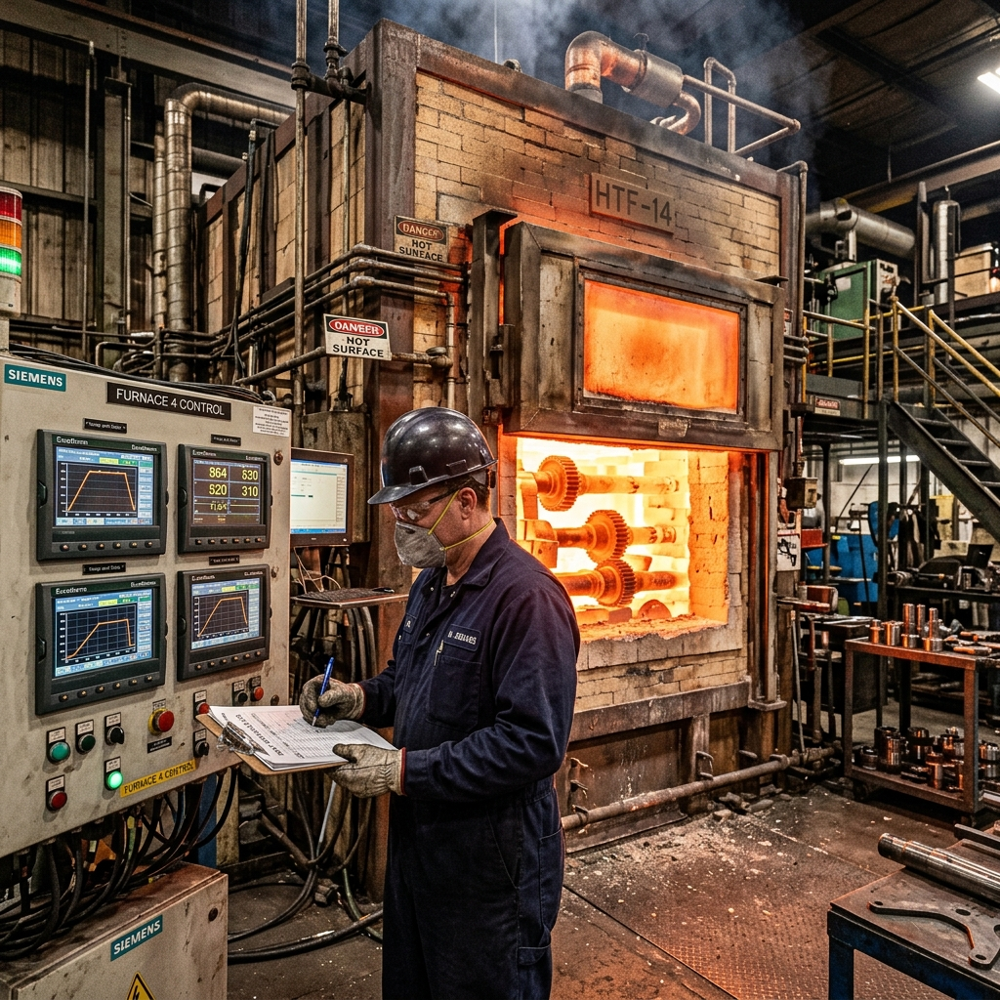

<!--Copyright (c) 2026 Mustafa Uzumeri. All rights reserved.-->

---
title: "heat_treating_furnace_log"
type: "pedagogy"
topics: [safety, compliance, nadcap-ac7102, pyrometry, heat-treating, furnace-log, story]
sources: []
status: "active"
---

# Heat Treating Furnace Log — A Bicultural Dual-Register Explanation

<figure class="blog-hero">
  
  <figcaption>The heat treater logs the furnace temperature and soak time — verifying that the steel undergoes a controlled heat cycle (the Curing of the Wood) to align its inner strength.</figcaption>
</figure>

This document presents a dual-register bicultural explanation of **Heat Treating Furnace Logging and Pyrometry Control** — a critical metallurgical quality assurance process governed by Nadcap AC7102 and AMS2750 (Pyrometry). The relational narrative register draws a direct parallel to the traditional art of **The Curing of the Wood**, where drying and heating green wood to make a hunting bow requires slow, logged cycles of heat to prevent the wood from becoming brittle or cracking internally under tension.

---

## Why This Process?

Metal parts (such as gears, shafts, or structural joints) are heated in industrial furnaces to temperatures exceeding 800°C to alter their molecular structure. This makes the metal harder, tougher, or more ductile. If the heating rate is too fast, the outer shell expands faster than the core, causing internal stress cracks. If the soak time (time at temperature) is too short, the center of the part remains un-cured, leaving it weak. If the thermocouples (temperature sensors) are out of calibration, the furnace might run too hot, grain-coarsening the steel and making it brittle. Because you **cannot see heat treatment defects** with the naked eye, the furnace log is the legal record that proves the process was followed exactly.

This is identical to the traditional curing of wood for hunting bows or snowshoes: a green piece of hickory or ash must be heated slowly over hot stones, or dried in the shade over many moons. If you dry the wood too fast by placing it directly into a hot flame, it looks fine on the outside, but the fibers inside are scorched and brittle. The first time the hunter pulls the bowstring in the cold winter air, the bow will explode in his face. The carver remembers how many fires have burned and how long the wood has sat; the log is the keeper of that memory.

| Settler Compliance Demand | Traditional Story Parallel |
|---|---|
| **Thermocouple Calibration (AMS2750)** | Verifying the hand's sensitivity to the fire's heat, ensuring the carver's judgment is true |
| **Ramp Rate Control (°C per Hour)** | Stoking the fire slowly so the heat reaches the center of the wood without burning the skin |
| **Soak Time Logging (Time at Temp)** | Counting the stars or logs burned to ensure the heat has lived in the heart of the wood long enough |
| **Quench Delay & Medium Check** | Plunging the heated wood into cold water or snow at the exact moment to freeze its shape |
| **Furnace Chart Recorder & Log Book** | The carver's memory sticks or notches that record the curing cycles of the winter wood |

---

## Register A: Conventional Expository SOP

> **SOP Code: HT-SOP-102 — Furnace Operation and Pyrometry Logging Protocol**
>
> 1.0 **Purpose & Scope**: This procedure defines temperature tracking, thermocouple calibration, and log-book requirements for metallurgical heat treatment, in compliance with Nadcap AC7102 and AMS2750.
>
> 2.0 **Furnace Control & Pyrometry Requirements**:
> 2.1 Verify that the furnace has a valid System Accuracy Test (SAT) certification (performed within the last 14 days in accordance with AMS2750).
> 2.2 Inspect the load thermocouples for physical damage or wire degradation. Connect the thermocouples directly to the part or representative test coupon.
>
> 3.0 **Thermal Cycle Execution**:
> 3.1 **Ramp Cycle**: program the furnace controller to increase temperature at a rate not exceeding 150°C per hour until the target temperature of 845°C is reached.
> 3.2 **Soak Cycle: Once all thermocouples reach 845°C ± 5°C, start the soak timer. Maintain temperature for 60 minutes ± 2 minutes.**
> 3.3 **Log Recording**: Record temperature readings from the chart recorder in the log book (Form 102-HTL) every 15 minutes. Note any temperature excursions.
> 3.4 **Quenching**: Upon completion of the soak cycle, transfer parts to the oil quench tank. **The quench transfer delay must not exceed 15 seconds.**
>
> 4.0 **Compliance**: Any missing log entries, uncalibrated thermocouple runs, or quench delay exceedances will invalidate the thermal run. The parts will be quarantined and subjected to destructive micro-hardness testing.

---

## Register B: Bicultural Relational Narrative

> **The Curing of the Wood**
>
> A heat treatment operator in safety glasses and heavy leather gloves stands before a large, roaring brick furnace. Next to him, a young welder-in-training is looking at a digital screen showing lines rising on a temperature graph.
>
> The operator taps the screen. "You see this graph? This is the history of the steel. We are heating this shaft to eight hundred and forty-five degrees, and we must write down the temperature every fifteen minutes. You might think this log book is just paper for the inspectors, but it is actually the **memory of the steel**. The steel remembers how it was heated, and it will hold that memory forever. Let me tell you about **The Curing of the Wood**.
>
> "When a carver wants to make a hunting bow, they select a green branch of hickory. Green wood is alive, full of water, and flexible. But if you try to bend a green branch immediately, it has no memory; it will bend but will not snap back. If you dry it too fast by placing it directly on a hot fire, the outside will dry to a crust, but the center will remain wet. When you bend it, the wood will splinter from the inside out.
>
> "The carver cures the wood slowly. They place it near the heat of the hearth, stoking the fire gently. They do not rush. The heat must travel slowly through the wood, from the bark to the very center of the branch. This is the **ramp rate**. If the heat climbs too fast, the wood will crack.
>
> "Once the wood is warm throughout, the carver keeps it at that heat for a long time. They count the logs burned to keep the heat steady. This is the **soak time**. It is during this quiet time that the fibers of the wood forget their wild shape and learn their new strength.
>
> "In our factory, our steel parts are the same. If we heat them too fast, or if we do not let them soak at eight hundred and forty-five degrees for a full hour, the metal will be hard on the outside but soft at the core. When the machine lifts a heavy load in the sub-zero winter of the North, the metal will snap.
>
> "Our **thermocouples** are our hands. If a carver's hand loses its feeling for the heat of the fire, they will burn the bow. We test our sensors every two weeks to make sure they tell the truth.
>
> "Our **quench** is the freezing of the wood's shape. When we pull the parts out, we have only fifteen seconds to plunge them into the oil. If we wait, the heat escapes, the memory is lost, and the steel becomes weak.
>
> "Write the numbers in the log book with respect. The book is the story of the fire. If the story is true, the hunter walks out onto the winter trail with a bow that will not break. If the story has gaps, the hunter walks into danger."

---

## The Structural Bridge: What the Two Registers Share

Both registers focus on controlling thermal energy over time to eliminate internal stress and change material properties. The expository SOP (Register A) defines the pyrometric limits, ramp speeds, soak times, and quenching delays. The relational narrative (Register B) explains the metallurgical physics of heat transfer and molecular alignment using the traditional craft of bow curing, ensuring the operator understands that thermal processing is a process of deep internal transformation that requires complete consistency.

| SOP Requirement | Expository Rationale | Relational Rationale |
|---|---|---|
| Bi-Weekly SAT Calibration (§2.1) | Ensures temperature sensors are accurate to prevent overheating | "Ensuring the carver's hand is sensitive to the heat so they do not burn the bow" |
| Maximum 150°C/Hr Ramp (§3.1) | Prevents thermal stress cracks from uneven expansion | "Stoking the fire slowly so the heat reaches the center of the wood without burning the skin" |
| 60-Minute Soak Cycle (§3.2) | Ensures complete molecular transformation (austenitization) | "The quiet time of soak: letting the fibers forget their old shape and learn their new strength" |
| 15-Minute Log Intervals (§3.3) | Programmatic audit trail verifying continuous process control | "Writing the story of the fire: the memory log that proves the steel's journey" |
| <15-Second Quench Delay (§3.4) | Prevents premature cooling and phase transformation before quenching | "Plunging the wood into the water at the exact moment to freeze its shape before the heat escapes" |
| Quarantining Incomplete Runs (§4.0) | Mandates structural testing to verify part strength | "Testing the bow before the hunt to ensure it does not explode in the hunter's hand" |

---

## Pedagogical Notes

1.  **Invisible Quality (Metallurgical Phase Change)**: Because heat-treated metal looks identical to untreated metal, operators often view the documentation as administrative busywork. The "memory of the steel" metaphor positions the log book as the material's biography, emphasizing its structural importance.
2.  **Thermal Inertia and Soak**: Trainees often assume that as soon as the air temperature of the furnace reaches the target, the part is cured. The narrative makes the lag between air temperature and core temperature ("from the bark to the center") intuitive.

---

<!--Copyright (c) 2026 Mustafa Uzumeri. All rights reserved.-->
