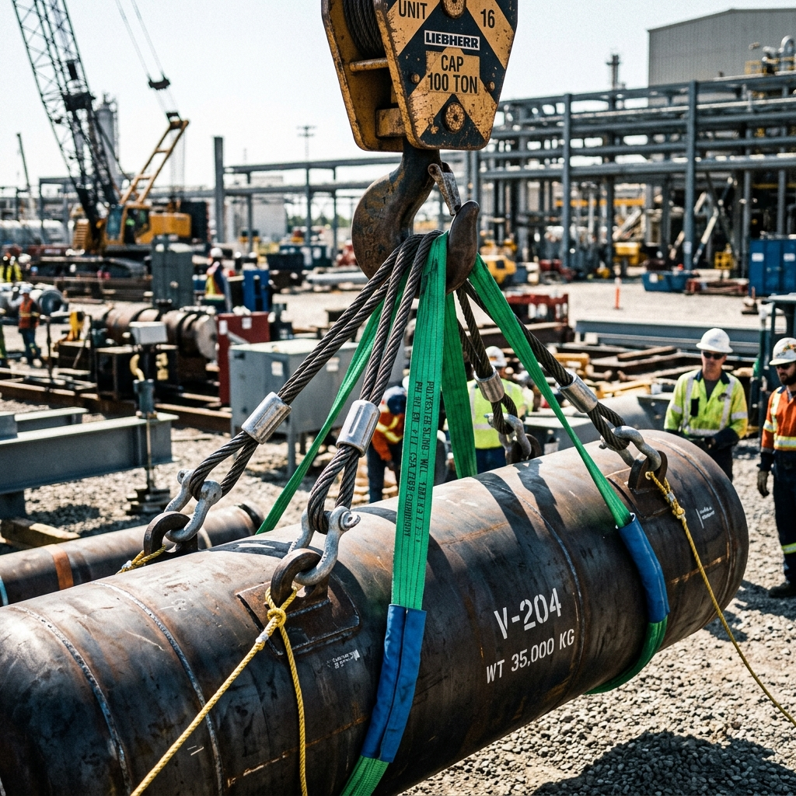

<!--Copyright (c) 2026 Mustafa Uzumeri. All rights reserved.-->

---
title: "heavy_rigging_load_hoist"
type: "pedagogy"
topics: [safety, compliance, csa-z150, rigging, hoist, mobile-cranes, story]
sources: []
status: "active"
---

# Heavy Rigging Load Hoist — A Bicultural Dual-Register Explanation

<figure class="blog-hero">
  
  <figcaption>The rigger checks the load line and the center of gravity — ensuring the heavy cables (the Sinews of the Giant's Arm) are perfectly balanced to lift without snapping.</figcaption>
</figure>

This document presents a dual-register bicultural explanation of **Heavy Rigging Load Hoist** — a critical safety-sensitive operation governed by CSA Z150 (Safety Code for Mobile Cranes). The relational narrative register draws a direct parallel to the traditional concept of **The Arm of the Giant**, where raising a heavy boulder requires finding the balance point and ensuring every supporting strap acts as a healthy muscle sinew working in perfect unison.

---

## Why This Process?

Rigging is the science of moving heavy loads through space. When hoisting objects weighing several tons (such as steel beams, engines, or precast concrete), any failure in the rigging hardware or load calculation is catastrophic. If the center of gravity (CoG) is miscalculated, the load will tilt when lifted, causing shock loads that can snap cables or tip the crane. If a single shackle or sling is worn, or if the angles are too shallow, the stress multiplies exponentially.

This is identical to the traditional method of moving heavy boulders or logs for defensive walls or lodge posts: if the ropes are tied off-center, the log will swing wildly, crushing the crew, or the load will snap the raw-hide ties because one strap was carrying all the weight instead of sharing the burden.

| Settler Compliance Demand | Traditional Story Parallel |
|---|---|
| **Center of Gravity (CoG) Identification** | Locating the balance point of a heavy cedar log before lifting |
| **Sling Angle Stress Calculation** | Understanding that spreading the ropes too wide puts more strain on the ties |
| **Pre-Use Hardware Inspection** | Examining raw-hide ropes and wooden levers for fraying or rot before the lift |
| **D/d Ratio (Sheave/Drum Diameter)** | Ensuring a rope is not bent too sharply over a hard edge, which crushes its fibers |
| **Clear Path & Signal Communication** | The lead builder using hand motions to guide the crew in silence |

---

## Register A: Conventional Expository SOP

> **SOP Code: SAF-SOP-150 — Heavy Rigging and Hoisting Safety Protocol**
>
> 1.0 **Purpose & Scope**: This procedure defines the minimum inspection and calculation requirements for rigging and hoisting heavy loads (>10 tons) using mobile cranes, in accordance with CSA Z150 and provincial OHS standards.
>
> 2.0 **Pre-Lift Planning & Calculations**:
> 2.1 Identify the total gross weight of the load, including rigging hardware (hooks, shackles, spreader bars).
> 2.2 Determine the exact Center of Gravity (CoG). **The crane hook must be positioned directly above the CoG to prevent load swing during initial lift.**
> 2.3 Calculate the sling angle. **Slings must not be rigged at angles less than 45° to the horizontal. A 30° sling angle doubles the tension load on the sling.**
> 2.4 Verify that all hardware (wire rope slings, synthetic slings, shackles) has a legible Rated Capacity tag.
>
> 3.0 **Rigging Hardware Inspection**:
> 3.1 Inspect wire ropes for broken wires (no more than 6 in one lay), kinks, or corrosion.
> 3.2 Inspect synthetic slings for acid burns, melting, punctures, or missing capacity tags.
> 3.3 Ensure all shackles are rated, and the pins are fully engaged and tightened.
>
> 4.0 **Execution & Communication**:
> 4.1 Perform a test lift (bump the load) 50-100 mm off the ground to verify balance and brake function.
> 4.2 Only one designated signal person may direct the crane operator, using standard hand signals.
> 4.3 Keep all non-essential personnel outside the lift-path fall zone.
>
> 5.0 **Compliance**: Any lift executed without a signed Lift Plan (Form 150-LP) for loads exceeding 10 tons will result in immediate work stoppage and safety audit.

---

## Register B: Bicultural Relational Narrative

> **The Arm of the Giant**
>
> An experienced rigger in a yellow high-visibility vest stands near a massive iron hook hanging from a crane boom. Beside him, a young apprentice is wrapping steel wire rope around a heavy steel frame.
>
> The rigger places his hand on the steel wire. "You are wrapping these lines quickly, but let us stop and look. This crane is not just a machine; it is the **Arm of the Giant**. The crane boom is the bone, the winch is the heart, and these wire ropes are the sinews of the arm. If even one sinew is weak, or if we place the load in a way that pulls the arm crooked, the Giant will drop the weight, and anyone standing beneath will be crushed.
>
> "Think of how our ancestors moved the great stone hearths. When we had to lift a boulder that took ten men to push, we did not just tie a rope anywhere and pull. First, the Elder would walk around the stone, touching it with his fingertips. He was feeling for the **center of the weight** — the heart of the stone. He knew that if we lifted from one side of the heart, the stone would swing like a pendulum when it left the earth. A swinging stone cannot be controlled; it becomes a weapon that smashes the legs of the lifters. We must place our lift directly over the heart.
>
> "Second, look at the angle of these straps. If you pull these cables tight at a flat angle to the load, you are forcing the ropes to fight each other. In our hunting stories, when two men carry a heavy deer on a pole, they walk close together. If they stand far apart and stretch their arms wide, the deer feels twice as heavy, and their shoulders will pop. When we rig these cables, we want them to stand tall, like the pines in a dense forest — at least forty-five degrees. If they lie down flat, the tension doubles. The metal will scream, and the cables will snap.
>
> "Third, look at how the wire rope wraps around the sharp edge of this steel frame. If you run a rope over a sharp stone edge, the stone cuts the outer fibers, and the rope fails. We use wood padding or softeners to protect the rope. We call this the **respect of the bend**. A rope must have a smooth curve to keep its strength.
>
> "Before we lift the load, we 'bump' it. We lift it just an inch. We watch how it hangs. If it tilts, we put it down and adjust the ties. We do not try to fight gravity with our hands. We let the earth tell us if our balance is true.
>
> "Only one person talks to the Giant. If five people are shouting directions, the crane operator is blind. One voice guides the arm, clear and calm.
>
> "Respect the heart of the weight, guard the sinews of the ropes, and never stand under the hand of the Giant when it rises."

---

## The Structural Bridge: What the Two Registers Share

Both registers focus on managing gravity and preventing mechanical failure. The expository SOP (Register A) defines the strict safety margins, weight limits, and angles. The relational narrative (Register B) explains the physics of load balance and sling tension using the physical mechanics of body movement and traditional boulder-lifting, ensuring the crew understands the hidden forces at play.

| SOP Requirement | Expository Rationale | Relational Rationale |
|---|---|---|
| Hook Over CoG (§2.2) | Prevents side-loading of the boom and swing of the load | "Lifting directly over the heart of the stone to prevent it swinging like a pendulum" |
| Minimum 45° Sling Angle (§2.3) | Reduces tension load on slings caused by geometry | "Keeping the lifting lines close and tall so they do not fight each other and double the weight" |
| Inspect Hardware (§3.0) | Identifies broken wires or damaged fibers before failure | "Checking the sinews of the arm for wear before asking them to carry the giant's load" |
| Sharp Edge Softening (§2.0) | Prevents cutting or crushing of sling fibers on metal edges | "The respect of the bend: using padding so the sharp stone does not slice the fibers" |
| Test Lift / Bump (§4.1) | Verifies load stability, rigging balance, and hoist brake | "Bumping the load an inch to let the earth tell us if our balance is true" |
| Single Signal Person (§4.2) | Eliminates conflicting commands to crane operator | "Having only one voice guide the arm so the Giant is not blinded by noise" |

---

## Pedagogical Notes

1.  **Invisible Forces (Tension Multiplication)**: Flat rigging angles are a major source of rigging failures because operators often assume that if a sling is rated for 5 tons, it can lift 5 tons at any angle. The "Deer on a Pole" metaphor makes the geometric multiplier of tension intuitive.
2.  **Collective Discipline**: In rigging, a single weak point fails the entire lift. The concept of "sinews of the arm" reinforces that safety is not about individual components but about the complete system working in coordination.

---

<!--Copyright (c) 2026 Mustafa Uzumeri. All rights reserved.-->
