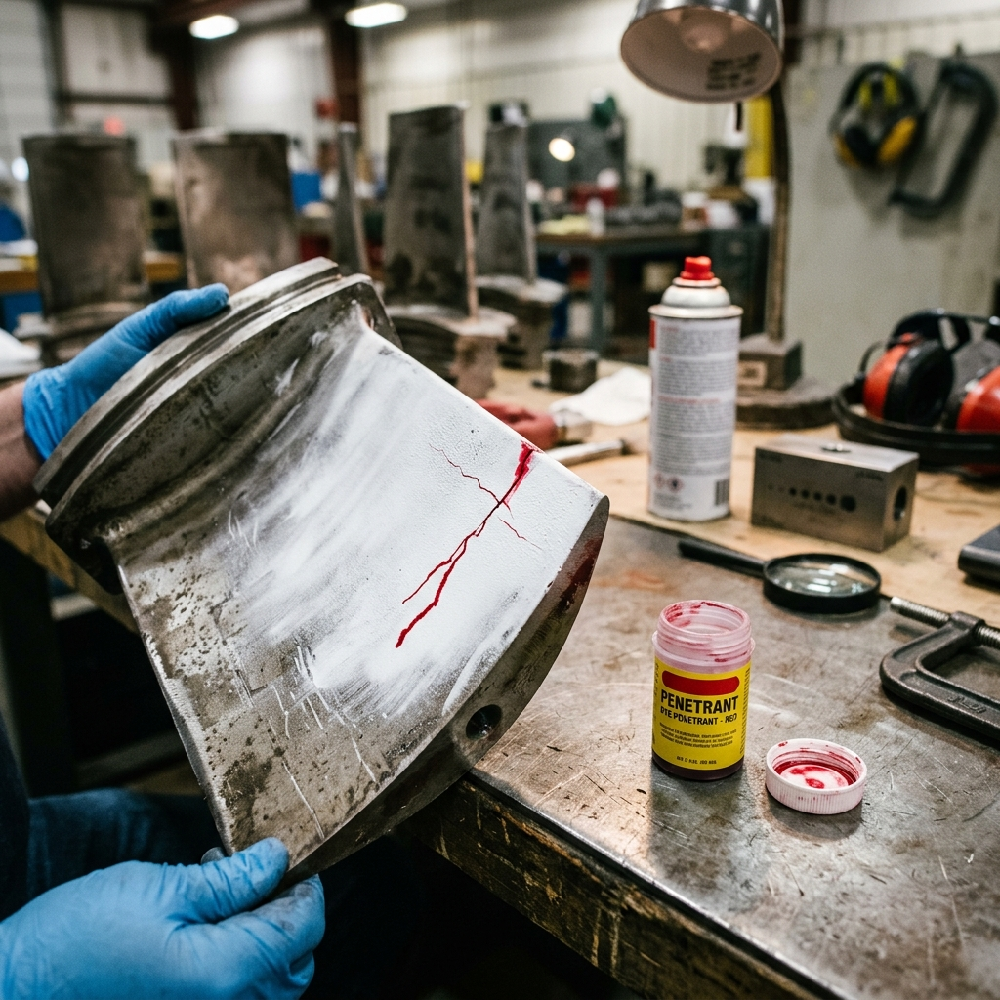

<!--Copyright (c) 2026 Mustafa Uzumeri. All rights reserved.-->

---
title: "liquid_penetrant_inspection"
type: "pedagogy"
topics: [safety, compliance, nadcap-ac7114, ndt, inspection, story]
sources: []
status: "active"
---

# Liquid Penetrant Inspection — A Bicultural Dual-Register Explanation

<figure class="blog-hero">
  
  <figcaption>The inspector applies the white developer over the red dye — drawing out the hidden surface cracks (the Blood of the Stone) to make the invisible flaws visible to the eye.</figcaption>
</figure>

This document presents a dual-register bicultural explanation of **Liquid Penetrant Inspection (LPI)** — a critical aerospace non-destructive testing (NDT) process governed by Nadcap AC7114. The relational narrative register draws a direct parallel to the traditional technique of **The Blood of the Stone**, where fat, oil, or water and charcoal are rubbed on hides, wood, or stone to pull hidden cracks and animal tracks into sharp contrast.

---

## Why This Process?

Aerospace components (such as turbine blades, weldments, or landing gear) are subject to high cyclic stress. Over time, they can develop micro-cracks on the surface. These cracks are **invisible to the naked eye** because they are extremely narrow (often less than a micrometer wide). If a component with a micro-crack is returned to service, the crack will grow under stress, leading to sudden, catastrophic structural failure during operation. Liquid Penetrant Inspection makes these invisible cracks visible by using capillary action to draw a bright red dye into the crack, and then using a white developer to draw it back out, creating a highly visible red-on-white bleed-out line.

This is identical to traditional tracking and material inspection: when inspecting a cedar canoe hull or a stone tool for hidden fractures, craftspeople would rub fish oil and fine charcoal ash over the surface. The oil carried the dark ash into the microscopic cracks. When the surface was wiped clean, the dark lines remained, exposing the cracks like veins on a leaf — the "blood of the stone."

| Settler Compliance Demand | Traditional Story Parallel |
|---|---|
| **Surface Pre-Cleaning (Solvent/Ultrasonic)** | Washing the wood or stone to clear away dirt, moss, and grease that block the openings |
| **Penetrant Application & Dwell Time** | Letting the fish oil soak into the grain of the wood or cracks of the stone over time |
| **Excess Penetrant Removal (Wipe-Down)** | Wiping the surface clean so only the oil trapped deep inside the cracks remains |
| **Developer Application (Capillary Bleed-Out)** | Applying dry, white clay or ash to pull the wet oil out, making it bloom on the surface |
| **Discontinuity Evaluation (Sizing & Limits)** | Deciding if a crack in a bow or canoe hull is a minor blemish or a structural break |

---

## Register A: Conventional Expository SOP

> **SOP Code: NDT-SOP-114 — Liquid Penetrant Inspection Protocol**
>
> 1.0 **Purpose & Scope**: This procedure defines the requirements for Type II (Visible Dye), Method C (Solvent-Removable) liquid penetrant inspection of machined metal parts, in compliance with Nadcap AC7114 and ASTM E1417.
>
> 2.0 **Process Steps**:
> 2.1 **Surface Preparation**: Clean the test surface thoroughly using solvent cleaner (Class 2). The surface must be dry and free of oil, grease, scale, or paint. Allow 5 minutes for solvent evaporation.
> 2.2 **Penetrant Application**: Spray or brush a continuous film of visible red dye penetrant onto the inspection area. **Maintain a minimum dwell time of 10 minutes (maximum 30 minutes) to allow capillary action to draw dye into surface cracks.**
> 2.3 **Removal of Excess Penetrant**: Wipe the surface with clean, lint-free cloths. To remove remaining surface residue, dampen a cloth with solvent cleaner and wipe. **Do not spray solvent cleaner directly onto the part, as it will wash the penetrant out of the cracks.**
> 2.4 **Developer Application**: Shake the developer container vigorously. Spray a thin, uniform layer of non-aqueous wet developer (white silica suspension) onto the part from a distance of 250-300 mm.
> 2.5 **Inspection**: Observe the part during developer application. **Conduct final evaluation between 10 and 30 minutes after the developer dries.** Look for red bleed-out lines against the white background.
>
> 3.0 **Interpretation**: Linear indications (length > 3x width) are rejectable. Rounded indications larger than 1.5 mm must be evaluated against design limits.

---

## Register B: Bicultural Relational Narrative

> **The Blood of the Stone**
>
> A quality inspector in blue gloves stands at a clean metal workbench. A young aerospace technician is holding a polished aluminum bracket. The inspector has a red spray can and a white spray can on the table.
>
> The inspector picks up the bracket. "It looks clean and strong, doesn't it? If you look at it under this magnifying glass, it seems perfect. But metals are like the stones of the river — they can hide their fractures deep inside, keeping a secret that will only show itself when the stress is greatest. Let us perform the ceremony of the **Blood of the Stone** to see what it is hiding.
>
> "First, we wash the metal until it is completely pure. If there is grease from your fingers or oil from the machine, the oil will block the tiny gates of the cracks. The crack must be empty to receive the dye.
>
> "Second, we spray the **red penetrant**. This liquid is thin, thinner than water. It has a special spirit that loves to climb into small spaces — **capillary action**. In our stories, when the hunters wanted to see if a clay pot was cracked before baking it, they filled it with colored grease and let it sit by the fire. The grease would search out the tiniest gaps in the clay. We must leave the red dye on the metal for ten minutes. This is the **dwell time** — the time of waiting. The liquid needs time to find the bottom of the crack.
>
> "Third, we wipe the surface clean. We must be very gentle. If you wash it too hard, or spray solvent directly on it, you will wash the liquid out of the crack itself. We only want to clean the surface, leaving the red liquid trapped inside the throat of the fracture.
>
> "Fourth, we spray the **white developer**. This developer is like dry clay or fine wood ash. When you spread dry ash on a wet spot, the ash drinks the water, drawing it up to the surface. As the white powder dries, it pulls the red liquid out of the crack. The red dye spreads into the white powder, blooming like a red flower in the snow.
>
> "We call this the **bleed-out**. If you see a thin red line appear, the stone is bleeding. It is telling you: *I am broken here.* A red line is a track of a crack. If it is long and sharp, the metal has a fracture that will split when the plane climbs into the cold sky.
>
> "Do not ignore the red lines. The stone does not bleed without cause. Respect the blood, find the track, and ensure the bone is whole before it is flown."

---

## The Structural Bridge: What the Two Registers Share

Both registers describe a process that uses capillary dynamics to reveal surface discontinuities. The expository SOP (Register A) defines the solvent classes, dwell times, and reject criteria. The relational narrative (Register B) explains the physics of capillary action and absorption using traditional metaphors of clay pot testing and ash absorption, ensuring the technician understands why excessive washing or premature inspection invalidates the test.

| SOP Requirement | Expository Rationale | Relational Rationale |
|---|---|---|
| Solvent Clean Surface (§2.1) | Removes contaminants blocking capillary path | "Washing the metal so the grease does not block the tiny gates of the cracks" |
| 10-30 Min Dwell Time (§2.2) | Provides time for liquid to penetrate deep cracks | "The time of waiting: letting the red liquid search out the bottom of the fracture" |
| Wipe, Do Not Spray Cleaner (§2.3) | Prevents flushing penetrant out of defect openings | "Wiping gently so we only clean the surface, leaving the liquid trapped in the throat" |
| Spray Developer Thinly (§2.4) | Creates a capillary draw and high-contrast background | "Applying dry white clay to drink the wet liquid, drawing it up to bloom like a flower" |
| 10-30 Min Inspection Window (§2.5) | Allows complete bleed-out without excessive spreading | "Watching the red lines grow in the snow to trace the track of the crack" |
| Reject Linear Indications (§3.0) | Stress concentrations at sharp cracks propagate rapidly | "Recognizing that the stone does not bleed without cause and must be rejected" |

---

## Pedagogical Notes

1.  **Intuitive Capillary Physics**: Capillary action and absorbent draw can feel abstract to trainees. Comparing the process to dry wood ash drinking water from a wet spot ground the chemical/physical reactions in common, observable phenomena.
2.  **Patience in Quality Auditing**: In production environments, workers often rush the dwell and development times. The narrative frame of "the time of waiting" positions these pauses as active steps of physical discovery, rather than idle downtime.

---

<!--Copyright (c) 2026 Mustafa Uzumeri. All rights reserved.-->
