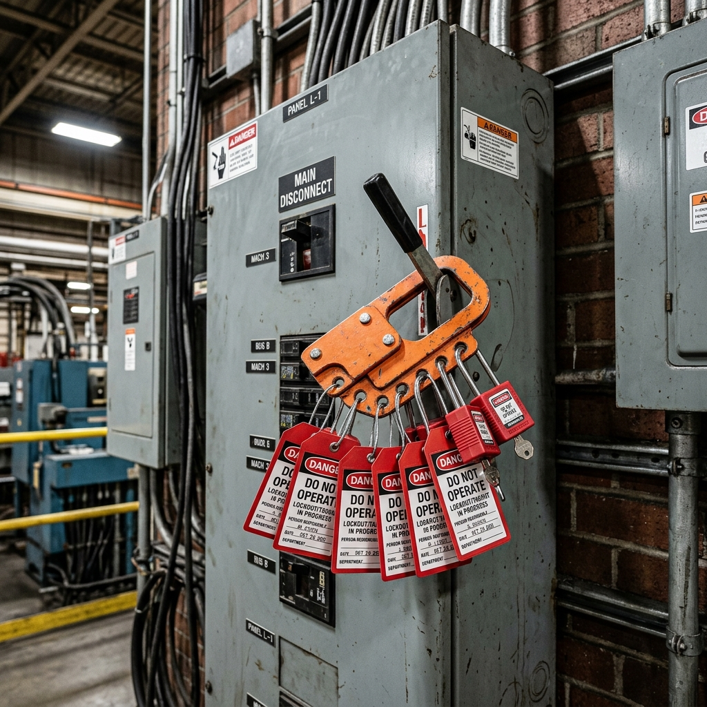

<!--Copyright (c) 2026 Mustafa Uzumeri. All rights reserved.-->

---
title: "loto_breaker_isolation"
type: "pedagogy"
topics: [safety, compliance, csa-z460, loto, story]
sources: []
status: "active"
---

# LOTO Breaker Isolation — A Bicultural Dual-Register Explanation

<figure class="blog-hero">
  
  <figcaption>The lock-out tag-out clamp holds the switch in place — a physical representation of the worker's life-shadow left on the machine to protect their safety.</figcaption>
</figure>

This document presents a dual-register bicultural explanation of **Lock-Out Tag-Out (LOTO) Electrical Breaker Isolation** — a critical safety process governed by CSA Z460 (Control of Hazardous Energy) and provincial OHS regulations. The relational narrative register draws a direct parallel to the traditional concept of the **life-shadow (or personal signature)**, where a physical object left behind represents an active relationship, a covenant, and an absolute boundary that cannot be crossed by others.

---

## Why This Process?

Electrical breaker isolation is an **invisible risk control**. Once a breaker switch is flipped off and the cover closed, the circuit appears safe. However, the energy remains present in the main lines, waiting to be re-energized by anyone who flips the switch back. Because the worker performing maintenance cannot see the current or monitor the switch while working inside the machine, they must establish an **un-bribable physical boundary** to prevent accidental activation.

This is similar to traditional boundaries of space and tool ownership: an active trap, a curing lodge, or a drying frame is left with a personal signet or physical indicator that tells the community: *"A hand is currently at work here; do not disturb the circle."*

| Settler Compliance Demand | Traditional Story Parallel |
|---|---|
| **Zero Energy State** | Verifying that the fire is fully out and cold before entering the pit |
| **Personal Lock Application** | Leaving a personal signet or belt on a drying frame to mark active work |
| **One Person, One Lock** | The life-shadow: only the one who leaves their mark can retrieve it |
| **Group Lock Box** | Coordinating multiple families' marks on a single shared lodge boundary |
| **Verifying Isolation (Try Step)** | Testing a branch's strength before stepping your full weight onto it |

---

## Register A: Conventional Expository SOP

> **SOP Code: SAFE-SOP-460 — Electrical Breaker Panel Lock-Out Tag-Out Protocol**
>
> 1.0 **Purpose & Scope**: This procedure defines requirements for isolating electrical circuits at primary breaker panels before servicing machinery, in accordance with CSA Z460-20 §7.2 and provincial OHS regulations.
>
> 2.0 **Preparation & Notification**:
> 2.1 Identify all energy sources (electrical, kinetic, gravity) associated with the target machinery.
> 2.2 Notify all affected operators and supervisors in the area that the machine will be shut down and locked out.
>
> 3.0 **Isolation & Lock Application**:
> 3.1 Perform a normal machine shutdown. Locate the primary breaker switch on the designated electrical panel.
> 3.2 Switch the breaker to the **OFF** position.
> 3.3 Apply the approved multi-lock scissor clamp (hasp) through the breaker switch handle loop.
> 3.4 Apply your personal **Red Lock** to the scissor clamp. The lock must be physically secured.
> 3.5 Write your name, department, date, and contact number on the designated Danger Tag, and attach the tag to your lock.
>
> 4.0 **Zero-Energy Verification (The "Try" Step)**:
> 4.1 Prior to entering the machine envelope, verify that the circuit is completely dead.
> 4.2 Press the local machine start button or activate the control switch. The machine must not start or cycle.
> 4.3 Return the machine control switch to the **OFF** position after testing.
>
> 5.0 **Lock Removal**:
> 5.1 Only the operator whose name is on the Danger Tag and who owns the key is authorized to remove the lock. 
> 5.2 **Under no circumstances shall a lock be cut or removed by another person without a formal management override authorization (Form 460-C).**

---

## Register B: Bicultural Relational Narrative

> **The Red Lock and the Life-Shadow**
>
> A veteran millwright stands in front of a gray steel panel box with a young apprentice. On the table lies a scissorhasp and a heavy brass lock, painted bright red. 
>
> The veteran picks up the red lock and hands it to the apprentice. "You see this lock? It only has one key, and that key is in your pocket. The engineers call this LOTO — Lock-Out Tag-Out. They will tell you it is a rule in the binder. But let me tell you what it actually is.
>
> "In the old times, when our hunters went out to set traps or when our weavers built a large loom frame in the woods, they did not have locks. But they had something stronger. If a weaver had to leave her frame to gather more willow branches, she would leave her personal sash or a carved bone signet hanging from the center beam. 
>
> "Everyone in the camp knew that signet. It was her **life-shadow** on the wood. It was a sign that said: *'My hands are still holding this frame; my spirit is present here.'* No one would touch that frame, because to touch it without her presence was to sever the relationship of respect between families. It was like stealing the breath from her mouth.
>
> "This red lock is your sash. Today, you are going to climb inside the conveyor belt to replace the bearings. If someone starts the motor while your arm is in the gears, you will lose it. So you flip this breaker switch to the OFF position, and you put this clamp on it. Then, you snap your red lock through the hole.
>
> "That lock is your life-shadow on the power line. As long as that lock is closed, it is your hand holding the switch down. No one can touch that switch, because to touch it is to touch your body.
>
> "Now, before you crawl into the machine, you must test the line. We call this the 'Try' step. It is like crossing a frozen creek. You don't just walk onto the ice because it looks solid. You take a heavy stick and you strike the ice first. You step your weight onto it slowly. You verify it holds. Here, you press the start button on the wall. If the belt moves even a millimeter, the ice is thin. You do not enter. You only step in when the button does nothing.
>
> "And remember: only your hand can remove that lock. If you go home at the end of the shift and leave your lock on the panel by accident, and the supervisor calls a locksmith to cut it off with bolt cutters, they are not just cutting metal. They are cutting your life-shadow. They are saying your presence does not matter. That is why we have the rule: one person, one lock, one key. You do not let anyone else hold your key, because your key is your breath. Protect it, and respect the locks of others as you would protect their life."

---

## The Structural Bridge: What the Two Registers Share

Both registers describe the same physical requirements. The expository SOP (Register A) defines the technical sequence. The relational narrative (Register B) frames the lock as a physical covenant, ensuring that the worker internalizes the safety obligation rather than treating it as a paper exercise.

| SOP Requirement | Expository Rationale | Relational Rationale |
|---|---|---|
| Apply Scissor Hasp (§3.3) | Allows multiple workers to lock out the same switch | "Ensures every hunter can place their sash on the boundary" |
| Apply Personal Red Lock (§3.4) | Prevents unauthorized re-energization of the panel | "Leaves your life-shadow on the switch; your hand holds it off" |
| Danger Tag with Contact Details (§3.5) | Identifies who is working on the system for communication | "Declares your name to the lodge so they know whose breath is on the line" |
| Zero-Energy "Try" Step (§4.2) | Verifies that isolation was successful and no stored energy remains | "Testing the ice of the frozen creek before stepping your full weight onto it" |
| Lock Override Authorization (§5.2) | Legal audit trail for emergency removal of a lock | "A formal gathering of the council before touching another's life-shadow" |

---

## Pedagogical Notes

1.  **Consequence Over Audits**: Relational learners respond best to safety training that emphasizes direct human impact and relationship boundaries rather than regulatory fines. Framing the lockout device as a personal "life-shadow" shifts the motivation from audit compliance to mutual protection.
2.  **The "Try" Step as Natural Caution**: The verification step (testing the button) is often rushed. Comparing it to testing ice on a creek anchors the action in a natural, intuitive safety loop that requires no translation.

---

<!--Copyright (c) 2026 Mustafa Uzumeri. All rights reserved.-->
