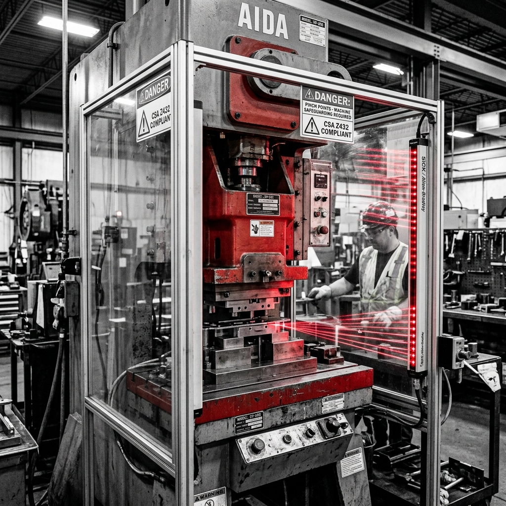

<!--Copyright (c) 2026 Mustafa Uzumeri. All rights reserved.-->

---
title: "machine_guarding_interlocks"
type: "pedagogy"
topics: [safety, compliance, csa-z432, machine-guarding, story]
sources: []
status: "active"
---

# Machine Guarding & Interlocks — A Bicultural Dual-Register Explanation

<figure class="blog-hero">
  
  <figcaption>The safety shield and light curtain form an invisible barrier — the Muzzle of the Iron Beast that keeps the operator's hands safe from its bite.</figcaption>
</figure>

This document presents a dual-register bicultural explanation of **Machine Guarding and Interlock Verification** — a critical safety procedure governed by CSA Z432 (Safeguarding of Machinery). The relational narrative register draws a direct parallel to the traditional relationship with **large domestic animals or captured forces (like the iron beast)**, framing machine shields and laser light curtains not as operational nuisances, but as the muzzle and the boundary line that keep both the beast and the village safe.

---

## Why This Process?

Modern industrial machinery operates with **unyielding force**. A mechanical press or automated milling head cannot distinguish between a piece of sheet metal and a human hand. Once the cycle begins, the machine will execute its path with thousands of pounds of pressure, instantly crushing or severing anything in its way. Because humans are subject to moments of distraction or slips, safety relies on **fail-safe physical barriers** and **optical interlocks** that cut the power before a hand can reach the danger zone.

In traditional understanding, a powerful draft animal (like a large ox or a protective sled dog) is valued for its strength, but it is always muzzled or corralled when working near children. The muzzle is not a punishment for the beast; it is the boundary that allows the beast and the people to live together in peace.

| Settler Compliance Demand | Traditional Story Parallel |
|---|---|
| **Fixed Guarding (Physical Shields)** | The sturdy log fence that keeps the corralled horse from stepping into the lodge |
| **Interlock Switch Check** | Testing the latch on the gate to ensure the beast cannot push it open |
| **Optical Light Curtains (Laser Barriers)** | The warning scent line that tells a dog where the camp boundary ends |
| **Stop-Time Measurement (Inertia)** | Knowing how long a running canoe takes to stop after you pull the paddle out |
| **Daily Pre-Shift Function Test** | Checking the halter and leash for wear before leading the animal out |

---

## Register A: Conventional Expository SOP

> **SOP Code: SAFE-SOP-432 — Machine Safeguarding and Interlock Verification Protocol**
>
> 1.0 **Purpose & Scope**: This procedure defines safety requirements for verifying the integrity of physical guards and testing electrical/optical interlock devices on all automated machinery, in compliance with CSA Z432-15 §6.2.
>
> 2.0 **Fixed Guard Inspection**:
> 2.1 Prior to shift start, visually inspect all fixed guards (plexiglass shields, metal grates).
> 2.2 Verify that all fasteners are secure. Fixed guards must require a tool (e.g., wrench, key) for removal; they must not be loose or bypassable by hand.
> 2.3 Inspect shields for cracks, deformation, or wear that could allow body parts to bypass the barrier.
>
> 3.0 **Interlock & Light Curtain Testing**:
> 3.1 **Test the Physical Gate Interlock**: Start the machine in normal cycle. Open the access gate. The machine must stop immediately.
> 3.2 **Test the Optical Light Curtain (The Test Rod Test)**: Start the machine in normal cycle. Insert the approved non-conductive test rod into the light curtain laser path. The machine must halt immediately.
> 3.3 Verify that the machine cannot be restarted from the main controls while the light curtain path is broken or the gate is open.
>
> 4.0 **Compliance**: Operating a machine with loose guards, bypassed interlock switches, or misaligned light curtains is a critical safety violation, resulting in immediate machine lockout and disciplinary review.

---

## Register B: Bicultural Relational Narrative

> **The Muzzle of the Iron Beast**
>
> A senior press operator stands beside a massive automated stamping machine with a new helper. The machine hums quietly. In front of the moving press plate, a transparent plexiglass door is shut, and a row of tiny red laser beams glows on the side.
>
> The senior operator points to the moving gears inside. "You see this press? It has the strength of a hundred horses. It can shape thick iron like clay. But the press has no eyes. It cannot see where the metal ends and your hand begins.
>
> "My grandfather trained draft oxen to clear logs from the forest. A good ox was a treasure; it did the work of ten men. But a working ox is a heavy beast with iron hooves and great horns. Grandfather never let a child lead the ox, and he always put a thick leather muzzle over its mouth when it walked near the camp.
>
> "The muzzle did not make the ox weaker. It did not change its work. It was the boundary that allowed the ox and the family to live in the same circle without blood.
>
> "This steel machine is our ox. The plexiglass doors and these red laser lights are the muzzle.
>
> "Before you start your work today, you must check the muzzle. Look at these bolts holding the fence. If they are loose, or if someone has left the door open and bypassed the switch with a wire to save time, the muzzle is broken. You do not lead a wild beast into the field without its halter.
>
> "Next, you test the laser curtain. We call this the **Test Rod test**. You take this wooden rod — it represents your arm — and you slide it through the red light path while the machine is cycling. 
>
> "The moment the wood breaks the light path, the power must die instantly. It is like the warning line of scent we place around our camp to tell the dogs: *'Do not step past this line.'* The machine must listen to that boundary. If it keeps moving even for a fraction of a second, the beast is not responding to the rein. You lock it out immediately.
>
> "Never bypass a guard. Never think your hands are fast enough to beat the machine. The iron beast does not feel anger, but it does not feel mercy either. It only follows its cycle. Keep the muzzle whole, and let the beast do the heavy work while you stand safely outside its reach."

---

## The Structural Bridge: What the Two Registers Share

Both registers describe the same physical requirements. The expository SOP (Register A) defines the testing steps and mechanical parameters. The relational narrative (Register B) explains the *why* of the guarding rules, framing the machine as a wild force that must remain muzzled for the safety of the working community.

| SOP Requirement | Expository Rationale | Relational Rationale |
|---|---|---|
| Guards Must Require Tools (§2.2) | Prevents operators from easily removing or bypassing guards during cycle | "Ensures the halter is locked on the beast; it cannot be shaken off by hand" |
| Gate Interlock Stop Test (§3.1) | Cuts control power immediately when access gate is opened | "Testing the gate latch to ensure the beast cannot push through the fence" |
| Light Curtain Test Rod Check (§3.2) | Verifies the optical sensor detects objects of minimum diameter | "Ensures the warning scent line is active and stops the beast's charge instantly" |
| Stop-Time Verification (§3.1) | Ensures the machine halts before a hand can reach the pinch point | "Knowing how long the canoe takes to stop after pulling the paddle; stopping before you hit the bank" |
| No-Restart While Blocked (§3.3) | Prevents accidental cycling while operator is inside danger zone | "Ensures the beast cannot be led forward while a helper is standing in its path" |

---

## Pedagogical Notes

1.  **Anti-Bypassing Logic**: Workers often bypass interlocks to clear jams faster and meet production quotas. Framing the interlock as a "halter" or "muzzle" helps workers see that bypassing the safety system is an act of disrespect toward a powerful force, rather than a clever shortcut.
2.  **Visual boundaries**: The laser light curtain is an invisible boundary that can be easily ignored. Comparing it to an active camp boundary helps workers respect the space even when the machine is stationary.

---

<!--Copyright (c) 2026 Mustafa Uzumeri. All rights reserved.-->
