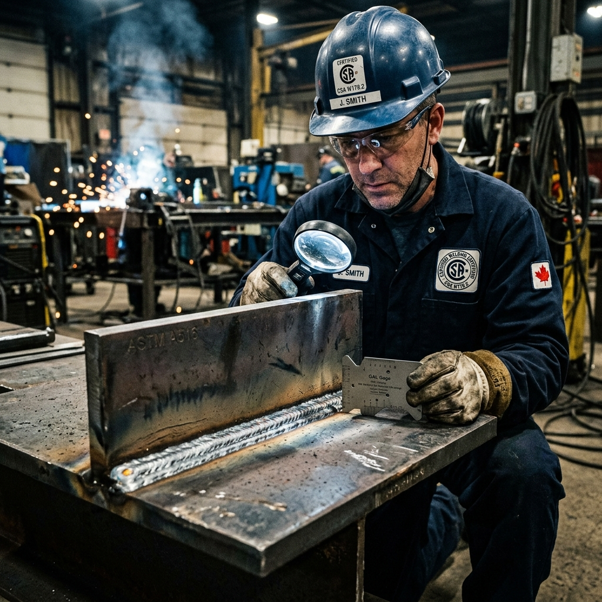

<!--Copyright (c) 2026 Mustafa Uzumeri. All rights reserved.-->

---
title: "structural_weld_joint_inspection"
type: "pedagogy"
topics: [safety, compliance, csa-w178-2, welding, inspection, story]
sources: []
status: "active"
---

# Structural Weld Joint Inspection — A Bicultural Dual-Register Explanation

<figure class="blog-hero">
  
  <figcaption>The welding inspector examines the joint — verifying the deep marriage of two steels (the Fusing of Two Bones) to ensure the structure holds under tension.</figcaption>
</figure>

This document presents a dual-register bicultural explanation of **Structural Weld Joint Inspection (Pre-Weld and Root Pass)** — a critical quality assurance task governed by CSA W178.2 (Certification of Welding Inspectors) and CSA W47.1. The relational narrative register draws a direct parallel to the traditional concept of **the fusing of two bones or the binding of joints in lodge construction**, where the union between two elements must be complete at the core, not just superficial on the surface.

---

## Why This Process?

A weld joint is a **marriage of metals**. When two steel plates are joined to carry a structural load (such as a crane boom or a mining rig), they cannot simply be glued together at the edges. The welder must melt the base metals and fuse them with a filler rod, creating a single, continuous crystalline structure. If the joint fit-up is incorrect, or if the first pass (the root pass) lacks penetration, an **invisible gap** remains at the center of the weld. Under load or cold weather, this hidden gap will act as a stress concentrator, causing the joint to fail catastrophically without warning.

This is identical to traditional joint construction in longhouses or sleds: if the lashings or mortise joints are only wrapped tight on the outside but contain rot or a loose gap at the core, the joint will snap when the sled carries its load through the mountain pass.

| Settler Compliance Demand | Traditional Story Parallel |
|---|---|
| **Root Opening Gap (Fit-Up Check)** | Checking the gap between logs to ensure the clay sealing will bind deeply |
| **Root Pass Penetration Audit** | Verifying the first, deepest lashing of a sled joint before adding outer layers |
| **Porosity & Slag Inclusion Check** | Inspecting a bone-glue seal for air bubbles that will weaken the bond |
| **Non-Destructive Testing (NDT / C-Scan)** | Feeling the weight and flexing the wood by hand to listen for internal cracks |
| **Welder Certification (CWB Tickets)** | The young hunter proving their knot-tying and lashing to the Elders before the hunt |

---

## Register A: Conventional Expository SOP

> **SOP Code: QMS-SOP-178 — Pre-Weld Fit-Up and Root Pass Inspection Protocol**
>
> 1.0 **Purpose & Scope**: This procedure defines inspection requirements for structural steel weld joints prior to and during the welding cycle, in accordance with CSA W59 (Welder Steel Construction) and CSA W178.2.
>
> 2.0 **Pre-Weld Fit-Up Inspection**:
> 2.1 Verify that joint bevel angles match the approved Welding Procedure Specification (WPS) within ±2.5°.
> 2.2 Inspect the joint root opening (gap) using a calibrated weld fillet gauge. **The gap must be maintained between 1.6 mm and 3.2 mm (1/16" to 1/8") to allow complete electrode penetration.**
> 2.3 Verify that the surfaces are clean of mill scale, rust, moisture, and grease within 25 mm of the joint.
>
> 3.0 **Root Pass Inspection**:
> 3.1 After the welder completes the first pass (the root pass), stop the process for visual inspection.
> 3.2 Verify complete root fusion. There must be no visible lack of penetration (LOP) or cold lap at the root face.
> 3.3 Inspect for surface porosity, undercut, or slag inclusions. All slag must be fully ground out before subsequent passes.
>
> 4.0 **Compliance**: Proceeding to weld the fill and cap passes without inspector sign-off on the root pass constitutes a non-conformance (Form 178-NCR). The joint must be cut out and re-prepared.

---

## Register B: Bicultural Relational Narrative

> **The Fusing of Two Bones**
>
> A welding inspector in a dark blue jacket stands beside a welding station, looking at two beveled steel plates held in a jig. Beside him, a young welder stands with his helmet raised.
>
> The inspector points to the tiny gap between the two plates. "The weld schedule says the root gap must be exactly three-thirty-seconds of an inch. If you make it too narrow, the weld rod cannot reach the bottom. If too wide, the metal will fall through. Let me tell you what this gap actually represents.
>
> "In our traditional medicine, when a hunter broke a leg bone in the winter forest, the healer had to set the bone. They did not just bind the skin. They knew that if the two ends of the bone did not touch exactly, or if there was muscle trapped in the gap, the bone would heal crooked or remain weak. The two bone ends had to marry at the marrow. 
>
> "When we weld these two steel plates, we are fusing two bones. The steel will support the main frame of a crane that lifts heavy loads over the heads of our workers. If the weld is only strong on the outside — the cap — but contains an empty gap at the center — the root — the bone is broken before it is ever used. Under tension, the weld will split from the inside out.
>
> "So first, we check the **fit-up**. We clean the metal until it shines like ice. If there is grease, scale, or moisture, it will bubble inside the liquid steel, leaving tiny pockets of air — **porosity**. Air is the enemy of strength. It is like rot inside the bone.
>
> "Second, you lay your first bead: the **root pass**. This is the deepest marriage. I look at it with my lens. I am looking to see if the liquid metal flowed completely to the bottom of the gap and fused with the shoulders of both plates. If I see a dark shadow at the bottom, it means the root is cold. The bones did not touch.
>
> "If I tell you to grind it out and start again, do not feel defeated. The healer would rather reset the bone three times in the tent than let the hunter walk out onto the winter trail on a leg that will snap under the first snow.
>
> "Our work is the marrow of this structure. The cap weld on top is what the world sees, but the root weld at the bottom is what keeps the crane in the air. Respect the root, fuse the marrow, and make sure the bones are one before you build the rest of the lodge."

---

## The Structural Bridge: What the Two Registers Share

Both registers describe the same physical requirements. The expository SOP (Register A) defines the technical gap sizes, angles, and defect types. The relational narrative (Register B) explains the *why* of the root pass using the traditional logic of bone setting and joint loading, helping the welder see the inner passes as the core structural foundation.

| SOP Requirement | Expository Rationale | Relational Rationale |
|---|---|---|
| Clean Joint Area (§2.3) | Prevents hydrogen embrittlement and porosity defects | "Cleaning the metal until it shines to prevent rot inside the bone marrow" |
| Root Opening Gap Check (§2.2) | Ensures space for the weld rod to deposit filler at the root root | "Setting the exact distance so the marrow of both bones can meet and fuse" |
| Root Pass Inspection (§3.1) | Verifies the foundation weld is defect-free before capping | "Checking the first, deepest lashing before wrapping the outer skin" |
| Grind Out Slag (§3.3) | Prevents non-metallic inclusions from weakening weld layers | "Clearing the dirt and ash from the joint so the next weld can bond clean" |
| Non-Conformance Cut-Out (§4.0) | Mandates complete joint reconstruction if root pass fails | "Resetting the bone in the tent today so the hunter does not fall on the trail tomorrow" |

---

## Pedagogical Notes

1.  **Invisible Defect Prevention**: Relational learners often take pride in the visual appearance of their work (the weld cap). However, in welding, a beautiful cap can hide a failed root. The "Fusing of Two Bones" metaphor shifts focus to the invisible root, helping the welder prioritize weld penetration over surface appearance.
2.  **Welder-Inspector Relationship**: In settler environments, the inspector is often viewed as a hostile adversary. The narrative reframes the inspector's role as the "healer" who ensures the structural bones are set correctly, reducing friction on the shop floor.

---

<!--Copyright (c) 2026 Mustafa Uzumeri. All rights reserved.-->
