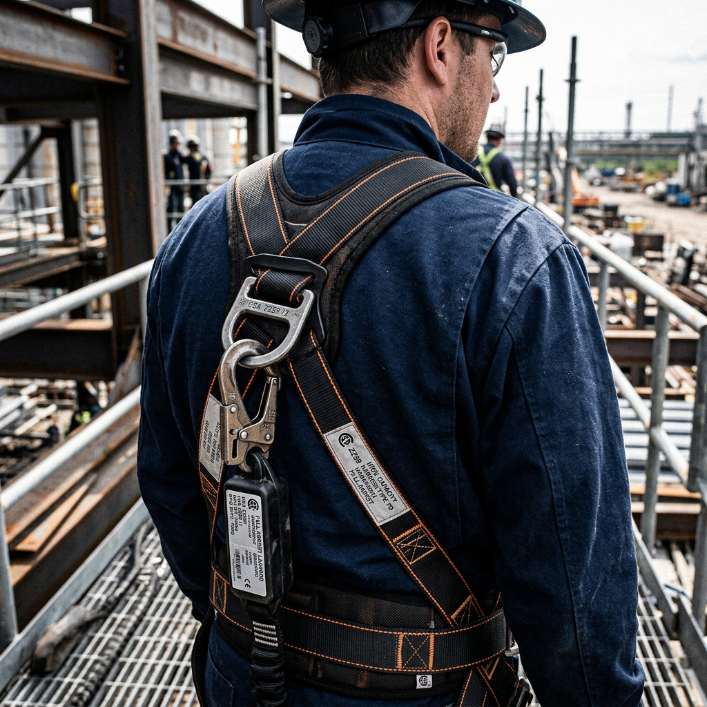

<!--Copyright (c) 2026 Mustafa Uzumeri. All rights reserved.-->

---
title: "working_at_heights_harness"
type: "pedagogy"
topics: [safety, compliance, csa-z259, fall-protection, story]
sources: []
status: "active"
---

# Working at Heights Harness — A Bicultural Dual-Register Explanation

<figure class="blog-hero">
  
  <figcaption>The D-ring on the shoulders holds the lifeline — the Eagle's Tether that roots the worker to the earth while they reach into the sky.</figcaption>
</figure>

This document presents a dual-register bicultural explanation of **Working at Heights Harness Inspection and Donning** — a critical safety procedure governed by the CSA Z259 series (Fall Protection) and provincial safety regulations. The relational narrative register draws a direct parallel to the traditional concept of **the tether (like the roots of a tree or a hunter's anchor rope)**, framing the safety harness not as an uncomfortable restraint, but as the physical connection that roots the worker to the earth while their body reaches into the sky.

---

## Why This Process?

Working at heights involves an **irreversible physical transition**. The human body is not built for flight; if a worker loses their footing on a high scaffold, gravity acts instantly, and they cannot stop themselves. Because the fall occurs in less than a second, safety depends entirely on a **pre-established arrest system**. The harness must distribute the massive deceleration force across the body's skeletal structure (pelvis and shoulders) rather than the soft abdominal tissues, and the lifeline must stop the fall before the worker strikes the ground.

In traditional teachings, climbing to high cliffs to gather herbs, hunt eagles, or repair roofs requires absolute anchor discipline. The climber does not rely solely on their fingers; they tether themselves to a deep-rooted pine or a solid stone outcrop using a braided rawhide line. The tether is respected as the extension of the earth's hold on the climber.

| Settler Compliance Demand | Traditional Story Parallel |
|---|---|
| **Pre-Use Webbing & Stitching Check** | Inspecting every strand of a braided rawhide rope for rot or cuts before climbing |
| **D-Ring Positioning (Centered)** | Ensuring the anchor loop is centered between the shoulder blades, like the neck-rope of a pack |
| **Leg-Strap Tightness (Flat Hand Rule)** | Snug wraps around the thighs so the harness does not slide and crush when you drop |
| **100% Tie-Off (Double Lanyard)** | The "two-hand rule" when moving along a cliff: never release one hold before securing the next |
| **Anchor Point Selection (5,000 lbs)** | Tethering only to a living tree or a heavy, immovable boulder; never a dry branch |

---

## Register A: Conventional Expository SOP

> **SOP Code: SAFE-SOP-259 — Fall Protection Harness Donning and Inspection Protocol**
>
> 1.0 **Purpose & Scope**: This procedure defines safety requirements for inspecting, donning, and adjusting full-body safety harnesses prior to working at heights exceeding 3.0 meters, in compliance with CSA Z259.10 and OHS codes.
>
> 2.0 **Pre-Use Visual Inspection**:
> 2.1 Hold the harness by the back D-ring and shake it to let the straps fall into place.
> 2.2 Inspect all webbing for cuts, burns, fraying, chemical damage, or broken fibers.
> 2.3 Inspect all metal hardware (D-rings, buckles, grommets) for cracks, deformation, rust, or sharp edges.
> 2.4 Verify that the fall arrest indicators (folded webbing sections stitched with warning threads) are intact. If they are torn open, the harness has been subjected to a fall and must be destroyed immediately.
>
> 3.0 **Donning and Adjustment**:
> 3.1 Slip the shoulder straps over the arms like a jacket. Verify that the straps are not twisted.
> 3.2 Pull the leg straps between the thighs and connect the buckles.
> 3.3 Adjust the leg straps until they are snug. **Verify the fit: you should be able to slide a flat hand between the strap and your thigh, but not a clenched fist.**
> 3.4 Position the chest strap across the mid-chest, approximately 15 cm below the shoulders, and buckle it.
> 3.5 Verify the back D-ring position: **the D-ring must lie flat and be centered directly between the shoulder blades.**
>
> 4.0 **Anchor Verification**:
> 4.1 Connect the lanyard snap-hook only to an approved anchor point certified to support 22.2 kN (5,000 lbs) or an engineered fall-arrest system.

---

## Register B: Bicultural Relational Narrative

> **The Eagle's Tether**
>
> A veteran steelworker stands on a metal walkway high above the factory floor, holding a black webbing harness with steel buckles. Beside him, a young worker looks down at the long drop to the concrete below.
>
> The veteran lifts the harness, shaking it out so the straps hang straight. "The safety manager will tell you that putting this on is a rule to avoid a fine. But look at this steel ring on the back. This is the D-ring. Let me tell you what this really is.
>
> "When our young men went to the high cliffs to collect eagle feathers for ceremonies, they did not climb alone. They climbed with a rope braided from bison hide. That rope was made by the whole village; every family braided their care and prayers into the strands. 
>
> "Before the climber stepped onto the cliff edge, the Elder would check the rope inch by inch. They would run their fingers along the hide, feeling for dry rot or cuts. They knew that if the rope had a weak spot, the cliff would claim the hunter. The rope was called the **Eagle's Tether**. It was the root that bound the climber to the earth.
>
> "This harness is your Eagle's Tether. It is not a cage. It is a system of roots.
>
> "When you put it on, you slip it over your shoulders like a heavy winter coat. You pull these straps around your thighs and pull them snug. If they are too loose, when you fall, the straps will slide up and crush your groin, robbing you of your breath. We use the **flat-hand test**: your hand should slide flat under the strap like a leaf on water, but you should not be able to ball your hand into a fist. Snug, but not choking the blood.
>
> "Now, feel between your shoulder blades. The D-ring must sit right there, in the center. It is like the pack-strap of a heavy basket: if it is off-center, you will spin and strike the rock when you fall. It must sit where your body's strength is centered.
>
> "Finally, look at where you clip your line. The hook must only go into a beam that is part of the steel frame of the building — something that has its own roots deep in the concrete foundation. You do not clip to a light pipe or a loose conduit. That is like tying your rawhide rope to a dry branch at the edge of the cliff; if you fall, the branch will come down with you.
>
> "Wear this harness with pride. It is the cord that connects you to your family at home. Every time you clip that hook, you are making a promise: *'I will reach into the sky to do my work, but I will keep my roots bound to the earth so I can return to the circle.'*"

---

## The Structural Bridge: What the Two Registers Share

Both registers describe the same physical requirements. The expository SOP (Register A) defines the mechanical tolerances (flat-hand check, D-ring position, anchor load). The relational narrative (Register B) explains the *why* of the fitting steps using the traditional logic of anchoring, helping the operator internalize the donning checklist as a personal anchor.

| SOP Requirement | Expository Rationale | Relational Rationale |
|---|---|---|
| Check Fall Arrest Indicators (§2.4) | Prevents the reuse of a harness that has already suffered stress deformation | "Ensures the Eagle's Tether has not already been stretched and weakened by a previous fall" |
| Leg-Strap Flat-Hand Rule (§3.3) | Prevents harness slippage and severe femoral pressure during arrest | "Allowing the strap to fit flat like a leaf, but preventing it from sliding and crushing your breath" |
| Centered Back D-Ring (§3.5) | Ensures vertical orientation during fall to prevent spinal injury | "Placing the anchor point where the body's natural skeletal strength is centered" |
| Certified 5,000 lbs Anchor (§4.1) | Structural capacity to withstand dynamic fall arrest forces | "Tethering to the living pine or the solid stone outcrop, never to the dry branch" |
| Double Lanyard 100% Tie-Off (§4.2) | Ensures continuous protection during movement | "The two-hand rule of the cliff: never letting go of the earth before securing your next hold" |

---

## Pedagogical Notes

1.  **The "Flat-Hand" Muscle Memory**: Operators often wear leg straps excessively loose because they restrict walking comfort. The comparison to "bison hide crushing the groin" combined with the physical leaf-on-water flat-hand test creates a strong physical check that workers remember.
2.  **Respecting the Anchor**: Teaching workers to look for "the roots of the building" (structural steel) rather than just "something metal" improves anchor selection behavior significantly.

---

<!--Copyright (c) 2026 Mustafa Uzumeri. All rights reserved.-->
