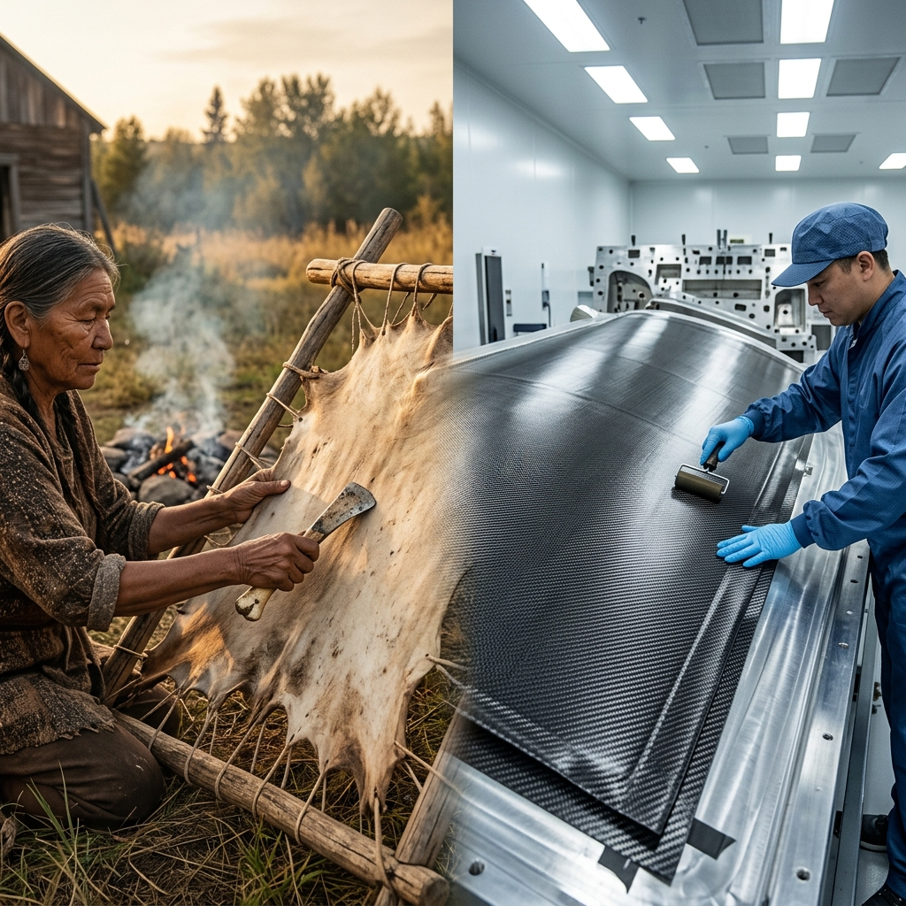

<!--Copyright (c) 2026 Mustafa Uzumeri. All rights reserved.-->

# Composite Layup & Autoclave Curing — A Bicultural Dual-Register Explanation

<figure class="blog-hero">
  
  <figcaption>Two parallel crafts of patience — traditional hide preparation and aerospace composite layup share the same discipline: plan carefully, prepare completely, and never rush the transformation.</figcaption>
</figure>

This document presents a dual-register bicultural explanation of **Advanced Composite Layup and Autoclave Curing** — a critical aerospace manufacturing process governed by AS9100D, Nadcap AC7118, and OEM process specifications. The relational narrative register draws a direct parallel to **traditional hide tanning**, a process that shares the same structural demands: multi-stage planning, meticulous preparation, irreversible chemical transformation, and the absolute discipline of patience.

This pairing was inspired by Dr. Linda Manyguns' (Mount Royal University) day-long student session on hide tanning with 200 students — an event that itself demonstrates the planning, preparation, and patience that define both the traditional craft and the aerospace process described here.

---

## Why This Process?

Composite layup and autoclave curing is among the most critical "special processes" in aerospace manufacturing. Unlike machining metal, where you can measure the result immediately, composite curing involves an **invisible chemical transformation** — thermoset resin crosslinks at the molecular level inside a sealed autoclave, and the operator cannot see, hear, or feel it happening. The part either emerges strong or it emerges flawed. There is no rework. There is no second chance.

This is precisely the structure of hide tanning: the tanning agents penetrate and bind with the collagen fibers inside the hide, transforming raw skin into durable leather through a process that cannot be observed directly, cannot be rushed, and cannot be reversed.

| Shared Structural Demand | Hide Tanning | Composite Layup & Curing |
|---|---|---|
| **Planning** | Selecting the right hide, preparing tanning agents, gathering tools, coordinating helpers | Reviewing the ply schedule, cutting prepreg to templates, verifying resin lot life, booking autoclave time |
| **Preparation** | Scraping, soaking, stretching the hide; brain or smoke preparation | Surface preparation, release agent application, precise ply placement and debulking |
| **Patience** | Waiting days or weeks for tanning agents to fully penetrate and bind | Waiting hours through a precisely controlled autoclave cure cycle — temperature ramps, pressure holds |
| **Invisible transformation** | Collagen crosslinking inside the hide — you cannot see it happening | Resin crosslinking inside the laminate — you cannot see it happening |
| **Irreversibility** | A rushed or improperly tanned hide is ruined; it cannot be re-tanned | A cured composite with voids, wrinkles, or fiber misalignment is scrap; it cannot be re-cured |
| **Consequence of impatience** | Weak, stiff, or rotting leather that fails in use | Delamination, porosity, or reduced fatigue life in a flight-critical structure |

---

## Register A: Conventional Expository SOP

> **SOP Code: QMS-SOP-710 — Advanced Composite Layup and Autoclave Curing Protocol**
>
> 1.0 **Purpose & Scope**: This procedure defines requirements for the manual layup of thermoset carbon fiber reinforced polymer (CFRP) prepreg laminates and their subsequent autoclave curing, applicable to all flight-critical composite structures per AS9100D §8.5.1 and Nadcap AC7118.
>
> 2.0 **Material Verification**:
> 2.1 Prior to layup, the operator shall verify the prepreg material's shelf life and out-time status using the Material Certification and Traceability Log (Form 710-A). Material exceeding maximum cumulative out-time shall be quarantined and tagged for disposition.
> 2.2 The operator shall confirm the correct fiber orientation, resin system, and areal weight match the Engineering Drawing ply schedule.
>
> 3.0 **Layup Procedure**:
> 3.1 Clean the mold tool surface per the approved solvent wipe protocol. Apply release agent per the manufacturer's datasheet, observing minimum flash-off time.
> 3.2 Place each ply sequentially per the Engineering Drawing ply schedule. Each ply shall be positioned within ±0.060" of the nominal boundary. Fiber orientation shall be within ±2° of the specified angle.
> 3.3 Perform intermediate debulking after every 3–5 plies (per OEM specification). Apply vacuum to minimum 22 inHg for not less than 15 minutes. Record debulk pressure and duration on Form 710-B.
> 3.4 The operator shall visually inspect each ply for wrinkles, bridging, foreign object debris (FOD), and fiber distortion before applying the subsequent ply.
>
> 4.0 **Vacuum Bagging & Autoclave Preparation**:
> 4.1 Apply peel ply, perforated release film, bleeder/breather, and vacuum bag per the approved bagging schematic. Verify bag integrity via vacuum leak test: the part shall hold minimum 22 inHg with decay ≤2 inHg over 5 minutes.
> 4.2 Load the bagged assembly into the autoclave. Connect thermocouple leads and vacuum lines per the cure tool loading plan.
>
> 5.0 **Autoclave Cure Cycle**:
> 5.1 Execute the cure cycle per the approved cure specification. A typical cure cycle for a 350°F (177°C) epoxy system consists of: ramp at 1–5°F/min to 350°F; hold at 350°F ±10°F for 120–180 minutes under 85–100 psi autoclave pressure; cool-down at ≤5°F/min to below 150°F before pressure release.
> 5.2 **Under no circumstances shall the cure cycle be interrupted, shortened, or modified without written engineering disposition.** Interruption of the cure cycle renders the part non-conforming.
> 5.3 The operator shall monitor and record thermocouple readings at minimum 1-minute intervals throughout the cure. All thermocouples must remain within the specified tolerance band.
>
> 6.0 **Post-Cure Inspection**:
> 6.1 After demolding, the cured laminate shall be inspected via ultrasonic C-scan (or equivalent NDT method per Nadcap AC7114) for porosity, delamination, and foreign object inclusions.
> 6.2 Any laminate exceeding the acceptance criteria for porosity (typically >2% by area) or containing delaminations larger than the minimum detectable flaw size shall be rejected and documented via Non-Conformance Report (NCR) Form 710-C.
>
> 7.0 **Compliance**: Failure to adhere to the approved ply schedule, debulking protocol, or cure cycle constitutes a direct violation of AS9100D quality standards and Nadcap AC7118 accreditation requirements, and may result in immediate disciplinary action and product quarantine.

---

## Register B: Bicultural Relational Narrative

> **The Story of the Hide and the Woven Sky**
>
> A veteran composite technician stands beside a young apprentice in the clean room, in front of a long curved mold shaped like a piece of an airplane wing. Beside them, a table holds neat stacks of dark, woven carbon fiber sheets — each one thin as a page, stiff with uncured resin, cold from the freezer.
>
> The technician picks up a sheet and turns it slowly in the light. "You see how the fibers are woven? Each thread runs in one direction. The engineers have drawn a map — a ply schedule — that tells us exactly which direction each layer must face, and in what order. If I asked you to lay all twelve sheets down right now, you might think: twelve sheets, how hard can that be? But let me tell you something first.
>
> "My grandmother tanned hides. She did it the old way, with brain and smoke. And the first thing she taught me is that the work begins long before you touch the hide. You have to plan. You scrape the hide clean — every bit of fat, every membrane — because anything you leave behind will rot underneath the surface where you cannot see it. You soak it. You stretch it. You prepare your tanning mixture. You gather your wood for smoking. All of this happens before the real transformation starts.
>
> "These carbon fiber sheets are our hide. The resin in them is like the brain mixture — it is the agent that will transform these loose fibers into something strong enough to carry people across the sky. But the resin has a life. From the moment we take it out of the freezer, a clock starts. If we leave it out too long, the resin begins to change before we are ready. It loses its ability to flow and bond. So we plan: we check the lot certificate, we verify the out-time, we confirm the shelf life. We do all of this before we touch the mold. Just like grandmother checked her tanning solution before she touched the hide.
>
> "Now, the layup itself. Each ply goes down one at a time, in a specific direction. The first layer might run at zero degrees — straight along the length of the wing. The next at forty-five. The next at ninety — across the wing. Then minus forty-five. Each angle gives the finished part strength in a different direction, the way the grain of a hide runs differently depending on which part of the animal it came from. Grandmother knew that the hide from the back is thick and strong, the belly is thin and stretchy. She worked each part differently. We do the same: we orient each ply to match the loads that the wing will carry in flight.
>
> "Between every few layers, we stop. We lay a vacuum bag over the stack and pull the air out. We call this debulking. It is like pressing the hide flat against the stretching frame — squeezing out the air pockets and the wrinkles, making sure each layer is in full contact with the one below. If we skip this step, if we are in a hurry and just keep stacking, tiny air pockets get trapped between the layers. You cannot see them. They are invisible. But they are like rot inside an untreated hide — they will weaken the part from within, and no one will know until it fails.
>
> "When all the plies are laid and the final vacuum bag is sealed, we wheel the mold into the autoclave. It is a long steel chamber, like the belly of a great oven. We close the door and we start the cure cycle. The temperature rises slowly — one degree, two degrees per minute — up to three hundred and fifty degrees. The pressure builds to a hundred pounds per square inch. And we wait.
>
> "This is the moment that separates the patient worker from the impatient one. Inside that autoclave, something is happening that you cannot see, cannot hear, cannot feel from the outside. The resin is crosslinking — the molecules are reaching out to each other and locking together, turning a stack of flexible sheets into a solid structure harder than steel and lighter than aluminum. It is exactly what happens inside a hide when the tanning agents bind with the collagen fibers. The hide stops being raw skin and becomes leather. The composite stops being a stack of sheets and becomes a wing.
>
> "Grandmother would say: the hide tells you when it is done. You learn to read it — the color, the feel, the way it moves. But you cannot rush it. If you pull it out of the smoke too early, the tanning has not penetrated to the center. The surface looks finished but the inside is still raw. It will rot from within.
>
> "In the autoclave, we have thermocouples — little sensors buried in the layup that tell us the temperature at every point. They are our way of listening to the hide. If one sensor reads too hot or too cold, the cure is uneven. If we cut the cycle short because we are behind schedule, the resin at the center of a thick laminate may not fully crosslink. The part will look perfect on the outside. It will feel solid. But inside, it is uncured — weak, brittle, waiting to fail. And the people who fly in the airplane built from that wing will never know our names, but they trust us.
>
> "When the cycle is complete and the autoclave cools slowly — because even the cooling must not be rushed, or thermal stresses will crack the resin — we open the door and demold the part. It is like unwrapping a tanned hide from the frame for the first time. You hold your breath. Is it good? Is it strong? Did we do our work with enough patience?
>
> "We send it to inspection. They run ultrasonic waves through the laminate — sound waves that pass through solid material and echo back from any void or separation. It is like running your hand across a finished hide, feeling for thin spots or tears. If the sound finds a void larger than a grain of rice, the part is rejected. All of our work — the planning, the layup, the hours in the autoclave — is lost.
>
> "That is why we do not rush. That is why we debulk every three plies. That is why we check the out-time before we start. That is why we monitor every thermocouple through every minute of the cure. Because this is not a job. It is a promise. The same promise my grandmother made when she prepared a hide that would become a pair of moccasins for a child who would walk through the winter snow. She knew that if the leather failed, the child's feet would freeze. She could not see the child when she did her work, but she knew the child was coming.
>
> "We cannot see the passengers who will sit above this wing. But they are coming. And they trust us to do our work the way grandmother did hers — with planning, with preparation, and with the patience to let the transformation happen in its own time."

---

## The Structural Bridge: What the Two Registers Share

Both registers describe the same physical requirements. The expository SOP (Register A) specifies the *what*: tolerances, temperatures, pressures, inspection criteria. The relational narrative (Register B) explains the *why* — not as an abstract compliance obligation, but as a chain of personal responsibility that connects the worker's hands to the safety of people they will never meet.

| SOP Requirement | Expository Rationale | Relational Rationale |
|---|---|---|
| Verify material out-time (§2.1) | Expired prepreg may not achieve full cure properties | "The resin has a life... if we leave it out too long, it begins to change before we are ready" |
| Place plies per ply schedule (§3.2) | Fiber orientation determines laminate strength | "Each angle gives the finished part strength in a different direction, the way the grain of a hide runs differently" |
| Debulk every 3–5 plies (§3.3) | Prevents void entrapment and delamination | "Squeezing out the air pockets and the wrinkles... they are like rot inside an untreated hide" |
| Do not interrupt cure cycle (§5.2) | Incomplete crosslinking creates structurally deficient laminate | "If you pull it out of the smoke too early, the tanning has not penetrated to the center" |
| Monitor thermocouples (§5.3) | Ensures uniform cure across the part | "They are our way of listening to the hide" |
| NDT inspection post-cure (§6.1) | Detects porosity and delamination invisible to the eye | "Like running your hand across a finished hide, feeling for thin spots or tears" |

---

## Pedagogical Notes

**Why hide tanning is the right parallel for composite curing:**

1. **The planning is the work.** In both processes, the majority of the skill lies in what happens *before* the main transformation. Cutting plies, verifying materials, and preparing the mold are the composite equivalent of scraping, soaking, and stretching the hide. Students who have participated in a hide tanning session (such as Dr. Manyguns' 200-student day-long workshop at Mount Royal University) already understand this intuitively — the day begins hours before the hide goes into the smoke.

2. **Patience is a technical skill, not a personality trait.** Both processes have non-negotiable waiting periods where the transformation is happening invisibly. The autoclave cure cycle and the tanning soak both demand that the worker resist the urge to check, adjust, or hurry. This is not passive waiting — it is disciplined trust in the process.

3. **The consequence of impatience is invisible.** A rushed hide looks finished on the surface but rots from within. A short-cycled composite looks solid but contains uncured resin that will fail under load. In both cases, the failure is delayed and hidden — which is why the worker's integrity matters more than any inspector's audit.

4. **The chain of care extends beyond the maker.** Grandmother's moccasins protect a child's feet in winter. The composite wing carries passengers across the sky. Neither the child nor the passengers know the maker's name, but both depend on the maker's promise. This relational accountability is the core of both the traditional and industrial ethic.

---

<!--Copyright (c) 2026 Mustafa Uzumeri. All rights reserved.-->
