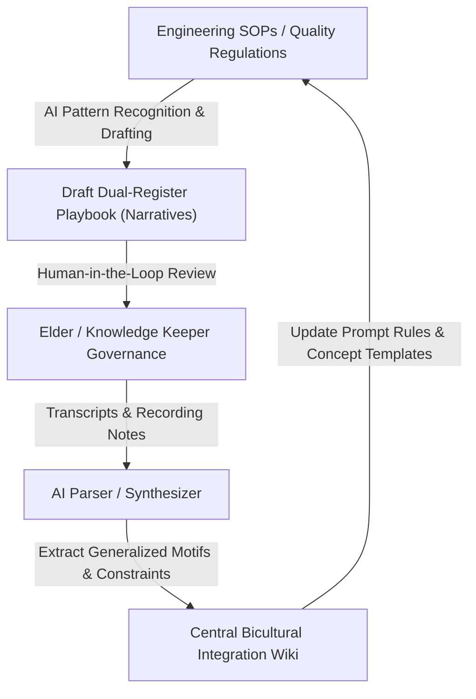
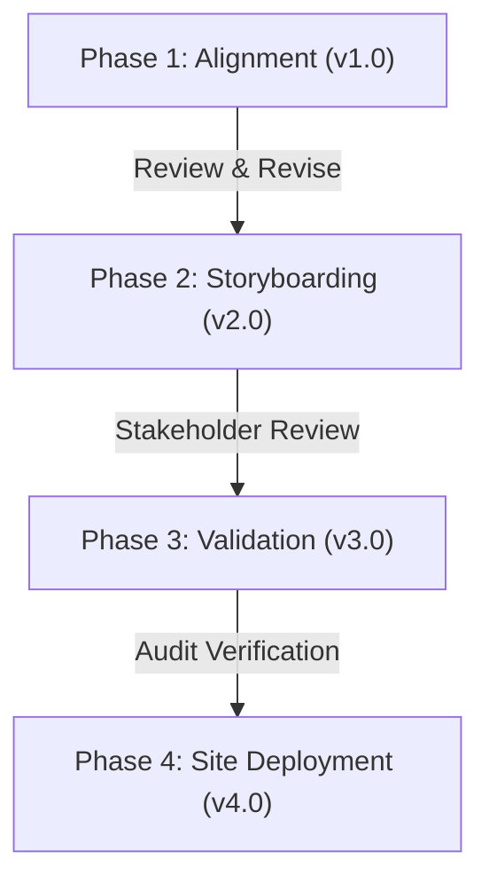

# bicultural_documentation_pilot

This document outlines a proposal for a multi-industry pilot project to design, validate, and deploy bicultural industrial process documentation and training systems. This pilot applies the [[wiki/pages/concepts/dual_register_playbook|Dual-Register Playbook]] framework across key process activities in the aerospace, automotive, mining, and medical device sectors.

## 1. Executive Summary

Industrial operations in high-reliability sectors require strict adherence to standard operating procedures (SOPs). However, conventional, abstract expository documentation often creates cognitive load, training friction, and workplace alienation—especially for Indigenous workers from reservation backgrounds. 

This pilot project aims to develop and test bicultural documentation templates that pair audit-ready expository guidelines with relational, consequence-based storytelling registers. The project will establish a repeatable methodology for translating complex quality standards into traditional pedagogical structures, boosting compliance retention and workforce integration.

### 1.1 The Target Problem Example: Expository Alienation vs. Relational Account
To see the difference in registers, compare how a critical quality standard—**Foreign Object Debris (FOD) Prevention and Closed-Loop Tool Control** under AS9100D—is written in conventional aerospace documentation versus how it is retold through a relational bicultural register.

#### Register A: Conventional Rule-Based Speak (Expository SOP)
> **SOP Code: QMS-SOP-402 — Tool Control & FOD Prevention Protocol**
>
> 1.0 **Purpose & Scope**: This procedure defines requirements for maintaining tool accountability to eliminate the risk of Foreign Object Debris (FOD) damage in flight-critical aerospace assemblies.
>
> 2.0 **Operator Requirements**:
> 2.1 Operators shall execute a visual inventory verification of designated foam-shadowed toolboards at the commencement of each shift. Every tool cutout must be occupied by its matched tool.
> 2.2 Any tool removed for process execution must be logged immediately on the Shift Route Sheet, detailing the tool identifier and the assembly workstation code.
> 2.3 Prior to engine compartment closure and before shift hand-off, the operator must perform a final 100% visual inventory check of the shadowboard to confirm complete tool return.
>
> 3.0 **Discrepancy Control**:
> 3.1 In the event of a missing tool at shift hand-off or engine closure, the operator shall immediately quarantine the assembly workstation and halt all adjacent operations.
> 3.2 The operator must immediately notify the Quality Assurance Supervisor and complete Non-Conformance Report (NCR) Form 402-A. The workstation will remain locked out until the tool is located and visual validation is signed off by the Quality Manager.
>
> 4.0 **Compliance**: Failure to adhere to tool tracking audits represents a direct violation of AS9100D quality standards and Nadcap accreditations, and may result in immediate disciplinary action.

---

#### Register B: Bicultural Relational Narrative (Indigenous Inspired Story)
> **The Story of the Iron Canoe and the Map of Promises**
>
> A veteran worker stands with a young apprentice in front of a blue foam board on the factory wall. In the center of the board, a shape is cut out in the shape of a small wrench, but the foam slot is empty.
>
> The elder worker points to the empty slot. "You see this empty space? The quality manual says if we leave this empty at the end of the shift, we must fill out Form 402-A and lock down the floor. It looks like a rule made by managers who live in offices far away, who do not trust us. But this board is not a list of rules for the company. It is a map of our promises.
>
> "Let me tell you about a hunter in the old times who prepared to go into the deep bush during the winter freeze. Before he left the lodge, his grandfather sat him down and laid out his hunting bag. Together, they counted every item: the skinning knife, the flint strike-a-light, the bone needle, and the spare sinew. The grandfather did not count them because he suspected the boy of being careless. He counted them because the winter forest does not forgive a forgotten tool.
>
> "If the hunter dropped his strike-a-light in the snow and did not return to find it, the snow would not call out to him. The land would remain silent. He would only discover the truth of his loss when the sun went down, his hands turned white with frost, and he could make no fire to warm himself or his family. The count before leaving the lodge was the promise the hunter made to the people who waited at home for him to bring back meat.
>
> "This turbine engine we are building is like a great iron canoe that will carry our relatives across the sky. When the plane flies, it does not move smoothly; it shakes and beats against the air like a birchbark canoe crossing the rapids of a wild river. If we leave a single socket wrench inside that engine compartment because we are rushed or trust our memory, that tool is not just a piece of metal. It is a wild spirit we have left in the dark.
>
> "As the plane climbs into the cold sky, that forgotten wrench will rattle loose. It will be sucked into the spinning blades of the compressor, and it will tear the engine apart in seconds. The passengers in that cabin will never know your name, and you will never see their faces. But they are our relatives, and they trust us.
>
> "When you look at this shadow board at the end of your shift, every empty shape is an unfulfilled promise. The audit count is not for the inspector; it is the way we hold the lives of those travelers in our hands. If a tool is missing, we do not stop the shift to save our jobs. We stop the shift because we cannot send a broken canoe into the sky rapids."

---

### 1.2 Setting the Project Foundation
This comparison exposes the core operational and pedagogical gaps that this pilot project is designed to bridge:
*   **The Invalidation of Expository Documentation**: Conventional SOPs (Register A) are written in a passive, decontextualized, and atemporal style that strips work of its human purpose. For workers from oral-tradition backgrounds, it creates a cognitive disconnect, framing safety checks as bureaucratic exercises.
*   **The Power of Relational Accountability**: Bicultural storytelling (Register B) does not change the physical rule (the tool board must still be checked and accounted for). Instead, it translates the rule's motive into a relational promise of communal safety, making compliance a matter of personal and collective integrity rather than auditing fear.
*   **Pilot Focus**: This pilot project does not rewrite the formal engineering and quality manuals required by AS9100D or Nadcap. Instead, it pairs these standard audit baselines with matching narrative registers. This sets the foundation for our pilot goals: transforming training from compliance policing into an active commitment to quality on the shop floor.

### 1.3 Pilot Goals & Objectives
Using the tool control and special process case studies as our framing models, this pilot establishes four concrete goals:
*   **Goal 1: Establish Cognitive Realism in Process Validation**: Replace abstract quality requirements with relational narratives across four target sectors (Aerospace, Automotive, Mining, Medical Devices). This ensures workers internalize hidden or sub-visual process states (FOD risks, crystalline changes, weld penetration, seal boundaries) as active, physical histories and personal commitments.
*   **Goal 2: Quantifiably Reduce Technical Audit Deficiencies**: Target a measurable drop in non-conformance reports (NCRs) and audit exceptions by supplementing expository compliance records with a personal promise framework (shifting documentation from auditing compliance to relational responsibility).
*   **Goal 3: Lower Onboarding and Qualification Barriers**: Accelerate shop-floor training times for new Indigenous hires while maintaining or increasing retention of complex quality specifications (like AS9100, IATF, ISO 13485) under shift fatigue.
*   **Goal 4: Build a Scale-Ready Bicultural Standard Operating Procedure (SOP) Template**: Create a repeatable dual-register documentation format validated by quality assurance managers, ready for integration into standard corporate training environments.

---

## 2. Industry Targets & Core Quality Standards

The pilot will select one critical "special process" or high-risk activity from each of the following four sectors:

| Industry Sector | Target Standards | Focus Activity | Quality Verification Challenge |
|---|---|---|---|
| **Aerospace** | AS9100D, CAR 561, Nadcap | Heat treating, chemical coating, NDT | Micro-fracture or crystalline structural failures cannot be verified visually post-machining. |
| **Automotive** | IATF 16949 | Critical weld joints, stamping, torque spec | Hidden structural welds or torque tolerances can fail under load far in the future. |
| **Mining** | ISO 45001, Mining Safety Act | Lockout-tagout, conveyor clearing, explosives | Safety controls and extraction limits require absolute adherence under conditions of severe fatigue. |
| **Medical Devices** | ISO 13485 | Sterile packaging seal, mold tolerances | Bio-burden contamination or microscopic seal breaches are invisible but carry life-or-death consequences. |

---

## 3. Human & Strategic Resources

The pilot operates under a highly leveraged, low-overhead model relying on three key participant groups:

### 3.1 Architect & Methodology Lead (Mustafa Uzumeri)
*   **Role**: Guides system design, provides the instructional design templates (drawing on 500+ iPOV eLearning projects), and structures the expository standards matching (drawing on academic ISO 9001 research) [[wiki/pages/pedagogy/instructional_design_pedagogy|instructional_design_pedagogy]].
*   **Bandwidth Constraint**: Time is available free of charge in modest quantities for architectural guidance, templates structure, and verification, but is strictly capped to prevent direct operational delivery loads [[wiki/pages/concepts/available_resources#1-architect-bandwidth-mustafa-uzumeri|available_resources, §1]].

### 3.2 Academic Storytelling Analysts (Trent University Indigenous Studies)
*   **Role**: Students from Trent University, ON (enrolled in Indigenous Studies or Bicultural Programs) will act as co-op or course-grade interns:
    *   Study the target expository SOPs.
    *   Collaborate with community Elders and knowledge keepers to identify traditional stories, metaphors, and relational causation models.
    *   Draft the **Narrative Register** translations (e.g. mapping the heat-treating crystalline shifts to wood-curing patterns).
*   **Funding**: Funded through academic co-op envelopes and research grants (e.g. Mitacs, SSHRC) [[wiki/pages/concepts/available_resources#42-phase-2-production-system-deployment|available_resources, §4.2]].

### 3.3 Strategic Access Facilitators (Indigenous Policy & Industry Experts)
*   **Role**: Policy leaders with established government, community, and industrial networks:
    *   Open doors to target manufacturing companies and mine sites.
    *   Engage local Band Councils and Treaty associations for community consent and OCAP compliance [[wiki/pages/concepts/available_resources#52-indigenous-organizations--local-groups|available_resources, §5.2]].
    *   Coordinate access to federal procurement or regional development funding (e.g. ISED, BDC Indigenous programs).

### 3.4 AI-Driven Content Development & Elder Feedback Loop
Scaling bicultural documentation across hundreds of highly specialized industrial procedures is impossible with manual drafting alone. The pilot addresses this through a semi-automated, closed-loop pipeline where AI performs the heavy lifting of pattern recognition and narrative development under strict human-in-the-loop cultural governance:

*   **AI-Driven Drafting & Pattern Recognition**: Generative AI models analyze complex engineering standards (e.g., Nadcap heat-treat specs, sterile mold tolerances) and identify underlying structural motifs (e.g., invisible parameters, delayed consequences, strict synchronization). The AI then parses public bicultural archives and oral history databases to match these motifs to appropriate cultural storytelling frames (such as wood-curing, animal migration patterns, or tool stewardship), drafting candidate dual-register SOPs.
*   **Elders and Knowledge Keepers Review (Cultural Governance)**: To ensure safety and cultural protection (complying with OCAP data sovereignty principles), all draft narratives are reviewed by community Elders and knowledge keepers. The Elders do not need to parse technical specifications; instead, they audit the generated stories for authenticity, linguistic precision, treaty context, and cultural safety.
*   **Feedback Synthesis (Banning Document-by-Document Opinions)**: Rather than letting reviews degenerate into isolated, static "document-by-document" opinion sheets that reside in silos, the Elder review sessions are treated as structured training inputs. An AI synthesizer parses the raw review transcripts and notes to extract generalizable constraints, preferred metaphors, disallowed themes, and storytelling rules.
*   **Dynamic Wiki Ingestion**: The synthesized rules and the validated stories are automatically fed back into the central Bicultural Integration Wiki (`wiki/pages/concepts/` and `wiki/pages/sources/`). This updates the core prompt guidelines and playbook templates. Subsequent AI generation cycles automatically inherit these corrections, ensuring the system continuously self-corrects and improves without manually rewriting every instruction.

---

## 4. Phased Revision & Implementation Roadmap

To accommodate ongoing feedback, changing regulations, and community needs, the pilot is divided into four distinct phases, allowing for revision cycles at each gate:

### Phase 1: Team Formation & Core SOP Selection (Version 1.x)
*   **Activities**:
    *   Form the project coalition (Mustafa Uzumeri, Trent University program leads, strategic policy advisors).
    *   Identify partner manufacturing and mining companies willing to host the pilot.
    *   Select one specific SOP per sector (e.g. aerospace titanium heat-treatment, automotive chassis welding).
*   **Revision Trigger**: Review and sign-off by partner company quality managers and Trent research coordinators.

### Phase 2: Dual-Register Storyboarding & Design (Version 2.x)
*   **Activities**:
    *   Deploy Trent students to research traditional narrative metaphors under the guidance of Elders.
    *   Draft the dual-register playbooks pairing the expository rule with the relational narrative.
    *   Develop visual media aids and simple video explanation assets drawing on the iPOV workflow [[wiki/pages/pedagogy/instructional_design_pedagogy#2-industrial-technical-explanation-ipov|instructional_design_pedagogy, §2]].
*   **Revision Trigger**: Community Elder review to ensure cultural accuracy, and stakeholder review to ensure OCAP data sovereignty compliance.

### Phase 3: Validation & Regulatory Matching (Version 3.x)
*   **Activities**:
    *   Cross-reference the expository register with the target audit frameworks (AS9100D, CAR 561, IATF 16949, ISO 13485) to ensure it satisfies auditors.
    *   Run simulation-based testing (using mock shop-floor scenarios or ClientSynth models) to evaluate retention.
*   **Revision Trigger**: Formal quality audit verification and regulatory check by policy experts.

### Phase 4: Shop-Floor Implementation & Deployment (Version 4.x)
*   **Activities**:
    *   Deploy the bicultural playbooks on the partner shop floors.
    *   Monitor shift compliance rates, non-conformance logs, and training completion times.
    *   Assemble a final project report for government and industry sponsors (seeking funding for Phase 2 production scaling) [[wiki/pages/concepts/available_resources#42-phase-2-production-system-deployment|available_resources, §4.2]].
*   **Revision Trigger**: Post-pilot project debrief and optimization for the next site iteration.

## 5. Academic Rigor & Long-Term Scaling Vision

To ensure the pilot serves as a launching pad for permanent industry impact and economic self-determination, the project is designed with a clear transition path from research sandbox to commercial scalability.

### 5.1 Academic Study & Research Process
The pilot will be run in tandem with a formal academic study (ideally supporting a PhD thesis or Master's research project) hosted at Trent University:
*   **Methodology Evaluation**: Rigorously measure the cognitive retention delta, error reduction rates, and employee satisfaction under the dual-register method compared to traditional expository SOPs.
*   **Linguistic & Pedagogy Analysis**: Document the transition mechanics of verb-centered grammars and relational story models in high-reliability industrial settings, contributing to the academic literature on bicultural technical communication.

### 5.2 Commercialization & Indigenous Entrepreneurship (Translation-as-a-Service)
If the pilot demonstrates measurable success (reduced NCRs, accelerated onboarding), the long-term goal is to commercialize the methodology through an Indigenous-led startup:
*   **Recruitment and Incubation**: Recruit and mentor one or two young Indigenous entrepreneurs to establish a "Translation-as-a-Service" (TaaS) company.
*   **AI-Powered Production Speed**: The startup will refine and focus the AI translation engine developed in this pilot. By feeding existing business process manuals, quality specs, and standard engineering SOPs through the structured Bicultural Integration Wiki system, the AI will perform the heavy lifting of story generation, draft creation, and regulatory mapping.
*   **High-Margin, Scalable Business Model**: Using AI for the heavy lifting of story writing and pattern matching makes the translation process exceptionally fast and inexpensive. The startup can then charge high-value commercial consulting fees to Canadian industrial firms (motivated by ESG commitments, federal 5% procurement requirements, and operational safety needs). This creates a high-margin, profitable startup that drives local economic independence and creates career paths for Indigenous story analysts.

---

<!--Copyright (c) 2026 Mustafa Uzumeri. All rights reserved.-->
