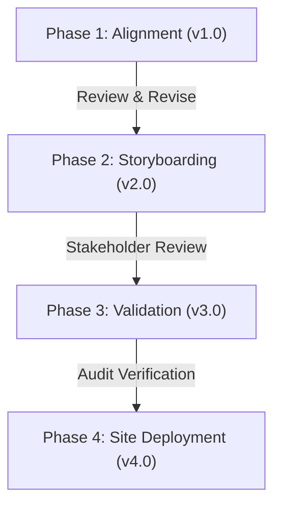

# bicultural_documentation_pilot

This document outlines a proposal for a multi-industry pilot project to design, validate, and deploy bicultural industrial process documentation and training systems. This pilot applies the [[wiki/pages/concepts/dual_register_playbook|Dual-Register Playbook]] framework across key process activities in the aerospace, automotive, mining, and medical device sectors.

## 1. Executive Summary

Industrial operations in high-reliability sectors require strict adherence to standard operating procedures (SOPs). However, conventional, abstract expository documentation often creates cognitive load, training friction, and workplace alienation—especially for Indigenous workers from reservation backgrounds. 

This pilot project aims to develop and test bicultural documentation templates that pair audit-ready expository guidelines with relational, consequence-based storytelling registers. The project will establish a repeatable methodology for translating complex quality standards into traditional pedagogical structures, boosting compliance retention and workforce integration.

---

## 2. Industry Targets & Core Quality Standards

The pilot will select one critical "special process" or high-risk activity from each of the following four sectors:

| Industry Sector | Target Standards | Focus Activity | Quality Verification Challenge |
|---|---|---|---|
| **Aerospace** | AS9100D, CAR 561, Nadcap | Heat treating, chemical coating, NDT | Micro-fracture or crystalline structural failures cannot be verified visually post-machining. |
| **Automotive** | IATF 16949 | Critical weld joints, stamping, torque spec | Hidden structural welds or torque tolerances can fail under load far in the future. |
| **Mining** | ISO 45001, Mining Safety Act | Lockout-tagout, conveyor clearing, explosives | Safety controls and extraction limits require absolute adherence under conditions of severe fatigue. |
| **Medical Devices** | ISO 13485 | Sterile packaging seal, mold tolerances | Bio-burden contamination or microscopic seal breaches are invisible but carry life-or-death consequences. |

---

## 3. Human & Strategic Resources

The pilot operates under a highly leveraged, low-overhead model relying on three key participant groups:

### 3.1 Architect & Methodology Lead (Mustafa Uzumeri)
*   **Role**: Guides system design, provides the instructional design templates (drawing on 500+ iPOV eLearning projects), and structures the expository standards matching (drawing on academic ISO 9001 research) [[wiki/pages/pedagogy/instructional_design_pedagogy|instructional_design_pedagogy]].
*   **Bandwidth Constraint**: Time is available free of charge in modest quantities for architectural guidance, templates structure, and verification, but is strictly capped to prevent direct operational delivery loads [[wiki/pages/concepts/available_resources#1-architect-bandwidth-mustafa-uzumeri|available_resources, §1]].

### 3.2 Academic Storytelling Analysts (Trent University Indigenous Studies)
*   **Role**: Students from Trent University, ON (enrolled in Indigenous Studies or Bicultural Programs) will act as co-op or course-grade interns:
    *   Study the target expository SOPs.
    *   Collaborate with community Elders and knowledge keepers to identify traditional stories, metaphors, and relational causation models.
    *   Draft the **Narrative Register** translations (e.g. mapping the heat-treating crystalline shifts to wood-curing patterns).
*   **Funding**: Funded through academic co-op envelopes and research grants (e.g. Mitacs, SSHRC) [[wiki/pages/concepts/available_resources#42-phase-2-production-system-deployment|available_resources, §4.2]].

### 3.3 Strategic Access Facilitators (Indigenous Policy & Industry Experts)
*   **Role**: Policy leaders with established government, community, and industrial networks:
    *   Open doors to target manufacturing companies and mine sites.
    *   Engage local Band Councils and Treaty associations for community consent and OCAP compliance [[wiki/pages/concepts/available_resources#52-indigenous-organizations--local-groups|available_resources, §5.2]].
    *   Coordinate access to federal procurement or regional development funding (e.g. ISED, BDC Indigenous programs).

---

## 4. Phased Revision & Implementation Roadmap

To accommodate ongoing feedback, changing regulations, and community needs, the pilot is divided into four distinct phases, allowing for revision cycles at each gate:

### Phase 1: Team Formation & Core SOP Selection (Version 1.x)
*   **Activities**:
    *   Form the project coalition (Mustafa Uzumeri, Trent University program leads, strategic policy advisors).
    *   Identify partner manufacturing and mining companies willing to host the pilot.
    *   Select one specific SOP per sector (e.g. aerospace titanium heat-treatment, automotive chassis welding).
*   **Revision Trigger**: Review and sign-off by partner company quality managers and Trent research coordinators.

### Phase 2: Dual-Register Storyboarding & Design (Version 2.x)
*   **Activities**:
    *   Deploy Trent students to research traditional narrative metaphors under the guidance of Elders.
    *   Draft the dual-register playbooks pairing the expository rule with the relational narrative.
    *   Develop visual media aids and simple video explanation assets drawing on the iPOV workflow [[wiki/pages/pedagogy/instructional_design_pedagogy#2-industrial-technical-explanation-ipov|instructional_design_pedagogy, §2]].
*   **Revision Trigger**: Community Elder review to ensure cultural accuracy, and stakeholder review to ensure OCAP data sovereignty compliance.

### Phase 3: Validation & Regulatory Matching (Version 3.x)
*   **Activities**:
    *   Cross-reference the expository register with the target audit frameworks (AS9100D, CAR 561, IATF 16949, ISO 13485) to ensure it satisfies auditors.
    *   Run simulation-based testing (using mock shop-floor scenarios or ClientSynth models) to evaluate retention.
*   **Revision Trigger**: Formal quality audit verification and regulatory check by policy experts.

### Phase 4: Shop-Floor Implementation & Deployment (Version 4.x)
*   **Activities**:
    *   Deploy the bicultural playbooks on the partner shop floors.
    *   Monitor shift compliance rates, non-conformance logs, and training completion times.
    *   Assemble a final project report for government and industry sponsors (seeking funding for Phase 2 production scaling) [[wiki/pages/concepts/available_resources#42-phase-2-production-system-deployment|available_resources, §4.2]].
*   **Revision Trigger**: Post-pilot project debrief and optimization for the next site iteration.

---

<!--Copyright (c) 2026 Mustafa Uzumeri. All rights reserved.-->
