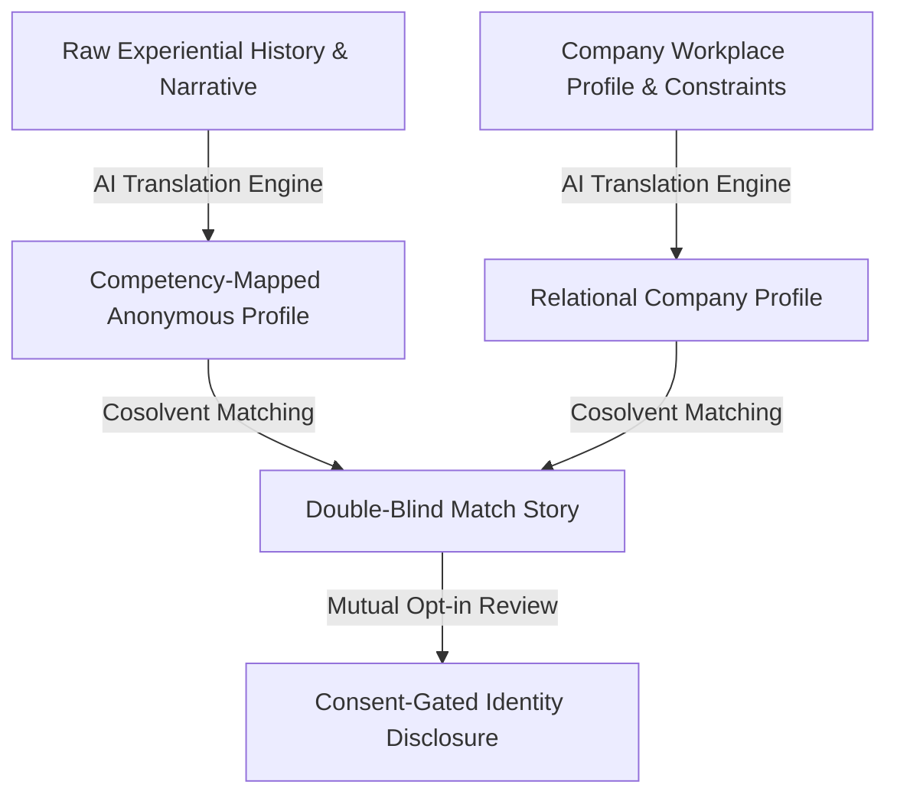
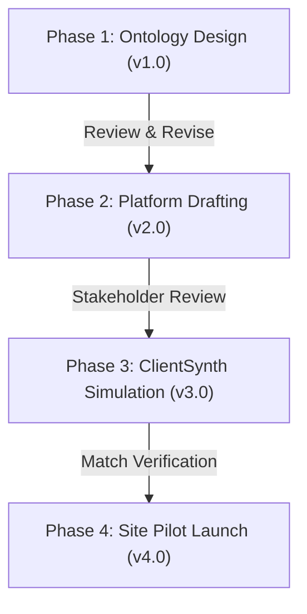

<!--Copyright (c) 2026 Mustafa Uzumeri. All rights reserved.-->

# Double-Blind Bicultural Content Match Pilot

This document outlines a proposal for a pilot project to design, validate, and deploy a **Double-Blind Bicultural Content Match Stories** placement engine. This pilot executes the progressive trust intermediation framework described in [[wiki/pages/concepts/bicultural_integration_exchange|bicultural_integration_exchange]], bridging the gap between experiential/narrative candidate histories and standard corporate HR filtering systems.

---

## 1. Executive Summary

Traditional hiring systems in high-reliability and technical sectors depend heavily on standardized resume formats and automated Applicant Tracking Systems (ATS). However, conventional resume formats create an **Opacity** barrier for Indigenous candidates from reservation backgrounds. These candidates often communicate their capabilities, work histories, and responsibility structures through a narrative and experiential register that does not fit standard corporate HR profiles, resulting in high rejection rates.

Conversely, companies face high **Cognitive Bandwidth** constraints and **Risk** when evaluating candidates from non-traditional paths because they lack structured methods to translate narrative experience into technical capabilities.

This pilot project aims to build a double-blind, consent-gated match engine. The system translates an Indigenous candidate's experiential history (e.g., harvesting logistics, land stewardship) into equivalent industrial competencies paired with a 30-day onboarding blueprint. Simultaneously, it translates the employer's workplace culture and flexible capacity rules into a relational framework for the candidate. Identities are disclosed only after both sides opt-in to the generated match narrative.

### 1.1 The Target Problem Example: ATS Resume Filtering vs. Translated Match Narrative
To illustrate the difference, compare how a candidate's experiential background is typically filtered out by conventional HR screening versus how it is matched using a translated, double-blind bicultural register.

#### Profile A: Conventional Expository CV (Filtered Out by Standard ATS)
> **Candidate Profile ID: CAN-902 — Applicant History**
> 
> *   **Employment Gaps**: Unemployed November 2024 to April 2025; Unemployed November 2023 to April 2024.
> *   **Experience**:
>     *   *Seasonal Harvester & Family Caregiver* (November–April, multiple years): Gathered resources, managed family logistics, operated local snowmobiles and transport.
>     *   *Community Liaison, Band Council* (Part-time, 2023): Handled disputes, organized local meetings, distributed community notices.
>     *   *Construction Laborer* (Seasonal, 2021–2022): General site cleanup, hand tool operations.
> *   **Certifications**: Standard high school diploma, driver's license.
> 
> **HR ATS Audit Verdict**: *REJECT. High risk due to chronic seasonal gaps. Missing direct industrial logistics experience or enterprise resource planning (ERP) system credentials.*

---

#### Profile B: Translated Bicultural Match Story & Blueprint (Progressive Intermediation)
> **Match Narrative ID: Match-902-A (Double-Blind Profile)**
>
> **Candidate Competency Translation**:
> *   **Variable-Condition Resource Logistics**: Managed seasonal supply networks, cold-weather transport operations, and community equipment inventory under extreme environmental constraints. Equivalent to multi-domain logistics coordination and fleet management.
> *   **Multi-Stakeholder Relations**: Coordinated community communications, resource allocation, and dispute resolution across band council leadership, family units, and regional government representatives. Equivalent to cross-functional stakeholder management.
> *   **Asset Stewardship & Safety**: Maintained remote operational machinery under isolated conditions, executing safety checkups with zero equipment loss.
>
> **30-Day Onboarding Blueprint**:
> *   *Week 1–2 (Technical Integration)*: Match candidate's spatial planning and equipment upkeep experience with the company's tool control protocols [[wiki/pages/concepts/dual_register_playbook|dual_register_playbook]].
> *   *Week 3–4 (Relational Checkpoint)*: Introduce the local Shared Facilitator to coordinate communication between the team lead and the candidate, ensuring smooth transition dynamics.
> *   *Temporal Accommodation*: Candidate is backed by a peer-to-peer capacity rotation pool, allowing time away for seasonal community harvests without interrupting shop-floor output.
> 
> **Company Relational Profile (Presented to Candidate)**:
> > "This workplace operates as a collective promise. Their team maintains a shadowboard tool inventory because they hold the safety of travelers in their hands. They respect seasonal harvests and family obligations, and they have committed a local Elder to guide your onboarding check-ins."

---

### 1.2 Setting the Project Foundation
This pilot addresses three core structural gaps in technical recruitment:
*   **The Invalidation of Narrative Experience**: Conventional ATS systems actively filter out non-traditional work histories, missing high-reliability capabilities in logistics, leadership, and crisis management.
*   **Progressive Disclosure of Identity**: By hiding specific identities, genders, and backgrounds until a mutual match is confirmed, the engine protects candidate privacy and prevents implicit corporate bias.
*   **Integration from Day Zero**: Rather than placing a worker and hoping they adapt, the engine pairs the placement with a pre-configured, localized support structure (Facilitator + Onboarding Blueprint), addressing the operational root causes of retention failure.

### 1.3 Pilot Goals & Objectives
Using the bicultural matching framework, this pilot establishes four concrete goals:
*   **Goal 1: Develop an AI Narrative-to-Competency Translation Model**: Map experiential, oral-tradition work histories to standard industrial skill taxonomies (such as AS9100 logistics, ISO quality roles) without losing the candidate's authentic voice.
*   **Goal 2: Achieve Mutual Double-Blind Match Approvals**: Validate that double-blind bicultural match stories lead to higher initial interview acceptance rates from hiring managers compared to standard CVs.
*   **Goal 3: Increase 90-Day Retention Rates**: Target a measurable increase in 90-day employee retention by pre-integrating the match with dynamic scheduling and Shared Facilitators [[wiki/pages/concepts/shadow_capacity|shadow_capacity]].
*   **Goal 4: Enforce OCAP Data Sovereignty**: Ensure all candidate narrative profiles are stored on sovereign, community-controlled databases [[wiki/pages/concepts/platform_governance_models|platform_governance_models]].

### 1.4 Technical Leverage: DeeperPoint & Market Physics

This pilot does not require building a custom matching engine or simulation framework from scratch, which drastically reduces initial development costs, timeline, and execution risk. Instead, it directly leverages the existing DeeperPoint open-source technology stack and structural theories:
*   **The Cosolvent Matching Engine**: The pilot uses DeeperPoint's core **Cosolvent** matching protocol to handle double-blind, multi-entity optimization (matching Candidates, Employers, and Facilitators simultaneously). This open-source codebase serves as a functional foundation, shifting the work from software development to configuration and tuning.
*   **ClientSynth Simulation Harness**: Rather than testing matches on live candidates and employers first—which carries high reputational and operational risk—the pilot uses **ClientSynth** to run thousands of simulated matching runs with synthetic candidate and company agents, validating matching accuracy in Phase 3 prior to physical deployment.
*   **The Market Physics Framework**: DeeperPoint's thin market theory guides the diagnostic design, specifically identifying and mitigating known resistance forces like **Opacity** (unrecognized skills), **Temporal Distance** (flexible scheduling), and **Cognitive Bandwidth** (onboarding overhead). This prevents the pilot from building features that do not map to actual transactional bottlenecks.

---

## 2. Industry Targets & Core Matching Scenarios

The pilot will target entry-to-intermediate technical and operational roles across four high-reliability sectors:

| Industry Sector | Target Roles | Candidate Translation Area | Partner Readiness Requirement |
|---|---|---|---|
| **Aerospace** | Inventory Specialists, Material Control, Assembly Tech | Mapping hunting precision, traditional carving, and tool care to AS9100 quality/tool audits. | Commitment to host a local Shared Facilitator. |
| **Automotive** | Assembly Logistics, Fleet Sourcing, Team Leads | Mapping community coordination and seasonal harvest logistics to parts supply chains. | Agreement to participate in peer-to-peer shift rotation scheduling. |
| **Mining** | Conveyor Safety Monitors, Equipment Operators | Mapping land navigation, survival logistics, and environmental tracking to site safety. | Openness to coordinate with Band Councils on safety oversight. |
| **Medical Devices** | Sterile Packaging Assemblers, Cleanroom Inspectors | Mapping traditional weaving/sewing details to sterile seal inspections (ISO 13485). | Custom training templates that support bicultural playbooks. |

---

## 3. Human & Strategic Resources

The pilot operates under a low-overhead model relying on three key participant groups:

### 3.1 Architect & Methodology Lead (Mustafa Uzumeri)
*   **Role & Core Background**: Designs the matching ontology, structures the translation rules, and oversees technical alignment. Mustafa Uzumeri's experience in building structured corporate training and process validation programs ensures the translated competencies directly satisfy formal quality standards.
*   **Bandwidth Constraint**: Architectural guidance and validation oversight only; no direct day-to-day placement operations [[wiki/pages/concepts/available_resources|available_resources]].

### 3.2 Academic Recruitment Analysts (Trent University Indigenous Studies)
*   **Role**: Students from Trent University will act as interns to:
    *   Work with candidates to collect narrative histories and experiential descriptions.
    *   Iterate on the AI-generated bicultural translations to ensure linguistic accuracy and respect.
    *   Draft company relational profiles based on workplace safety and scheduling policies.
*   **Funding**: Funded through co-op and research envelopes (SSHRC, Mitacs).

### 3.3 Strategic Access Facilitators
*   **Role**: Indigenous employment officers, Band Council representatives, and regional training consultants who:
    *   Identify candidate pools and manage local community registry consent.
    *   Serve as the Shared Facilitator pool matching with the placements.
    *   Audit the platform's data management to ensure OCAP compliance.

### 3.4 AI-Driven Matching Pipeline
The system operates as a progressive disclosure matching pipeline powered by AI under strict human-in-the-loop governance:

*   **AI Translation Engine**: Parses narrative inputs (such as recordings of candidate work stories) and maps them to technical competency tags (logistics, safety, team leadership) while drafting the anonymous match profile.
*   **Cosolvent Matcher**: Analyzes the overlap between translated capabilities, onboarding readiness, and geographic/temporal parameters to generate the Double-Blind Match Story.
*   **Verification & Opt-In**: A Trent student analyst and local facilitator review the match story for authenticity. The anonymous story is then presented to both parties. Identity and contact details are only disclosed upon mutual opt-in.

---

## 4. Phased Revision & Implementation Roadmap

The matching engine pilot is divided into four distinct development phases, allowing for revision cycles at each gate:

### Phase 1: Team Formation & Core Matching Ontology Design (Version 1.x)
*   **Activities**:
    *   Form the pilot coalition (Mustafa Uzumeri, Trent University coordinates, and regional employment boards).
    *   Define the taxonomy mapping narrative experiences to technical competencies.
    *   **AI-Assisted Operations**: Leverage generative AI tools to research and map traditional narrative registers to standard industrial skill domains, helping build the foundation of the bicultural translation ontology. Use AI tools to draft initial proposals, matching templates, and coordinate coalition planning documents.
*   **Revision Trigger**: Review and approval of the mapping taxonomy by Trent Indigenous Studies coordinators and participating HR managers.

### Phase 2: Double-Blind Match Storyboard & Blueprint Design (Version 2.x)
*   **Activities**:
    *   Build standard templates for anonymous match profiles and company relational profiles.
    *   Draft candidate translations for the first cohort.
*   **Revision Trigger**: Review by local Elders and facilitators to ensure OCAP data compliance and cultural safety of narrative translations.

### Phase 3: ClientSynth Simulation & Validation (Version 3.x)
*   **Activities**:
    *   Deploy simulated candidate profiles and corporate openings in a ClientSynth testbed.
    *   Verify match accuracy, scoring bias, and compliance alignment.
*   **Revision Trigger**: Successful verification of match stability and compliance with AS9100/ISO standards by policy and quality audit advisors.

### Phase 4: Pilot Site Placement & Match Launch (Version 4.x)
*   **Activities**:
    *   Deploy the match engine with active candidates and target manufacturing partners.
    *   Activate Shared Facilitator check-ins and monitor 90-day retention rates.
*   **Revision Trigger**: Post-pilot debrief to optimize onboarding blueprints for next-stage commercial scaling.

### 4.5 AI Technology, Cost, and Risk Profile by Phase

The pilot uses an incremental AI technology roadmap to minimize initial cost and mitigate data-sovereignty risks.

| Phase | AI Support Level | AI Technology Focus | Work & Development Effort | Expense Profile | Technical & Operational Risk |
| :--- | :--- | :--- | :--- | :--- | :--- |
| **Phase 1: Ontology** | **Medium** | AI-assisted research, idea assembly, and matching ontology plan drafting. | Low (Prompt engineering, research synthesis) | **Very Low** (Standard LLM/API subscription costs) | **Very Low** (Design-stage support only; no operational risk) |
| **Phase 2: Storyboard** | **Medium** | Generative LLM drafting; processing and parsing Elder/facilitator review transcripts. | Moderate (Template prompt design, translation parsers) | **Low to Moderate** (API usage tokens, pipeline scripting) | **Low to Medium** (Mitigated by mandatory human-in-the-loop Elder review) |
| **Phase 3: Simulation** | **High** | Multi-agent user simulations (e.g., ClientSynth) and automated match scoring. | High (Simulation testbed construction, multi-agent matching scripting) | **Moderate to High** (Development costs, high token usage) | **High** (Simulation accuracy vs. real-world behavior, match stability) |
| **Phase 4: Pilot Launch** | **High** | Production API pipeline integration, secure identity masking, and OCAP candidate registry. | High (Production software deployment, secure data room setup) | **High** (Sovereign database deployment, security audits) | **High** (Operational compliance, data sovereignty, recruitment integration) |

---

## 5. Academic Rigor & Long-Term Scaling Vision

To ensure the matching system provides permanent career paths and community-controlled economic development, the project has a clear scaling trajectory.

### 5.1 Academic Study & Research Process
The pilot operates in tandem with a research study at Trent University:
*   **Evaluation Metrics**: Compare bicultural matched candidates against standard placement control groups on onboarding time, 90-day attrition, and worker well-being.
*   **Linguistic Mapping Research**: Document the effectiveness of translating narrative experiences to corporate competencies, contributing to the academic literature on bicultural HR practices.

### 5.2 Commercialization & Indigenous Entrepreneurship (Bicultural Placement Platform)
Following a successful pilot, the matching platform will transition to an Indigenous-led recruitment agency:
*   **Incubation**: Mentor Indigenous graduates to own and run the platform.
*   **High-Margin Model**: Leveraging AI for competency mapping and match story drafting keeps operational overhead low, allowing the agency to charge standard commercial recruitment fees (15–20% of first-year salary) to industrial firms seeking to fulfill ESG and federal 5% procurement requirements.
*   **Community Sovereignty**: The core database is maintained as an Ostrom-based platform commons, ensuring the community retains control of their career profiles and data assets.

---

<!--Copyright (c) 2026 Mustafa Uzumeri. All rights reserved.-->
