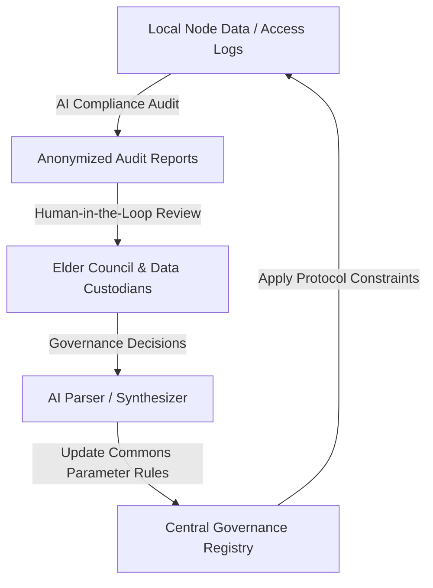
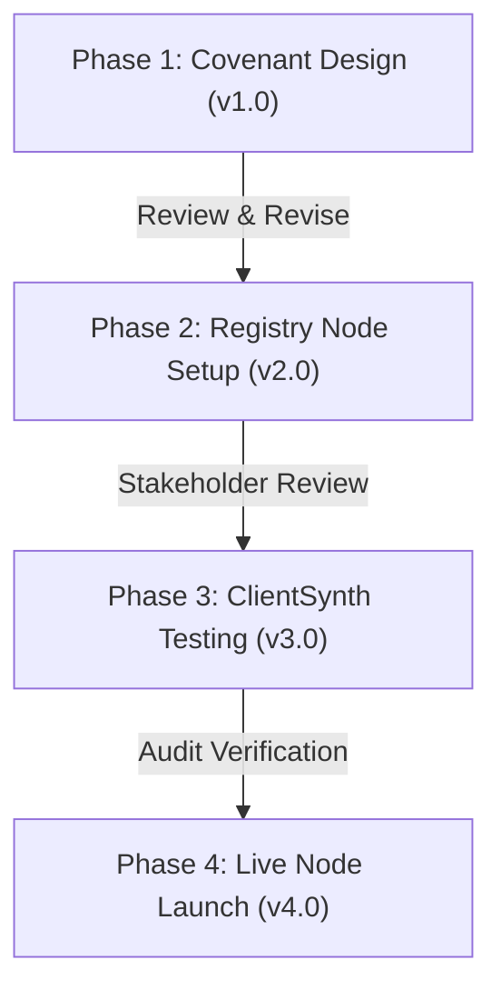

<!--Copyright (c) 2026 Mustafa Uzumeri. All rights reserved.-->

# Ostrom-Based Platform Commons Pilot

This document outlines a proposal for a pilot project to design, validate, and deploy a decentralized, cooperative governance architecture for the Bicultural Integration Exchange. This pilot executes the **Ostrom-Based Platform Commons** model described in [[wiki/pages/concepts/platform_governance_models|platform_governance_models]], applying Elinor Ostrom’s eight principles for managing common-pool resources (CPRs) to ensure data sovereignty, community trust, and absolute compliance with OCAP principles.

---

## 1. Executive Summary

Traditional digital matching and employment platforms operate under an extractive "Aggregator Trap" model. In these systems, a central corporate intermediary controls, packages, and monetizes candidate data. For Indigenous communities, this extractive architecture represents a direct threat to data sovereignty and violates the **OCAP Principles** (Ownership, Control, Access, and Possession) of community-owned cultural and personal datasets.

Furthermore, standard corporate Terms of Service (ToS) strip candidates and local communities of agency, offering no pathways for collective bargaining, safe-workplace validation, or community-led dispute resolution.

This pilot project aims to build an Ostrom-based cooperative governance protocol for the Bicultural Integration Exchange. Candidate registries are contractually and physically separated from corporate databases, hosted on sovereign, community-controlled server nodes, or protected by localized encryption keys held strictly by community custodians. Platform operational rules (such as safety baselines, minimum wage thresholds, and scheduling boundaries) are managed as a digital commons, using local Shared Facilitators as peer monitors.

### 1.1 The Target Problem Example: Extractive Aggregator Platform vs. Ostrom Platform Commons
To see the difference in governance structures, compare how candidate records and workplace standards are managed under a standard extractive platform versus a decentralized Ostrom-based platform commons.

#### Model A: Conventional Extractive Platform (The Aggregator Trap)
> **Platform Governance: Centralized SaaS Terms of Service (ToS)**
> 
> 1.0 **Data Ownership**: All candidate profile data, work logs, and skill assessments submitted to the platform are the exclusive property of the platform operator. The operator may package, sell, or analyze this data for commercial recruitment optimization.
> 2.0 **Workplace Standards**: Wage levels and schedule expectations are determined strictly by employer demand. The platform does not intervene in local working conditions.
> 3.0 **Dispute Resolution**: Disputes are handled via centralized, automated email ticketing managed by the SaaS vendor. Platform decisions are final, and user accounts may be suspended unilaterally without community recourse.
> 
> **Operational Outcome**: *Data extraction without community compensation. High attrition rates as workers face inflexible environments with no structural voice.*

---

#### Model B: Ostrom-Based Platform Commons (Cooperative Protocol)
> **Commons Registry ID: Treaty-7-Commons-Node (Decentralized Protocol)**
>
> **Sovereign Data Custody (OCAP Compliance)**:
> *   The candidate's narrative work history, references, and personal data reside on a secure local database node owned by the Band Council.
> *   Employers only receive temporary, read-only access to double-blind translated profiles during matching. All PII is masked and protected by keys held by local community custodians.
>
> **Ostrom Commons Rules**:
> *   *Rule 1 (Clearly Defined Boundaries)*: Only certified local workers and ready employers committed to bicultural playbooks may access the commons pool.
> *   *Rule 2 (Congruence with Local Conditions)*: Wage minimums and temporal scheduling limits (ceremony and harvest windows) are set dynamically by the local community.
> *   *Rule 3 (Local Monitoring)*: Shared Facilitators act as community-appointed monitors to verify shop-floor safety, working conditions, and protocol adherence.
> *   *Rule 4 (Graduated Sanctions)*: Employers who fail to respect scheduling accommodations or safety playbooks receive progressive warnings from the Facilitator pool before temporary suspension from matching.
> *   *Rule 5 (Low-Cost Conflict Resolution)*: Disputes are reviewed and resolved locally in joint sessions between the Employer, Candidate, and the Shared Facilitator.
> 
> **Operational Outcome**: *Data remains within community possession. High employee retention because working conditions align with community-validated boundaries.*

---

### 1.2 Setting the Project Foundation
This pilot addresses three core governance gaps in digital matching systems:
*   **The Loss of Data Control**: Candidate profiles and stories are treated as sovereign assets rather than tradeable commodities, preventing unauthorized monetization or algorithmic bias.
*   **Decentralized Monitoring**: Rather than relying on distant, automated software controls, the system embeds human-in-the-loop Shared Facilitators to bridge communication gaps and validate employer readiness.
*   **Cooperative Power Balance**: By managing the matching pool as a commons, the platform prevents the decay into an asymmetrical market where large buyers dictate terms to fragmented participants.

### 1.3 Pilot Goals & Objectives
Using the Ostrom commons framework, this pilot establishes four concrete goals:
*   **Goal 1: Implement a Decoupled Local-First Architecture**: Deploy secure, local-first database nodes for candidate profiles, verifying that PII data can be stored locally under community keys while matching safely with central employer records.
*   **Goal 2: Codify Ostrom Rules into Platform Protocols**: Translate community-defined working parameters (minimum wages, ceremony calendar exceptions, safety playbooks) into active software constraints.
*   **Goal 3: Establish a Localized Dispute Resolution Protocol**: Implement a structured conflict-resolution workflow managed by pooled facilitators, minimizing escalation costs.
*   **Goal 4: Validate OCAP Audit Standards**: Achieve formal sign-off from community data officers, proving the platform meets strict Ownership, Control, Access, and Possession requirements.

### 1.4 Technical Leverage: DeeperPoint & Market Physics

This pilot utilizes the DeeperPoint open-source technology stack and structural theories to drastically reduce development timelines and overhead:
*   **The Cooperative Protocol Blueprints**: The pilot leverages DeeperPoint's open-source cooperative network designs and dynamic permissioning APIs. This allows candidate profiles to remain locked in local registries while still interacting securely with matching engines.
*   **ClientSynth Governance Testing**: Before launching on-site nodes, the pilot uses **ClientSynth** to simulate cooperative interactions. We run agent-based simulations to test how graduation sanctions, monitoring levels, and variable wage thresholds affect employer engagement and candidate retention in Phase 3.
*   **The Market Physics Framework**: DeeperPoint's thin market theory provides the diagnostic framework to prevent the "Aggregator Trap." It maps structural desire and transaction friction forces, ensuring the platform commons operates as an efficient, self-sustaining ecosystem rather than a bureaucratic bottleneck.

---

## 2. Target Communities & Cooperative Parameters

The pilot will configure localized commons parameters for the four target sectors:

| Sector | Local Node Host | Commons Monitoring Rule | Temporal Boundary Rule |
|---|---|---|---|
| **Aerospace** | Regional Treaty Council | Shared Facilitator audits tool control and Nadcap-related safety environments. | 3-day flexible adjustment for seasonal cultural obligations. |
| **Automotive** | First Nations Employment Center | Facilitator monitors weld-cell workload and assembly team integration. | Shift rotation pool coordinates backup operators automatically. |
| **Mining** | Band Council Development Corp | Community monitors mine safety protocols and conveyor clearings. | Custom scheduling allowances for regional treaty gatherings. |
| **Medical Devices** | Indigenous Health & Training Center | Facilitator checks cleanroom onboarding and sterile pack environments. | Flexible hours to support family-care and elder obligations. |

---

## 3. Human & Strategic Resources

The pilot operates under a cooperative model leveraging three key participant groups:

### 3.1 Architect & Methodology Lead (Mustafa Uzumeri)
*   **Role & Core Background**: Designs the commons metadata schema, configures Ostrom parameters in the protocol, and audits compliance. Mustafa Uzumeri's extensive background in ISO 9001 quality standardization ensures the cooperative protocols align with industrial compliance audits.
*   **Bandwidth Constraint**: Architectural guidance and structural design only; no direct day-to-day operations [[wiki/pages/concepts/available_resources|available_resources]].

### 3.2 Academic Governance Analysts (Trent University Indigenous Studies)
*   **Role**: Trent students act as researchers to:
    *   Consult with community Elders to draft the localized commons covenants and temporal boundaries.
    *   Iterate on conflict-resolution workflows.
    *   Audit the system logs to ensure strict OCAP compliance.
*   **Funding**: Funded through SSHRC, Mitacs, and academic research grants.

### 3.3 Strategic Access Facilitators
*   **Role**: Band Council administrators, Treaty leaders, and community Elders who:
    *   Operate the local registry nodes and manage decryption keys.
    *   Serve as the local monitors (Shared Facilitators) on the shop floors.
    *   Review and approve employer participation requests.

### 3.4 AI-Driven Audit & Commons Feedback Loop
The platform ensures continuous safety and OCAP compliance through a semi-automated audit pipeline:

*   **AI Compliance Audit**: Continuously monitors access logs and matching queries to detect unauthorized database lookups or potential data leakage, generating anonymized audit reports.
*   **Elder Council & Custodian Review**: Local data custodians review the reports to verify that no PII has been compromised and that employers are adhering to bicultural templates.
*   **Dynamic Constraint Updates**: Any changes or corrective sanctions are processed by the AI parser to update active commons rules (such as blocking a non-compliant employer's access), enforcing rules instantly across all nodes.

---

## 4. Phased Revision & Implementation Roadmap

The commons engine pilot is divided into four distinct development phases, allowing for revision cycles at each gate:

### Phase 1: Team Formation & Commons Covenant Design (Version 1.x)
*   **Activities**:
    *   Form the governance coalition (Mustafa Uzumeri, Trent University program leads, Band Council data officers).
    *   Draft the initial commons covenant outlining boundaries, graduated sanctions, and wage thresholds.
    *   **AI-Assisted Operations**: Leverage generative AI tools to analyze and map Elinor Ostrom’s eight principles of commons governance against existing Indigenous legal traditions and corporate partner contracts, helping the coalition draft initial covenants. Use AI to structure matching parameters, design proposal templates, and synthesize coalition feedback.
*   **Revision Trigger**: Review and formal approval of the covenant by participating Treaty councils and HR managers.

### Phase 2: Decoupled Registry Nodes & Protocol Design (Version 2.x)
*   **Activities**:
    *   Set up local-first database nodes for testing.
    *   Configure the encryption and masked matching interface.
*   **Revision Trigger**: Security audit to ensure candidate data is inaccessible without local community keys.

### Phase 3: Simulated Governance & Validation (Version 3.x)
*   **Activities**:
    *   Run simulated matching and governance events in a ClientSynth testbed.
    *   Verify the stability of graduated sanctions and scheduling conflict-resolution paths under high load.
*   **Revision Trigger**: Validation checks to confirm the simulated commons remains stable and compliant.

### Phase 4: Live Commons Node Deployment (Version 4.x)
*   **Activities**:
    *   Launch live registry nodes with the first cohort of candidates and partner employers.
    *   Monitor facilitator audit logs and track cooperation metrics (sanction rates, dispute costs).
*   **Revision Trigger**: Post-pilot debrief to optimize node parameters for next-stage commercial scaling.

### 4.5 AI Technology, Cost, and Risk Profile by Phase

The pilot uses an incremental AI technology roadmap to minimize initial cost and mitigate data-sovereignty risks.

| Phase | AI Support Level | AI Technology Focus | Work & Development Effort | Expense Profile | Technical & Operational Risk |
| :--- | :--- | :--- | :--- | :--- | :--- |
| **Phase 1: Covenant** | **Medium** | AI-assisted research, idea assembly, and commons governance plan drafting. | Low (Prompt engineering, research synthesis) | **Very Low** (Standard LLM/API subscription costs) | **Very Low** (Design-stage support only; no operational risk) |
| **Phase 2: Registry** | **None** | Deployment of local database nodes and cryptographic key distribution. | Moderate (Local database setup, encryption configuration) | **Low to Moderate** (Server infrastructure, local node setup) | **Low** (Data isolation security verification) |
| **Phase 3: Simulation** | **High** | Multi-agent commons simulations (ClientSynth) to model behavior under graduated sanctions. | High (Simulation setup, multi-agent scripting) | **Moderate to High** (Development costs, high token usage) | **High** (Simulation accuracy vs. real human cooperation patterns) |
| **Phase 4: Node Launch** | **Medium** | Automated OCAP access auditing and secure matching protocol verification. | High (Production software deployment, sovereign node orchestration) | **High** (Production software development, secure server hosting) | **High** (Operational compliance, data sovereignty, integration with enterprise systems) |

---

## 5. Academic Rigor & Long-Term Scaling Vision

To ensure the commons pilot provides a scalable, sovereign economic model, the project has a clear scaling trajectory.

### 5.1 Academic Study & Research Process
The pilot operates in tandem with a research study at Trent University:
*   **Governance Evaluation**: Analyze the efficacy of Ostrom's CPR principles applied to digital labor marketplaces, documenting conflict resolution speeds and trust scores.
*   **Sovereign Data Research**: Evaluate local-first database performance and OCAP standard compliance in high-reliability industrial sectors.

### 5.2 Commercialization & Economic Self-Determination (Cooperative SaaS Model)
Following a successful pilot, the platform will transition to a permanent cooperative SaaS business model:
*   **Incubation**: Mentor Indigenous software engineers and administrators to manage and maintain the decentralized network.
*   **High-Margin Model**: The platform charges minor transaction or placement fees to employers to cover central cloud routing costs, while node hosting and local matching logic remain locked in local community servers. This creates a sustainable, high-margin software cooperative.
*   **Community Sovereignty**: Data is never aggregated into a single corporate asset, protecting candidate profiles from venture capital extraction or predatory buyouts.

---

<!--Copyright (c) 2026 Mustafa Uzumeri. All rights reserved.-->
